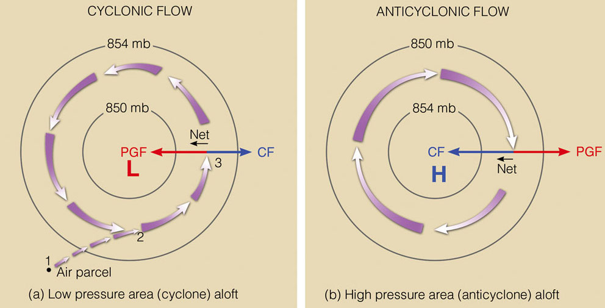
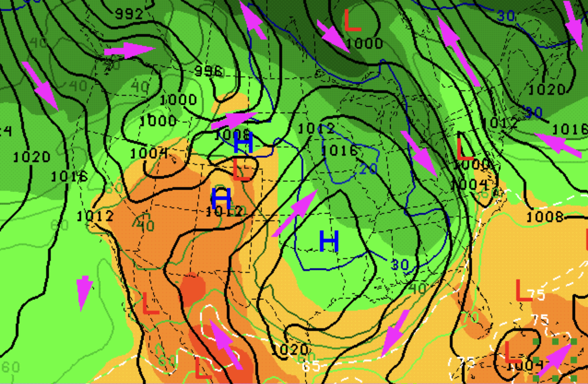

# Geostrophic theory {#sec-Geostrophic}

## Overview

Geophysical fluid dynamics embodies an incredibly wide range of spatial scales -- from planetary scales of tens of thousand kilometers to millimeters where the effect of viscosity is felt or clouds and micro-organisms form. Such a wide spectrum adds to the complexity and the degrees of freedom in this system and makes the understanding of the dynamics very challenging. One of our primary tools in geophysical fluid dynamics is to narrow down our attention to a smaller span of scales, and then use relevant scaling to reduce the dynamics to something simpler that is easier to understand or solve. More specifically, if we consider the scale of thousand kilometers in the atmosphere (or hundreds of kilometers in the ocean), scaling arguments lead to **geostrophic theory**, which is one of the most celebrated results of geophysical fluid dynamics. The scales of thousand kilometers in the atmosphere (which are given a special name of **synoptic scales** are the range of scales that characterise our daily weather. Hence, geostrophic theory has been the cornerstone of weather forecast for many decades. To investigate this theory, we start by introducing the appropriate scaling for different variables and then use asymptotic expansion to simplify the dynamics. 

## Scaling the equations and Rossby number

The goal of scaling is to understand the relative importance of different phenomena that influence the fluids motion. In geophysical fluids, we have seen that stratification and rotation play crucial roles in the dynamics. The characteristic length scale that marks the relative importance of these two phenomena is the *deformation radius* (also known as Rossby radius of deformation) defined as
$$
    \Ld = \frac{N \mathcal{H}}{f_0},
$$ {#eq-def_radius}
where $\mathcal{H}$ is the vertical scale ($f$ and $N$ are Coriolis and Brunt--Väisälä frequencies introduced in previous chapters). Recall that stratification/buoyancy primarily acts in the vertical, whereas the leading order Coriolis force $f \eb_z \times \vb$ acts in the horizontal. Hence, $\Ld$ characterises the horizontal scale at which rotational effects become as important as buoyancy effects. In the atmosphere, the ratio $N/f$ is typically of order 100, so for a vertical scale associated with the height of the tropopause (first layer of the atmosphere where the weather dynamics take place), $\Ld = 1000$ km. In synoptic or weather scales, we consider horizontal scales that close $\Ld$ or slightly larger. The deformation radius of the ocean is an order of magnitude smaller than that of the atmosphere because $N/f$ is much smaller in the ocean. Hence, the order of hundred kilometer in the ocean is dynamically equivalent to thousand kilometer in the atmosphere.

We scale the flow variables with the following characteristic values
$$
   (x,y) = {\mathcal{L}}{({x^*},{y^*})}, \quad z = {\mathcal{H}}{\zh} , \quad t = {\mathcal{T}}{\tha} , \quad  (u,v) =  {\mathcal{U}}{(\nd{u},\nd{v})}, \quad w = {\mathcal{W}}{\wh},,
$$ 
$$
p = {\mathcal{P}}{\ph} , \quad b = {\mathcal{B}}{\bh} , \quad \fb = {f_0}{\nd{\boldsymbol{f}}} , 
$$ {#eq-scaling}
where $\nd{()}$ are dimensionless. We also use $\gradH = 1/ \mathcal{L} \ \nd{\nabla}_H$, consistent with the scale of $x$ and $y$. We then non-dimensionalise the (hydrostatic) Boussinesq equations
$$
\frac{1}{f_0 \mathcal{T}} \frac{\partial\vh}{\partial \tha} + \frac{\mathcal{U}}{f_0 \mathcal{L}} \ (\vh \cdot \gradHh ) \vh + \frac{\mathcal{W}}{f_0 \mathcal{H}} \wh \frac{\partial \vh }{\partial \zh} + \fh \times \vh = - \frac{\mathcal{P}}{\bar\rho f_0 \mathcal{L}\ \mathcal{U} } \ \gradHh \ph,$$ {#eq-nd_BousmomH}
$$ \frac{\bar\rho \mathcal{B} \mathcal{H}}{\mathcal{P}} \ \bh = \frac{\partial \ph }{\partial \zh} ,$$  {#eq-nd_BousmomV} 
$$ \gradHh \cdot\vh + \frac{\mathcal{W} \mathcal{L}}{\mathcal{U} \mathcal{H}}  \frac{\partial \wh}{\partial \zh} =0, $$ {#eq-nd_Bousdiv}
$$\frac{1}{f_0 \mathcal{T}} \frac{\partial \bh}{\partial \tha} + \frac{\mathcal{U}}{f_0 \mathcal{L}} \ (\vh\cdot\gradHh ) \bh + \frac{\mathcal{W}}{f_0 \mathcal{H}} \wh \frac{\partial \bh}{\partial \zh} + \frac{N^2 \mathcal{W}}{\mathcal{B}} \wh =0.$$ {#eq-nd_Bousbuoy}

::: {.callout-note appearance="simple"}
We could have started from non-hydrotatic Boussinesq equations as well and by a scaling argument shows that the vertical momentum equation at the leading order is hydrostatic.
:::

In Equations ([-@eq-nd_BousmomH]) - ([-@eq-nd_Bousbuoy])  one of the most important dimensionless parameters in geophysical fluid dynamics has surface
$$
     \Ro = \frac{\mathcal{U}}{f_0 \mathcal{L}},
$$ {#eq-def_Ro}
which shows the ratio of inertial force to Coriolis force and is called **Rossby number**. If the Coriolis force is strong, we expect $\Ro$ to be small. Using the definition Rossby number ([-@eq-def_Ro]), we rewrite ([-@eq-nd_BousmomH]) - ([-@eq-nd_Bousbuoy])  as 
$$ \frac{1}{f_0 \mathcal{T}} \frac{\partial\vh}{\partial \tha} + \Ro \ (\vh \cdot \gradHh ) \vh + \Ro \frac{\mathcal{W} \mathcal{L}}{\mathcal{U} \mathcal{H}} \wh \frac{\partial \vh }{\partial \zh} + \fh \times \vh = - \frac{\mathcal{P}}{\bar\rho f_0 \mathcal{L}\ \mathcal{U} } \ \gradHh \ph, $$ {#eq-nd_BousmomH2} 
$$ \frac{\bar\rho \mathcal{B} \mathcal{H}}{\mathcal{P}} \ \bh = \frac{\partial \ph }{\partial \zh} , $$ {#eq-nd_BousmomV2} 
$$ \gradHh \cdot\vh + \frac{\mathcal{W} \mathcal{L}}{\mathcal{U} \mathcal{H}}  \frac{\partial \wh}{\partial \zh} =0,$$ {#eq-nd_Bousdiv2}
$$ \frac{1}{f_0 \mathcal{T}} \frac{\partial \bh}{\partial \tha} +\Ro \ (\vh\cdot\gradHh ) \bh + \Ro \frac{\mathcal{W} \mathcal{L}}{\mathcal{U} \mathcal{H}} \wh \frac{\partial \bh}{\partial \zh} + \frac{N^2 \mathcal{W}}{\mathcal{B}} \wh =0. $$ {#eq-nd_Bousbuoy2}

In the rest of this chapter we assume $N$ to be constant. However, the geostrophic theory can be easily generalised to a variable $N$.

::: {.callout-note appearance="simple"}
$Ro$ is named after after the Swedish-American meteorologist Carl-Gustav Arvid Rossby, who first explain who first explained the large-scale motions of the atmosphere using fluid mechanics.
:::

## Leading order: geostrophic balance

Our goal in this section is to use the relevant scaling to the weather scale to simplify the Bousinesq equation. To that end, we consider the following assumptions

1. The Rossby number is small and we denote it by $\Ro =\epsilon$ to emphasise this fact. This means the Coriolis effect is strong. The average wind speed in the atmosphere is about $8 m/s$, the Coriolis parameter at mid-latitudes (about $35^{\circ}$) is $0.8 \times 10^{-4}$ and as mentioned earlier we are considering the weather (synoptic) scales of $\mathcal{L} = 1000 km$. With these values we get $\Ro \approx 0.1$, which is indeed a small parameter. A similar calculation for the ocean scales of 100 km leads to even smaller Rossby numbers.
2. The horizontal scale of motion is not significantly larger than the deformation radius (@eq-def_radius). More specifically, $$\frac{\Ld}{\mathcal{L}} = O(1) $$ 
This is a direct translation of considering the synoptic scales (thousands of kilometers) in the atmosphere or the mesoscales (hundreds of kilometers) in the ocean.
3. The time scale is $\mathcal{T}=\mathcal{L}/\mathcal{U}$. This time scale sometimes is referred to as *eddy turnover* time, because if we consider an eddy or vortex with the velocity $\mathcal{U}$ and diameter $\mathcal{L}$, it will roughly take $\mathcal{L}/\mathcal{U}$ time to make a full turn. This time scale is also known as *inertial* or *advective* time scale, because it will make the inertial or advection term $\vb \cdot \grad \vb$ the same order of magnitude as the time derivative. This assumption leads to $1/(\mathcal{T}f_0)=\Ro$ in ([-@eq-nd_BousmomH2]) - ([-@eq-nd_Bousbuoy2]) .
4. To keep $\partial w / \partial z$ in the continuity equation @eq-nd_Bousdiv2, we assume the vertical velocity scales as $\mathcal{W} =  \mathcal{U} \mathcal{H} / \mathcal{L}$. This is simply keeping the problem in more general form by allowing $\partial w / \partial z$ to exist at the leading order rather than imposing an extra assumption. In other words, such scaling allows $\mathcal{W} <  \mathcal{U} \mathcal{H} / \mathcal{L}$ as the terms $\partial w / \partial z$ and $w \partial / \partial z$ may naturally become small or zero in the solution (our scaling does not prevent).
5. The beta effect is an order ($\epsilon$) smaller than the $f_0$. More precisely,
$$ \fh = \left( \frac{f_0 + \beta \nd{y} \mathcal{L}}{f_0} \right) \eb_z =  \left( 1 + \frac{\beta \mathcal{L}}{f_0} \nd{y} \right) \eb_z =  \left( \nd{f}_0 + \epsilon \ \nd{\beta} \nd{y} \right) \eb_z
$$
where $\nd{\beta}$ is $O(1)$ due to the assumption made and $\nd{f}_0 = f_0/f_0 = 1$. Note that we still keep $\nd{f}_0$ in the equations (despite being simply 1) so the leading term of the Coriolis force will stand out in the non-dimensionalised equations. Likewise, we keep $\fh_0 = \nd{f}_0 \eb_z$ instead of the unit vector $\eb_z$.

Using the assumption 3, 4 and 5, we rewrite ([-@eq-nd_BousmomH2]) - ([-@eq-nd_Bousbuoy2]) 
$$ \epsilon \left(  \frac{\partial\vh}{\partial \tha} + (\vh \cdot \gradHh ) \vh + \wh \frac{\partial \vh }{\partial \zh} \right) +  (\nd{f}_0 + \epsilon \nd{\beta} \nd{y})  \eb_z \times \vh = - \frac{\mathcal{P}}{\bar\rho f_0 \mathcal{L}\ \mathcal{U} } \ \gradHh \ph, $$ {#eq-nd_BousmomH3} 
$$ \frac{\bar\rho \mathcal{B} \mathcal{H}}{\mathcal{P}} \ \bh = \frac{\partial \ph }{\partial \zh}, $$ {#eq-nd_BousmomV3} 
$$ \gradHh \cdot\vh + \frac{\partial \wh}{\partial \zh} =0, $$ {#eq-nd_Bousdiv3}
$$ \epsilon \left(\frac{\partial \bh}{\partial \tha} +(\vh\cdot\gradHh ) \bh + \wh \frac{\partial \bh}{\partial \zh}  \right) + \frac{N^2 \mathcal{W}}{\mathcal{B}}\wh =0. $$ {#eq-nd_Bousbuoy3}

If we consider the limit of small $\epsilon$ (following assumption 1), in the horizontal momentum @eq-nd_BousmomH3 the Coriolis force will be larger than all other terms in the LHS. We know the Coriolis force is not small at the weather scale as the horizontal wind $\vb$ is not negligible. Hence, the pressure gradient in the RHS has to be the same order as Coriolis force to balance it out. This require the following scaling for pressure
$$
    \mathcal{P} \sim \bar\rho f_0 \mathcal{L}\ \mathcal{U}
$$
Following this scaling, we can move to the vertical momentum @eq-nd_BousmomV3 and infer the approperiate scaling for buoyancy
$$
    \mathcal{B} \sim \frac{f_0 \mathcal{L}\ \mathcal{U}}{\mathcal{H}}
$$
After replacing for $\mathcal{B}$ and $\mathcal{P}$  all the pieces of scaling puzzle are complete and we have a set of equations for which we know the relative importance of all terms
\begin{align}
$$ \epsilon \left(  \frac{\partial\vh}{\partial \tha} + (\vh \cdot \gradHh ) \vh + \wh \frac{\partial \vh }{\partial \zh} \right) +  \fh_0 \times \vh + \epsilon \nd{\beta} \nd{y} \eb_z \times \vh = - \gradHh \ph, $$ {#eq-nd_BousmomH4}
$$ \bh = \frac{\partial \ph }{\partial \zh}, $$ {#eq-nd_BousmomV4}
$$ \gradHh \cdot\vh + \frac{\partial \wh}{\partial \zh} =0, $$ {#eq-nd_Bousdiv4}
$$ \epsilon \left(\frac{\partial \bh}{\partial \tha} +(\vh\cdot\gradHh ) \bh + \wh \frac{\partial \bh}{\partial \zh}  \right) + \left( \frac{\Ld}{\mathcal{L}} \right)^2 \wh =0. $$ {#eq-nd_Bousbuoy4}
where we have used the definition of deformation radius.

In the next step, we start with the classical asymptotic approach to reduce the above equations to a simpler set. We expand all variables in terms of $\epsilon$
$$
    \vh = \vh_0 + \epsilon \vh_1 + \dots, \quad \wh = \wh_0 + \epsilon \wh_1 + \dots, \quad
    \ph = \ph_0 + \epsilon \ph_1 + \dots, \quad \bh = \bh_0 + \epsilon \bh_1 + \dots  
$$
Upon substitution in @eq-nd_BousmomH4 and keeping the leading order terms (the smallest power of $\epsilon$), we find
$$  \fh_0 \times \vh_0 = - \gradH \ph_0, $$ {#eq-geobalance}

This is the infamous **geostrophic balance**, which is the building block of modern weather forecast. It expresses that the Coriolis forces is balancing the pressure gradient. If we take the divergence of both sides in @eq-geobalance, we find
$$  \gradHh \cdot\vh_0 = 0, $$ {#eq-divfree_geo}
which tells us that the horizontal velocity is divergence-free at the leading order. As a result, we can define the streamfunction below
$$ \nd{u}_0 = - \frac{\partial \psih}{\partial \nd{y}}, \quad \nd{v}_0 = \frac{\partial \psih}{\partial \nd{x}}. $$  {#eq-streamfunction_geo}
This looks similar to the definition of streamfunction for 2D incompressible flow. However, unlike 2D flow, $\psih$, $\nd{u}_0$ and $\nd{v}_0$ can depend on $z$. Considering @eq-geobalance, we can set
$$
    \nd{\psi} = \ph_0/f_0,
$$
which automatically satisfies @eq-streamfunction_geo. At leading order, @eq-nd_Bousdiv4 becomes
$$   \bh_0 = \frac{\partial \ph_0}{\partial z} $$ {#eq-hydstat_balance}
This is simply the **hydrostatic balance**. Consider the conservation of mass at leading order
$$
    \gradHh \cdot\vh_0 + \frac{\partial \wh_0}{\partial \zh} = 0.
$$
We have already established that $\gradHh \cdot\vh_0 = 0$ in @eq-divfree_geo. Hence,
$$ \frac{\partial \wh_0}{\partial \zh} = 0, $$ {#eq-dw0dz_geo}
implying that if $\wh_0$ is zero somewhere (like at the boundary) then it is zero everywhere. 

Considering the assumption 2, the buoyancy @eq-nd_Bousbuoy4 at leading order is
$$ \left( \frac{\Ld}{\mathcal{L}} \right)^2 \wh_0 = 0, $$ {#eq-w0_geo}
showing that the leading order the vertical velocity is zero. 

::: {.callout-note appearance="simple"}
Note that @eq-w0_geo is in a sense stronger than @eq-dw0dz_geo, but it requires ${\Ld}/\mathcal{L} = O(1)$. For $\mathcal{L}>{\Ld}$, all the leading order results hold (geostrophic and hydrostatic balance), except @eq-w0_geo. This range scale correspond to planetary scales. 
:::

As discussed earlier in @sec-thermalwind, we can also combined hydrostatic and geostrophic balance by taking the $z$-derivative of @eq-geobalance and substitute for pressure terms from @eq-hydstat_balance
$$  \fh_0 \times \frac{\partial \vh_0}{\partial \nd{z}} = - \gradH \bh_0 $$ {#eq-thermalwind_balance}
which is the *thermal wind balance* that holds at leading order.

We take a short break here from asymptotics and look at the implications and applications of geostrophic balance before proceeding to the next order.

### Geostrophic Balance and weather forecast

@eq-geobalance is one of the most important equations in the large scale atmospheric physics and weather forecast. For example by knowing the pressure distribution, we can find the geostrophic velocity using this equation. $- \gradH p_0$ in meteorology is known as *pressure gradient force* (PGF), the direction of which is from high to low pressure. This can be slightly confusing as the pressure gradient itself $\gradH p_0$ is in the opposite direction to PGF, but consider the force that fluid parcel feels is from high to low pressure. Knowing PGF and using cross product rule in @eq-geobalance, we find that if $\fb$ points upward (or out of the horizontal plane), when we face the direction of PGF, the geostrophic velocity should be to our right. This is the case in the Northern hemisphere where $\fb$ points upward. The situation is reversed in the Southern hemisphere as $\fb$ points downward. For instance, if the PGF is pointing northward in the Southern hemisphere, the geostrophic wind blows toward the west. Following this argument, we also find that the geostrophic velocity is aligned with constant-pressure contours known as *isobar*. As illustrated in the example offigure @fig-weathermap, using the direction of PGF we can find the direction of geostrophic velocity on weather maps (pressure contours)

{#fig-cycanticyc_schem width="85%"}

::: {#fig-satellite_image layout-ncol=2}

{width=90%}

{width=90%}

Satellite images of a cyclone (low-pressure system) in the left panel and an anticyclone (high-pressure system) in the right panel.
:::

{#fig-weathermap
width="65%"}

The geostrophic balance is also fundamental in understanding the pressure systems. These systems are basically giant vorticies that form our weather. For the moment, let's consider the Northern hemisphere. In a high pressure system, the pressure increase as we move toward the centre (see figure). Hence, PGF points outward. As a result, the fluid parcels should rotate clockwise in this system as shown in @fig-cycanticyc_schem (following our argument in the preceding paragraph). This system is known as *anticyclone*. In contrast, the direction of motion is anticlockwise in a low-pressure system (see @fig-cycanticyc_schem), which is known as *cyclone*.  With a similar reasoning we find out that cyclones (low-pressure systems) move anticlockwise and anticyclones (high-pressure systems) move clockwise in the Southern hemisphere. When a cyclone moves over sea, it absorbs moisture into its core as it has low pressure compared to its surrounding. This moisture turns into cloud and is carried in-land and create rainy weather.  Hence, low-pressure systems (cyclones) are associated with rain and clouds and high-pressure systems with sunny weather. Such characteristics of these systems are beautifully capture in satellite images such as those shown in @fig-satellite_image. The clouds are attracted toward the centre of cyclone, whereas they are repelled from the centre of anticyclone.

::: {.callout-note appearance="simple"}
The thermodynamics behind the formation of cyclones/anticyclones  is beyond the scope of this course but is an important area of study in  meteorology. More particularly, development or strengthening of cyclones in the atmosphere can lead to the formation of hurricanes (this branch of science is so important that is given a name: *Cyclogenesis*).
:::

## Next order: quasigeostrophy {#sec-QGBouss}

The leading order asymptotics revealed very useful information about the geostrophic balance and vertical velocity. However, these relations are *diagnostic* and time independent. In other words, they show, for example, how velocity is related to pressure but they do not show how velocity or pressure evolve in time. We know that the large scale atmosphere and ocean are dynamic and change in time. Hence, to find the time evolution of the flow variables we have to go to the next order (i.e. $O(\epsilon)$). 

Starting with horizontal momentum equation @eq-nd_BousmomH4, we find 
$$
    \frac{\partial\vh_0}{\partial \tha} + (\vh_0 \cdot \gradHh ) \vh_0 + \nd{\beta} \nd{y} \eb_z \times \vh_0 + \fh_0 \times \vh_1 = - \gradHh \ph_1.
$$
We then take the curl of this equation 
    \begin{align*}
        \frac{\partial}{\partial \nd{x}} \left( \frac{\partial \nd{v}_0}{\partial \tha} + \nd{u}_0 \frac{\partial \nd{v}_0}{\partial \nd{x}} + \nd{v}_0 \frac{\partial \nd{v}_0}{\partial \nd{y}} + \nd{\beta} \nd{y} u_0 + \nd{f}_0 u_1  \right) 
        &- \frac{\partial}{\partial \nd{y}} \left( \frac{\partial \nd{u}_0}{\partial \tha} + \nd{u}_0 \frac{\partial \nd{u}_0}{\partial \nd{x}} + \nd{v}_0 \frac{\partial \nd{u}_0}{\partial \nd{y}} - \nd{\beta} \nd{y} v_0 - \nd{f}_0 v_1  \right)
        = 0 \nonumber \\
    \rightarrow \quad & \frac{\partial\nd{\zeta}_0}{\partial \tha} + (\vh_0 \cdot \gradHh ) \nd{\zeta}_0 + \nd{\beta} v_0 = -  \nd{f}_0 \gradHh \cdot \vh_1, \label{QGvort1}
    \end{align*}
where we used @eq-divfree_geo and $\nd{\zeta}_0 = \partial \nd{v}_0 / \partial \nd{x} - \partial \nd{u}_0 / \partial \nd{y}$ is the vertical vorticity at zeroth order. The next order mass conservation equation is
$$
    \gradHh \cdot\vh_1 + \frac{\partial \wh_1}{\partial \zh} = 0,
$$
which can be used to replace for $\gradHh \cdot \vh_1$ in @q-QGvort1
$$
    \frac{\partial\nd{\zeta}_0}{\partial \tha} + (\vh_0 \cdot \gradHh ) \nd{\zeta}_0 + \nd{\beta} v_0 = \nd{f}_0 \frac{\partial \wh_1}{\partial \zh}
$$ {#eq-QGvort2}
At next order, we obtain an evolution equation for the buoyancy as well
$$
    \frac{\partial \bh_0}{\partial \tha} + (\vh_0 \cdot\gradHh ) \bh_0 + \left( \frac{\Ld}{\mathcal{L}} \right)^2 \wh_1 = 0.
$$
We take the $z$ derivative of this equation and use it to substitute for $\partial \wh_1 / \partial \zh$ in the RHS of @eq-QGvort2
$$
    \frac{\partial\nd{\zeta}_0}{\partial \tha} + (\vh_0 \cdot \gradHh ) \nd{\zeta}_0 + \nd{\beta} v_0 = \nd{f}_0 \left( \frac{\mathcal{L}}{\Ld}  \right)^2  \frac{\partial}{\partial \zh} \left( \frac{\partial \bh_0}{\partial \tha} +(\vh_0 \cdot\gradHh ) \bh_0 \right) 
$$ {#eq-xx1}
After expanding the RHS of this equation
$$  \frac{\partial}{\partial \zh} \left( \frac{\partial \bh_0}{\partial \tha} + \vh_0 \cdot\gradHh \bh_0 \right) = 
    \frac{\partial}{\partial \tha} \frac{\partial \bh_0}{\partial \zh} + \vh_0 \cdot\gradHh \frac{\partial \bh_0}{\partial \zh} +  \frac{\partial \vh_0}{\partial \zh} \cdot \gradHh \bh_0,
$$
we find the last term is zero, because according to @eq-thermalwind_balance $\gradHh \bh_0$ and ${\partial \vh_0}/{\partial \zh}$ are normal to each other. Hence, @eq-xx1 simplifies to 
$$
    \frac{\nd{D_0}}{D t} \left(\nd{\zeta}_0 + \nd{f}\right) = \nd{f}_0 \left( \frac{\mathcal{L}}{\Ld}  \right)^2  \frac{\nd{D_0}}{D t} \frac{\partial \bh_0}{\partial \zh},
$$ {#eq-xx2}
where 
$$
    \frac{\nd{D_0}}{D t} = \frac{\partial}{\partial \tha} + \vh_0 \cdot\gradHh. 
$$
We can rewrite @eq-xx2 as a material conservation of single quantity
$$
    \frac{\nd{D_0} \nd{q}}{D t}  = 0, \quad \text{where} \quad \nd{q} = \nd{\zeta}_0 + \nd{f} +  \nd{f}_0 \left( \frac{\mathcal{L}}{\Ld}  \right)^2  \frac{\partial \bh_0}{\partial \zh}.
$$ {#eq-QGnondim}
This is the quasi-geostrophic (QG) balance in the non-dimensional form. We can transform all variables back to their dimensional version (using @eq-scaling) and drop the subscripts assuming that the flow is approximated by its leading order terms to arrive at 
$$ 
    \frac{D q}{D t}  = 0, \quad \text{where} \quad q = \zeta + f +  \frac{1}{N^2}    \frac{\partial b}{\partial z}.
$$ {#eq-QGdim}
which is the QG equation in the dimensional form. $q$ in this equation is the known as **potential vorticity** (PV), which is of immense significance in geophysical fluid dynamics. @eq-QGdim implies that following each particle in a QG flow we find its PV remains unchanged. Note that all the variables in @eq-QGdim can be written in terms of a streamfunction $\psi$ (the dimensional version of $\psih$ in @eq-streamfunction_geo):
\begin{itemize}
    \item horizontal velocity components: $u=-{\partial \psi}/{\partial y}$ and $v={\partial \psi}/{\partial x}$,
    \item vertical vorticity (vorticity in the $z$ direction): $\zeta = \gradH^2 \psi$,
    \item perturbation buoyancy: $b = f_0 {\partial \psi}/{\partial z}$.
\end{itemize}
This means that QG equation is basically a partial differential equation for only one variable. Considering that the full Boussinesq equations contain 5 unknown variables, this is a significant simplification to describe the large scale atmospheric and oceanic flows (thanks to mathematics and in particular perturbation methods!).

## Shallow water quasigeostrophy {#sec-QGSW}

We can follow a similar procedure for the rotating shallow water system. At leading order, we find the geostrophic balance in the form of
$$
    \fb \times \ub = - g \gradH \eta
$$
At next order, we find a similar material conservation
$$
    \frac{D q}{D t}  = 0, \quad \text{where} \quad q = \zeta + f +  -\frac{f_0}{H} \eta = \gradH^2 \psi + f -\frac{1}{\mathcal{L}_d^2} \psi.
$$ {#eq-SWQG}
which is the QG equation for shallow waters. This form of $q$ is the shallow water PV and 
$$  \mathcal{L}_d = \frac{\sqrt{g H}}{f_0} $$ {#eq-SW_DefRadius}
is the deformation radius for this system.

::: {.callout-note appearance="simple"}
The derivation of shallow water quasigeostrophy is rather shorter and simpler that that of the Boussinesq system detailed above. We leave this for you in the assignments.
:::

