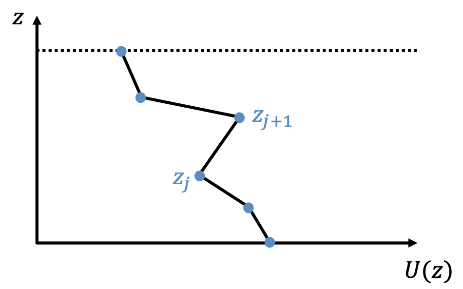
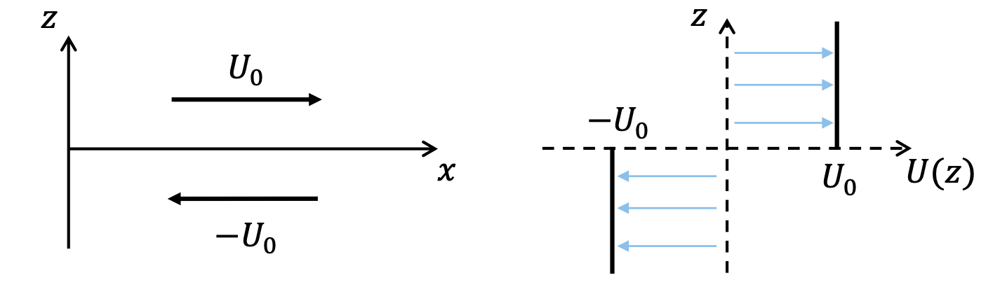
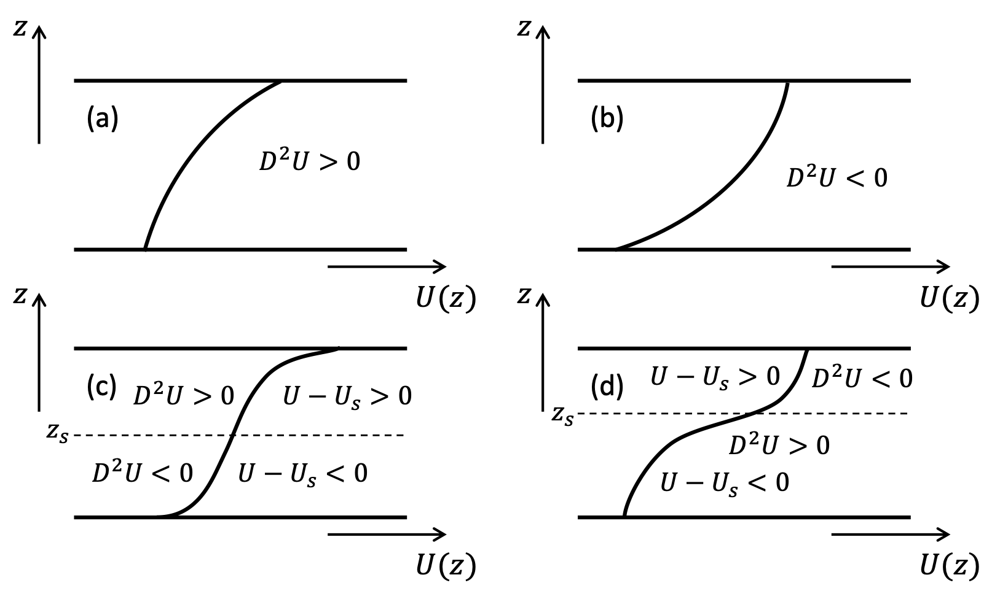

# Instabilities {#sec-chap:instab}

## Overview

What flows occur in nature? Of course, any flow we observe must be a solutions of the governing equations subject to suitable initial and boundary conditions but the flow must also be stable. That is, it must be able to persist when perturbed by the disturbances that inevitably arise in the oceans and atmosphere. The idea of stability is true outside of fluid mechanics too. A common example is consider a ball at rest in the bottom of a valley; if the ball is displaced a small amount it will eventually return to rest at the bottom of the valley -- the configuration is *stable*. Whereas, if we consider a ball at rest on top of a hill, a small displacement will cause the ball to run away and so this configuration is *unstable*.

In any stability problem there are two stages we must consider. First, we must identify a solution of the governing equations -- the *"basic state"* and then second we consider perturbations to this state. The size of the perturbation is important. If a basic state can be shown to be stable to *all* perturbations of whatever size, then the solution is globally (or nonlinearly) stable. However, it is difficult to show such results and so most stability theory (and everything we cover in this course) concerns the study of infinitesimally small perturbations. For such small perturbations, nonlinear products of perturbations can be neglected and we are left with linear perturbation equations. We can then determine if perturbations grow (exponentially) or decay (or oscillate). If there exists at least one growing perturbation, then the system in linearly unstable. If *all* perturbations decay then the system is linearly stable.

::: {.callout-note appearance="simple"}
Sentence on limitations?
:::

### Recall Kelvin-Helmholtz instability

 Recap KH in what form?

## Parallel shear flow instabilities

Kelvin Helmholtz is an example of a shear flow instability. In this section we will consider the instability of shear flows in more depth. Our motivation for this is that not only are shear flow instabilities a classical problem in hydrodynamics but they have close connections to our interests in geophysical fluid dynamics. Firstly, they are an example of a so-called *barotropic instability* which are common in both the atmosphere and ocean (broadly, a barotropic instability occurs when a flow is unstable because of horizontal shear, rather than due to gravity, or buoyancy, say). Secondly, shear flow instability is analogous to so-called *baroclinic instability* which is the main instability that results in the weather systems that occur in the atmosphere.
 
We will be concerned with unidirectional shear flow, that is, flow in one direction that is dependent on another direction: 
$$
 \Ub = U(z)\eb_x.
$$ {#eq-basicstate}
 For simplicity, we will consider the case of a constant density (so no buoyancy effects), inviscid fluid. The governing equations are therefore Euler's equations:
$$
 \frac{\partial \ub}{\partial t} + (\ub\cdot\grad)\ub = -\frac{1}{\rho_0}\nabla p, $$ {#eq-goveqinstability1}
$$
 \nabla\cdot\ub = 0. 
$$ {#eq-goveqinstability2}

We take the unidirectional shear flow (@eq-basicstate) as our basic state along with constant pressure: $P=\text{const}$ (exercise: check this is a solution of the governing equations). Then, let's perturb the basic state and set $\ub (\xb,t)=\Ub(z)+\ub '(\xb,t)$, $p(\xb,t)=P + p'(\xb,t)$, where primed quantities are small perturbations to the basic state.

At this stage, we will restrict ourselves to two-dimensional flow independent of $y$, i.e., 
$$
\ub'(\xb,t) = u'(x,z,t)\eb_x + w'(x,z,t)\eb_z, \quad p'(\xb,t) = p'(x,z,t).
$$ {#eq-perturb}
This will make our analysis neater partly because it allows us to introduce a streamfunction. However, it turns out (though we won't prove this here) that for unidirectional shear flows, the most unstable perturbations are two-dimensional anyway.

Substituting @eq-perturb into @eq-goveqinstability1 and @eq-goveqinstability2 and writing out in component form gives:
$$
 \frac{\partial u'}{\partial t} + U\frac{\partial u'}{\partial x'} + w\frac{\mathrm{d}U}{\mathrm{d}z}  = -\frac{\partial p'}{\partial x}, 
$$ {#eq-componentform1}
$$
 \frac{\partial w'}{\partial t} + U\frac{\partial w'}{\partial x'}  = -\frac{\partial p'}{\partial z},
$$ {#eq-componentform2}
$$
 \frac{\partial u'}{\partial x} + \frac{\partial w'}{\partial z} = 0, 
$$ {#eq-componentform3}
where we have neglected products of perturbation quantities and so these equations are linear equations for $u'$, $w'$ and $p'$. We therefore seek normal mode solutions of the form
$$
u'(x,z,t) = \mathcal{R}e \{\hat u(z) \exp(ik(x-ct)) \}, 
$$ {#eq-normalmodel1}
$$
w'(x,z,t) = \mathcal{R}e \{\hat w(z)  \exp(ik(x-ct)) \}, 
$$ {#eq-normalmodel2}
$$
p'(x,z,t) =  \mathcal{R}e \{  \hat p(z) \exp(ik(x-ct)) \},
$$ {#eq-normalmodel3}
where $c=c_r + i c_i$ is the (possibly complex) wavespeed. The growth rate of these modes is given by $\sigma = -ik(c_r+ic_i) = -ikc_r + kc_i$, so that in particular, the modes grow exponentially if $\mathcal{R}e(\sigma)=kc_i>0$ and decay if $\mathcal{R}e(\sigma) = kc_i<0$. In other words, the mode is stable if $kc_i\leq 0$ and unstable if $kc_i>0$.

Then, substituting ([-@eq-normalmodel1])-([-@eq-normalmodel3]) into ([-@eq-componentform1])-([-@eq-componentform3]) gives:
$$
-ikc\hat u + ikU\hat u +DU \hat w = -ik \hat p,
$$ {#eq-normalmodeu}
$$
-ikc\hat w + ikU\hat w = -\ddz{\hat p},
$$ {#eq-normalmodew}
$$
ik\hat u + \ddz{\hat w} = 0, 
$$ {#eq-normalmodedivu}
where we have introduced $D\equiv\ddz{}$ to denote the $z$-derivative of a basic state quantity. Now we can make us of the 2D nature of our perturbations and define a streamfunction $\psi(x,z,t)$ that satisfies $u=\frac{\partial \psi}{\partial z}$, $w=-\frac{\partial \psi}{\partial x}$. Then, assuming the normal mode ansatz carries over to the streamfunction, we have that $\hat u =\ddz{\hat\psi}$ and $\hat w =-ik\hat\psi$. Note these automatically satisfy @eq-normalmodedivu. Writing @eq-normalmodeu and @eq-normalmodew in terms of the streamfunction gives
$$
ik(U-c)\ddz{\hat\psi} - DU ik \hat \psi  = -ik\hat p, 
$$ {#eq-normalmode_a}
$$
k^2(U-c)\hat \psi = -\ddz{\hat p}. 
$$ {#eq-normalmode_b}

@eq-normalmode_a then gives $-\hat p = (U-c)\ddz{\hat\psi} - DU\hat \psi$ which can be used in @eq-normalmode_b to yield
\begin{align*}
k^2(U-c)\hat\psi & = \ddz{}\left( (U-c)\ddz{\hat\psi} -DU\hat\psi \right) \\
& = (U-c)\frac{\mathrm{d}^2}{\mathrm{d}z^2}\hat\psi -D^2U\hat \psi,
\end{align*}
where $D=\frac{\mathrm{d}^2 \hat\psi}{\mathrm{d}z^2}$. This equation can be rearranged to arrive at **Rayleigh's equation**
$$
\frac{\mathrm{d}^2 \hat\psi}{\mathrm{d}z^2} - k^2\hat\psi -\frac{D^2U}{U-c} \hat \psi = 0.
$$ {#eq-Rayleighs}

This is a second-order differential equation and so two boundary conditions are required to fully specify the system. We take these to be either:

1. $\hat w = 0$ at $z=z_1, z_2$ $\Rightarrow$ $\hat \psi = 0$ at $z=z_1, z_2$ for impermeable boundaries at $z=z_1, z_2$, or

2. $|\hat w| = 0$ as $|z| \rightarrow \infty$ $\Rightarrow$ $|\hat \psi| \rightarrow \infty$ as $|z| \rightarrow \infty$ for an unbounded system.

@eq-Rayleighs is clearly unchanged if we take $k$ to $-k$ and so without loss of generality, we may take $k\geq0$. In this case, there is instability is $c_i>0$.

If $\hat\psi$ is a solution of @eq-Rayleighs with eigenvalue $c$, then $\hat\psi^*$ is also a solution (with eigenvalue $c^*$). To see this, take the complex conjugate of @eq-Rayleighs to get
$$\frac{\mathrm{d}^2 \hat\psi^*}{\mathrm{d}z^2} - k^2\hat\psi^* -\frac{D^2U}{U-c^*} \hat \psi^* = 0. $$ 
So for each unstable mode there is a corresponding stable mode and therefore the "most stable" this system can be is neutrally stable, i.e., $c_i=0$. This is a result of considering the inviscid system.

::: {.callout-note appearance="simple"}
Note that @eq-Rayleighs has a regular singular point if $c = U(z)$ for some $z$ in the domain – this is called a “critical layer”. It complicates the analysis if we were attempting to solve Rayleigh’s equation in general. However, the singularity can only occur if $c$ is real, and so it is not so important when considering conditions for instability (since we must have $c_i\neq0$ for instability).
:::

### Piecewise linear profiles

{#fig-piecewise width=50%}

Although Rayleigh's equation is linear, it can be quite tricky to solve analytically for arbitrary smooth $U(z)$. However, we can make progress if we consider piecewise linear flows in which $DU$ is constant over some interval (see @fig-piecewise) since then $D^2U=0$ in each region and Rayleigh's equation becomes $\frac{\mathrm{d}^2 \hat\psi}{\mathrm{d}z^2} - k^2\hat\psi=0$. 

In each region we can write $U(z) = a_j z + b_j$, $z_j\leq z \leq z_{j+1}$ and the general solution of Rayleigh's equation in each region is $\hat\psi_j = A_je^{kz} + B_je^{-kz}$. The idea then is to find the constants $A_j$ and $B_j$ in each region by applying appropriate matching conditions between adjacent regions but what should these matching conditions be? We have two constants to determine in each case, so we require two conditions:

1. The first comes form the fact that the full version of Rayleigh's equation, i.e., @eq-Rayleighs must be valid everywhere. Note we cannot just use the reduced version as that equation is not valid at the interfaces themselves. Note @eq-Rayleighs  can be written as 
$$
\ddz{}\left( (U-c)\ddz{\hat\psi} - DU\hat\psi\right) - k^2(U-c)\hat\psi = 0.
$$
Now suppose that at $z=z_0$, $U$ or $DU$ is discontinuous and integrate across the interface at $z_0$, i.e., from $z_o-\epsilon$ to $z_0+\epsilon$ and let $\epsilon\rightarrow 0$:
$$
\left[ (U-c)\ddz{\hat\psi} - DU\hat \psi \right]_{z_0-\epsilon}^{z+\epsilon} - k^2\int_{z_0-\epsilon}^{z+\epsilon}(U-c)\hat\psi \, dz = 0 $$
Now let $\epsilon\rightarrow 0$. Since $(U-c)\hat\psi$ is finite (though possibly discontinuous), then integral goes to zero as $\epsilon\rightarrow 0$. It follows that
$$
(U-c)\ddz{\hat\psi} - DU\hat \psi \quad \text{must be continuous at $z=z_0$}.
$$
This is our first condition.

::: {.callout-note appearance="simple"}
Note this condition is the equivalent of saying that the pressure must be continuous at $z=z_0$ [PROBLEM SHEET?]. However, in more complicated systems, it is better to integrate the governing equation across the interface, as above.
:::

2.  The second condition comes from imposing continuity of the perturbed interface. Suppose the surface $z=z_0$ is perturbed to $z=z_0+\zeta(x,t)$ where $\zeta=\zeta_0 \exp(ik(x-ct))$ then 
\begin{align*}
w & =\frac{Dz}{Dt} = \frac{D\zeta}{Dt} = \left(\frac{\partial}{\partial t} + U\frac{\partial}{\partial x}\right)\zeta = (-ikc+ikU)\zeta_0\exp(ik(x-ct)) \quad \text{and}\\
w & = \hat w \exp(ik(x-ct)) = -ik\hat\psi \exp(ik(x-ct)) ).
\end{align*}
Hence 
$$ \zeta_0 = -\frac{ik\hat\psi}{-ikc+ikU}= -\frac{\hat\psi}{U-c} $$
and continuity of the perturbed interface implies that
$$
\frac{\hat\psi}{U-c} \quad \text{must be continuous at $z=z_0$}.
$$
This is our second condition. Note if $U$ is continuous across the interface then this condition becomes the condition that $\hat\psi$ must be continuous across the interface.

In summary, for piecewise linear flows we have

1. $\frac{\mathrm{d}^2 \hat\psi}{\mathrm{d}z^2}  - k^2\hat\psi = 0 \Rightarrow \hat\psi = Ae^{kz} + Be^{-kz}$ in each region.

2. At each interface we must have continuity of $(U-c)\ddz{\hat\psi} - DU\hat \psi$ and 
$\frac{\hat\psi}{U-c}$.

3. There are two boundary (or infinity) conditions to fully specify the problem.

::: {.callout-tip icon="false"}
## Example: Kelvin Helmholtz instability of unbounded vortex sheet

Consider the flow
$$ U(z) = \begin{cases}
    U_0, & \text{if } z>0\\
    -U_0, & \text{if } z<0
\end{cases}
$$
with constant density $\rho=\rho_0$ (see @fig-KH_unbounded).

{#fig-KH_unbounded width=98%}

We solve $\frac{d^2\hat\psi_i}{dz^2} - k^2\hat\psi_i =0$ for $i=1,2$. Hence $\hat\psi_i = A_ie^{kz} + B_ie^{-kz}$. Let us assume (without loss of generality) that $k>0$ and since we wish for our solutions to remain bounded as $|z|\rightarrow \infty$, we have
$$ \hat\psi_i(z) = \begin{cases}
A_0e^{lz},  & \text{if } z>0\\
 B_1e^{-kz}, & \text{if } z<0.
 \end{cases}
$$
We next apply the interface conditions (at $z=0$). The first interface condition gives:
$$ \left[(U-c)\frac{d\hat\psi}{dz}\right]_1 = \left[(U-c)\frac{d\hat\psi}{dz}\right]_2 $$
$$ \Rightarrow \, (-U_0-c)\frac{d\hat\psi}{dz} \bigg |_1 = (U_0-c)\frac{d\hat\psi}{dz} \bigg |_2 $$
$$ \Rightarrow \, -(U_0+c)kA_0e^{kz_0}  = -(U_0-c)kB_1e^{-kz_0} $$
$$
 \Rightarrow \, -(U_0+c)A_0  = -(U_0-c)B_1 
$$ {#eq-interfacecondeg1}

The second interface condition gives:
$$ \left[\frac{\hat\psi}{U-c}\right]_1 = \left[\frac{\hat\psi}{U-c}\right]_2 $$
$$ \Rightarrow \,\frac{1}{-U_0-c}A_0e^{kz_0} =\frac{1}{U_0-c}B_1e^{-kz_0} $$
$$
 \Rightarrow \, -\frac{A_0}{U_0+c}  = \frac{B_1}{U_0-c} 
$$ {#eq-interfacecondeg2}

The two interface conditions @eq-interfacecondeg1 and @eq-interfacecondeg2 together imply
\begin{align*}
&\frac{(U_0+c)^2B_1}{U_0-c} = -(U_0-c)B_1, \\
\Rightarrow \,&(U_0+c)^2 = -(U_0 - c)^2 \quad\quad (B_1\neq0),   \\
\Rightarrow \,&U_0^2 = -c^2,  \\
\Rightarrow \,& c = \pm iU_0.
\end{align*}

Recall for $k>0$, we have instability is $c_i>0$ and so here we have instability for all $U_0\neq 0$. The growth rate is $\sigma = kc_i = kU_0$ and so the modes with largest $k$ (shortest wavelength) grow the fastest. In reality, viscosity would prevent instability occurring for all modes both by forbidding discontinuous $U(z)$ and by damping small-scale disturbances.

Refer back to KH from earlier section here or FMIII?

:::

::: {.callout-note appearance="simple"}
There is no loss of generality from having a symmetric base state such as this one as we can always make a Galilean transformation to obtain this symmetric base state (see problem sheet?)
:::

::: {.callout-note appearance="simple"}
Remark on physical interpretation of KHI of vortex sheet?
:::

::: {.callout-note appearance="simple"}
See problem sheet for stability of plane Couette flow and an unbounded shear layer.
:::

### Rayleigh's Inflection Point Criterion

As noted above, Rayleigh's equation can be difficult to solve analytically for smooth velocity profiles. However, it is possible to derive some results that give us some indication as to when a continuous profile might be unstable. We begin with *Rayleigh's Inflection Point Criterion* which is a necessary condition for instability.
It says that, for a flow $U(z)\eb_x$ between rigid planes at $z=z_1$ and $z=z_2$, a necessary condition for instability is that $U(z)$ must have an inflection point in $z_1<z<z_2$ (i.e., a place where $D^2U$ changes sign).

**Proof.** To see this we multiply @eq-Rayleighs by $\hat\psi^*$ and integrate over the domain:
$$
\int_{z_1}^{z_2} \hat\psi^*\frac{\mathrm{d}^2 \hat\psi}{\mathrm{d}z^2} \, dz - k^2\int_{z_1}^{z_2} |\hat\psi|^2 \, dz - \int_{z_1}^{z_2} \frac{D^2U}{U-c}|\hat\psi|^2 \, dz =0.
$$ {#eq-RIPCproof1}
Now, using integration by parts, the first term becomes
$$ \int_{z_1}^{z_2} \hat\psi^*\frac{\mathrm{d}^2 \hat\psi}{\mathrm{d}z^2} \, dz = \left[ \hat\psi^* \ddz{\hat\psi} \right]^{z_2}_{z_1} - \int_{z_1}^{z_2} \bigg |\ddz{\hat\psi}\bigg |^2 \, dz = -\int_{z_1}^{z_2} \bigg |\ddz{\hat\psi} \bigg |^2\, dz,$$
where the boundary term goes to zero because of the impermeability boundary conditions. Hence @eq-RIPCproof1 can be written as
$$
\int_{z_1}^{z_2} \left( \bigg |\ddz{\hat\psi} \bigg |^2 +  k^2 |\hat\psi|^2 \right) \, dz + \int_{z_1}^{z_2} \frac{D^2U}{U-c}|\hat\psi|^2 \, dz =0.
$$ {#eq-RIPCproof2}
Next, consider the imaginary part of @eq-RIPCproof2. Note the first term is purely real so we just need the imaginary part of the second term. This is easiest found if we multiply top and bottom by $U-c^*$, i.e.,
$$ \int_{z_1}^{z_2} \frac{D^2U}{U-c}|\hat\psi|^2 \, dz  =  \int_{z_1}^{z_2} \frac{D^2U(U-(c_r-ic_i)}{|U-c|^2}|\hat\psi|^2 \, dz $$
$$
 = \int_{z_1}^{z_2} \frac{D^2U(U-c_r)}{|U-c|^2}|\hat\psi|^2 \, dz + i \int_{z_1}^{z_2} \frac{D^2Uc_i}{|U-c|^2}|\hat\psi|^2 \, dz. 
$$ {#eq-RIPCproof3}
So the imaginary part of @eq-RIPCproof2 is given by 
$$
c_i\int_{z_1}^{z_2} \frac{D^2U}{|U-c|^2}|\hat\psi|^2 \, dz = 0.
$$ {#eq-RIPCproof4}

Now, recall for instability we have $c_i\neq0$ and so it follows that $D^2U$ must change sign at least once in $(z_1,z_2)$, i.e., $U(z)$ has an inflection point in $(z_1,z_2)$ and we are done.

::: {.callout-note appearance="simple"}
This is a one way implication, instability implies the flow has an inflection point. It is not true the other way around -- a flow can have an inflection point and be stable.
:::

::: {.callout-note appearance="simple"}
This result is very useful because it tells us if the flow does not have an inflection point then the flow must be stable.
:::

### Fjørtoft's Criterion
There is a stronger form of Rayleigh's Inflection Point Criterion known as *Fjørtoft's Criterion* and this says:
A necessary condition for instability is that $D^2U(U-U_s)<0$ somewhere in the flow, where $z_s$ is a point as which $D^2U=0$ and $U_s=U(z_s)$.

**Proof.** Here we use the real part of @eq-RIPCproof2 and using @eq-RIPCproof3, we see that it is given by
$$\int_{z_1}^{z_2} \left( \bigg |\ddz{\hat\psi} \bigg |^2 +  k^2 |\hat\psi|^2 \right) \, dz +\int_{z_1}^{z_2} \frac{D^2U(U-c_r)}{|U-c|^2}|\hat\psi|^2 \, dz =0. $$

The trick then is to add to this $(c_r-U_s)\int_{z_1}^{z_2} \frac{D^2U}{|U-c|^2}|\hat\psi|^2 \, dz$ which we know is equal to zero from (\ref{eq:RIPCproof4}):
\begin{align*}
 &\int_{z_1}^{z_2} \left(\bigg |\ddz{\hat\psi} \bigg |^2 +  k^2 |\hat\psi|^2\right) \, dz +\int_{z_1}^{z_2} \frac{D^2U(U-c_r+c_r-U_s)}{|U-c|^2}|\hat\psi|^2 \, dz = 0 \\
 \Rightarrow &\int_{z_1}^{z_2} \frac{D^2U(U-U_s)}{|U-c|^2}|\hat\psi|^2 \, dz  = - \int_{z_1}^{z_2} \left( \bigg |\ddz{\hat\psi} \bigg|^2 +  k^2 |\hat\psi|^2\right) \, dz <0,
\end{align*}
and the result follows.

::: {.callout-note appearance="simple"}
Again this is a necessary condition, not sufficient. If $D^2U(U-U_s)<0$ somewhere, the flow could be stable or unstable
:::

::: {.callout-tip icon="false"}
## Example

Are the following basic state flow profiles stable or unstable?

{width=98%}

The flows in (a) and (b) do not contain an inflection point and are therefore stable by Rayleigh's inflection point criterion.

The flow in (c) contains an inflection point and so is possibly unstable by Rayleigh's criterion. However, $D^2U(U-U_s)\geq0$ everywhere and therefore the flow is stable by Fjørtoft's criterion.

The flow in (d) contains an inflection point and so is possibly unstable by Rayleigh's criterion. In addition, $D^2U(U-U_s)<0$ somewhere in the flow and therefore it is also possibly unstable by Fjørtoft's criterion but we cannot say anymore than that.
:::

## Baroclinic instability

**Baroclinic instability** is an instability that occurs in stably stratified and rotating fluids. It occurs in the atmosphere of the Earth and oceans and brings about the weather patterns we experience, it is therefore an instability that has many important consequences for us.

The instability comes around when potential energy is released when fluid parcels move along a sloping path. How can such a situation arise in a stably stratified fluid? Well, let's consider a layer in which the density not only decreases with height (stably stratified) but in which the density increases in the horizontal (or polewards) direction (see @fig-Baroclinic). Then consider moving the fluid parcel at A upwards (to B), then since the fluid is stably stratified, the fluid parcel will be denser that its surroundings and will sink back down. However, instead consider moving the fluid parcel at A to C, in this case, A will be less dense than its surroundings and therefore buoyant so the parcel will continue to rise. A small perturbation like this one can grow into a larger one an instability occurs.

{#fig-Baroclinic width=98%}

This parcel argument allows us to see a mechanism by which an instability can occur. In the next section, we explore baroclinic instability further by performing a stability analysis of the governing equations.

### Linear quasi-geostrophic equations

We can use equations we have already seen in order to examine baroclinic instability. In particular, we use the QG potential vorticity equation derived in section ... for the fluid interior and we will use the buoyancy equation ... with $w=0$ for the two vertical boundaries at $z=0$ and $z=H$, i.e.,
$$
\frac{\partial q}{\partial t} + \vb\cdot\nabla_H q = 0 \quad\quad 0<z<H
$$
where $q=\nabla_H^2 \psi + \beta y + \frac{\partial}{\partial z} \left(F \frac{\partial \psi}{\partial z} \right)$ with $F=\frac{f_0^2}{N^2}$, and
$$
\frac{\partial b}{\partial t} + \vb\cdot\nabla_H b = 0 \quad\quad z=0, H
$$
with $b=f_0\frac{\partial\psi}{\partial z}$.

A steady, basic state solution to these equations is a purely zonal flow $\Ub = U(y,z)\eb_x=-\frac{\partial \Psi}{\partial y} \eb_x$ where $\Psi$ is the streamfunction of the basic state velocity. The basic state buoyancy follows from thermal wind balance ( refer back to this in QG section?), i.e., $B=f_0\frac{\partial\Psi}{\partial z}$. The basic state potential vorticity is then $Q=\frac{\partial^2 \Psi}{\partial y}^2 + \beta y + \frac{\partial}{\partial z} \left(F \frac{\partial \Psi}{\partial z} \right)$.

Perturbing about this basic state and linearising in the usual way we arrive at the linear PV equation for the interior,
$$
\frac{\partial q'}{\partial t} + U\frac{\partial q'}{\partial x} + v'\frac{\partial Q}{\partial y} = 0  \quad\quad 0<z<H,
$$ {#eq-linearQGPV}
where $q'=\nabla_H^2 \psi' + \frac{\partial}{\partial z} \left(F \frac{\partial \psi'}{\partial z} \right)$ and $v'=\frac{\partial v'}{\partial x}$. The linearised buoyancy equation at the boundary becomes
$$
\frac{\partial b'}{\partial t} + U\frac{\partial b'}{\partial x} + v'\frac{\partial B}{\partial y} = 0  \quad\quad z=0,H
$$ {#eq-linQGbuoy}
with $b'=f_0\frac{\partial\psi'}{\partial z}$.

Proceeding in the standard way, we seek normal mode solutions. Since the basic state solution depends on $y$ and $z$ but not $x$, we can seek solutions of the form
$$
\psi'(x,y,z,t) = \mathcal{R}e \left\{ \hat\psi(y,z)e^{ik(x-ct)} \right\}
$$
from which it follows that 
\begin{align*}
b'(x,y,z,t) &= \mathcal{R}e  \left\{ f_0\frac{\partial \hat\psi}{\partial z}e^{ik(x-ct)}  \right\},\\
v'(x,y,z,t) &= \mathcal{R}e  \left\{ ik\hat\psi e^{ik(x-ct)}  \right\},\\
q'(x,y,z,t) &= \mathcal{R}e  \left \{ \left(-k^2\hat\psi + \frac{\partial^2 \hat\psi}{\partial y^2} + \frac{\partial}{\partial z}\left(F\frac{\partial \hat\psi}{\partial z}\right) \right)e^{ik(x-ct)}  \right\}.
\end{align*}

Substituting these into @eq-linearQGPV} gives
\begin{align*}
&-ikc \left( -k^2\hat\psi + \frac{\partial^2 \hat\psi}{\partial y^2} + \frac{\partial}{\partial z}\left(F\frac{\partial \hat\psi}{\partial z}\right) \right) + Uik \left( -k^2\hat\psi + \frac{\partial^2 \hat\psi}{\partial y^2} + \frac{\partial}{\partial z}\left(F\frac{\partial \hat\psi}{\partial z}\right) \right) + ik\hat\psi\frac{\partial Q}{\partial y} = 0,\\
\Rightarrow &(U-c)\left( -k^2\hat\psi + \frac{\partial^2 \hat\psi}{\partial y^2} + \frac{\partial}{\partial z}\left(F\frac{\partial \hat\psi}{\partial z}\right) \right) +\hat\psi\frac{\partial Q}{\partial y} = 0.
\end{align*}

Substituting these into @eq-linQGbuoy gives
\begin{align*}
&-ikc f_0 \frac{\partial \hat \psi}{\partial z} + Uikf_0  \frac{\partial \hat \psi}{\partial z}  + ik\hat\psi \frac{\partial B}{\partial y}= 0,\\
\Rightarrow &(U-c) \frac{\partial \hat\psi}{\partial z} - \frac{\partial U}{\partial z}\hat \psi = 0.
\end{align*}

These equations are analogous to Rayleigh's equation for parallel shear show (@eq-Rayleighs) and highlight the similarities between baroclinic instability and parallel shear flow instabilities.

::: {.callout-note appearance="simple"}
In much the same way as was done for Rayleigh's Inflection Point Criterion, necessary conditions for baroclinic instability may be derived (see problem sheet).
:::

