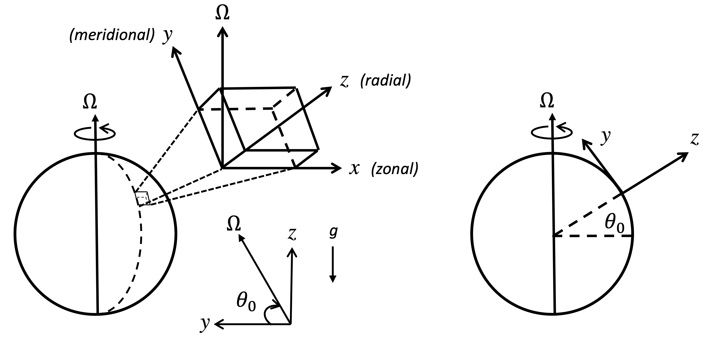
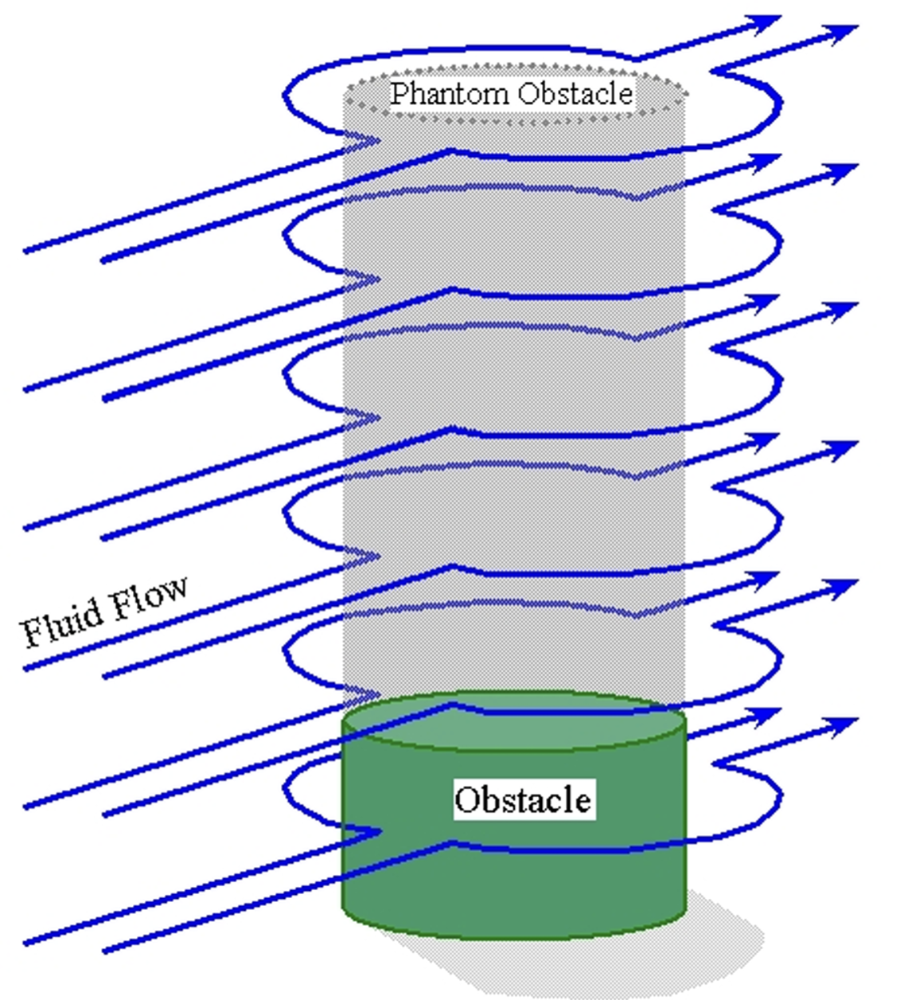

# Rotating fluids {#sec-chap:rotation}

Newton's second law applies in an inertial (non-accelerating) frame of reference but the Earth rotates (i.e., it is not an inertial frame of reference). Considering that we observe and measure everything from Earth's surface, it is useful to describe flows relative to Earth's surface rather than some inertial frame and therefore we need to recast our governing equations into a form appropriate for a rotating frame of reference.

## Rotating reference frame
Consider an inertial frame of reference $\mathrm{I}$, described by orthogonal basis vectors $\eb_1$, $\eb_2$ and $\eb_3$ and a second frame of reference $\mathrm{R}$ described by orthogonal basis vectors $\hat\eb_1$, $\hat\eb_2$ and $\hat\eb_3$ which is rotating with angular velocity $\Omb$ relative to $\mathrm{I}$. If we define $\left(\ddt{}\right)_\mathrm{I}$ to be a derivative with respective to time in the inertial frame, then clearly we have that $\left(\ddt{\eb_j}\right)_\mathrm{I}=0$ but $\left(\ddt{\hat\eb_j}\right)_\mathrm{I}\neq0$ because $\hat\eb_j$ is rotating relative to our inertial frame.

Now, consider a vector $\Cb$ of constant length that is rotating relative to the inertial frame at a constant angular velocity $\Omb$. It follows that, in the rotating frame $R$, $\Cb$ appears stationary, i.e., $\left(\ddt{\Cb}\right)_\mathrm{R}=0$ where now $\left(\ddt{}\right)_\mathrm{R}$ is a derivative taken in the rotating frame of reference. We want to know how this vector appear to change in time if observed from the inertial frame, i.e., what is $\left(\ddt{\Cb}\right)_\mathrm{I}$?

Consider a small interval of time $\delta t$ over which $\Cb$ rotates through a small angle $\delta \lambda$ (see @fig-rotframe). Then, the change in $\Cb$ as observed in the inertial frame is
$$ \delta\Cb = |\Cb|\sin\gamma\delta\lambda \eb_n $$
where $\gamma$ is the angle between $\Omb$ and $\Cb$, and $\hat n$ is the unit vector in the direction of the change of $\Cb$ (perpendicular to both $\Omb$ and $\Cb$). But the change in $\lambda$ is easily obtained from the angular velocity, in particular we have $\delta \lambda = |\Omb|\delta t$ and hence
$$ \delta \Cb = |\Cb||\Omb|\sin\gamma\delta t \eb_n = \Omb \times \Cb \delta t. $$
It follows that 
$$ \left( \ddt{\Cb}\right)_\mathrm{I} = \Omb\times\Cb. $$ {#eq-RtoI}

{#fig-rotframe width="50%"}

::: {.callout-tip icon="false"}
## Example

Consider the case where the rotating frame is rotating about the $\eb_3$ axis at a constant rate $\mathrm{\Omega}$. In this case basis vectors for the inertial frame and the rotating frame are related by
\begin{align*}
\hat\eb_1 &= \cos(\Omrm t)\eb_1 + \sin(\Omrm t)\eb_2, \quad \hat\eb_2 = -\sin(\Omrm t)\eb_1 + \cos(\Omrm t)\eb_2, \quad \hat\eb_3 = \eb_3,\\
\eb_1 &= \cos(\Omrm t)\hat\eb_1 - \sin(\Omrm t)\hat\eb_2, \quad \eb_2 = \sin(\Omrm t)\hat\eb_1 + \cos(\Omrm t)\hat\eb_2, \quad\quad \eb_3 = \hat\eb_3.
\end{align*}
Now, any vector $\ab$ can be expressed as 
\begin{align*}
\ab = a_j\eb_j &= a_1(\cos(\Omrm t)\hat\eb_1 - \sin(\Omrm t)\hat\eb_2) + a_2(\sin(\Omrm t)\hat\eb_1 + \cos(\Omrm t)\hat\eb_2) + a_3\hat\eb_3\\
& = (a_1\cos(\Omrm t) + a_2\sin(\Omrm t))\hat \eb_1 + (-a_1\sin(\Omrm t) + a_2\cos(\Omrm t))\hat \eb_2 + a_3\hat\eb_3 = \hat a_j \hat\eb_j,
\end{align*}
where $\hat a_1 = a_1\cos(\Omrm t) + a_2\sin(\Omrm t)$, $\hat a_2 = -a_1\sin(\Omrm t) + a_2\cos(\Omrm t)$ and $\hat a_3=a_3$. Note the coordinates $a_j$ and $\hat a_j$ are different but vector is the same.

We see that even simple trajectories can appear non-trivial in a rotating frame, e.g.,

- A stationary particle with position $\ab=(a_0,0,0)$ corresponds to $\hat\ab=(a_0\cos(\Omrm t), -a_0\sin(\Omrm t),0)$ in the rotating frame. This is a clockwise rotation with angular velocity $\Omrm$.
- A particle moving in a straight line at speed $v$ with position $\ab=(vt,0,0)$ in the inertial frame corresponds to $\hat\ab=(vt\cos(\Omrm t), -vt\sin(\Omrm t),0)$ in the rotating frame. This corresponds to a clockwise spiral.
 
Note that
\begin{align*}
\left(\ddt{\hat\eb_1} \right)_\mathrm{I} &= \ddt{}(\cos(\Omrm t)\eb_1 + \sin(\Omrm t)\eb_2) = -\Omrm\sin(\Omrm t)\eb_1 + \Omrm\cos(\Omrm t)\eb_2 = \Omrm\hat\eb_2\\
\left(\ddt{\hat\eb_2} \right)_\mathrm{I} &= \ddt{}(-\sin(\Omrm t)\eb_1 + \cos(\Omrm t)\eb_2) = -\Omrm\cos(\Omrm t)\eb_1 - \Omrm\sin(\Omrm t)\eb_2 = -\Omrm\hat\eb_1\\
\left(\ddt{\hat\eb_3} \right)_\mathrm{I} &= 0.
\end{align*}
Combining together, we can write 
$$ \left( \ddt{\hat\eb_j}\right)_\mathrm{I} = \Omb\times\hat\eb_j $$
which is expected from @eq-RtoI.

:::

Now let's consider a general vector $\Bb(t)=B_j(t){\hat\eb}_j$. In the rotating frame we have that 
$$ \left( \ddt{\Bb}\right)_\mathrm{R} = \ddt{}(B_j{\hat\eb}_j)_\mathrm{R} = \ddt{B_j}{\hat\eb}_j $$
since the ${\hat\eb}_j$ are stationary in the rotating frame. Note, there is no need to state which reference frame we differentiate the $B_j$ in since they are scalar functions.

In the inertial frame we have
\begin{align*}
\left( \ddt{\Bb}\right)_\mathrm{I} = \ddt{}(B_j{\hat\eb}_j)_\mathrm{I} &=  \ddt{B_j}{\hat\eb}_j + B_j\left(\ddt{\hat\eb_j}\right)_\mathrm{I}\\
& =  \left(\ddt{\Bb}\right)_\mathrm{R} + B_j\Omb\times\hat{\eb}_j\\
& =  \left(\ddt{\Bb}\right)_\mathrm{R} + \Omb\times(B_j\hat{\eb}_j)\\
& =  \left(\ddt{\Bb}\right)_\mathrm{R}  + \Omb\times\Bb.
\end{align*}
So, for any vector $\Bb$, we have
$$\left( \ddt{\Bb}\right)_\mathrm{I} =  \left(\ddt{\Bb}\right)_\mathrm{R}  + \Omb\times\Bb. $$ {#eq-rotframeref}

## Dynamics in a rotating frame

If we take $\Bb=\Xb$ in @eq-rotframeref to be the position vector of a fluid parcel, then we have that 
$$ \ub_\mathrm{I} = \ub_\mathrm{R} +  \Omb\times\Xb $$
where $\ub_\mathrm{I}$ is the perceived velocity in the inertial frame, and $\ub_\mathrm{R}$ is the perceived velocity in the rotating frame.

Then, to consider how accelerations are viewed in a rotating frame, put $\Bb=\ub_\mathrm{I}$ in @eq-rotframeref:
\begin{align*}
\left( \ddt{\ub}\right)_\mathrm{I} & =  \left(\ddt{\ub}\right)_\mathrm{R}  + \Omb\times\ub_\mathrm{I}\\
& = \left(\ddt{}(\ub_\mathrm{R}+  \Omb\times\Xb)\right)_\mathrm{R} + \Omb\times(\ub_\mathrm{R}+  \Omb\times\Xb)\\
& = \left(\ddt{\ub}\right)_\mathrm{R}+  \Omb\times\left(\ddt{\Xb}\right)_\mathrm{R} + \Omb\times\ub_\mathrm{R}+ \Omb\times(\Omb\times\Xb)\\
& = \left(\ddt{\ub}\right)_\mathrm{R}+  2\Omb\times\ub_\mathrm{R} + \Omb\times(\Omb\times\Xb).
\end{align*}
In an inertial frame Newton's law gives (for a fluid parcel of mass $m$)
$$
\left( \ddt{\ub}\right)_\mathrm{I} = \frac{1}{m}\Fb,
$$
so when viewed in a rotating frame, the same parcel obeys
$$
\left( \ddt{\ub}\right)_\mathrm{R} = \frac{1}{m}\Fb - 2\Omb\times\ub_\mathrm{R} - \Omb\times(\Omb\times\Xb).
$$

The extra "force" terms that appear on the right-hand-side are a result of working in a non-inertial reference frame. Since the forces are not real, they are often referred to as *fictitious* or *apparent* forces. The second term on the right-hand-side is known as the **Coriolis force**. If $\Omb$ points up (down), the Coriolis force deflects horizontally moving objects to the right (left) when observed in a rotating frame of reference.

The third term on the right-hand-side is known as the **Centrifugal force**. This force appears to push objects away from the rotation axis.

Now that we can treat accelerations appropriately, we can write down the momentum equation in a rotating frame of reference. We just need to replace $\DDt{\ub_\mathrm{I}}$ with
$$
\DDt{\ub_\mathrm{R}} + 2\Omb \times\ub_\mathrm{R} + \Omb\times(\Omb \times \Xb).
$$ {#eq-transformtorotframe}
For example, in the case of the Boussinesq equations, the momentum equation ([-@eq-Bousmom]) becomes
$$
\DDt{\ub_\mathrm{R}}  +2\Omb\times\ub_\mathrm{R} +\Omb\times(\Omb \times \Xb) = -\frac{1}{\bar\rho}\nabla p +b\eb_z.
$$

As density (or buoyancy) is a scalar, @eq-Bousdenistybuoy is unchanged in a rotating frame and therefore the Boussinesq equations in a rotating frame can be summarised as:

$$ \DDt{\ub}  + 2\Omb\times\ub +\Omb\times(\Omb \times \Xb) = -\frac{1}{\bar\rho}\nabla p +b\eb_z, $$ {#eq-Bousmomrot}
$$	\nabla\cdot\ub = 0,$$ {#eq-Bousdivu0rot}
$$ \DDt{b} +N^2(z)w=0,$$ {#eq-Bousdensityrot}
where we have dropped the subscript $\mathrm{R}$ from the velocity as we simply interpret $\ub$ in these equations to be the velocity in a rotating frame of reference.

::: {.callout-note appearance="simple"}
Here we have allowed for the effects of rotation by writing the (non-hydrostatic) Boussinesq momentum equation in a rotating reference frame. Note that other equation sets (e.g., the the shallow water, incompressible Navier-Stokes and hydrostatic Boussinesq equations) can be written in a rotating frame of reference in a similar way, i.e., by using @eq-transformtorotframe to incorporate the Coriolis and centrifugal forces in the momentum equations. We will make use of this in future sections.

:::

### Centrifugal force as a potential {#sec-centrifugalpotential}

A simplification to these equations can be made if we are able to write the centrifugal force as the gradient of a scalar potential that can then be combined with the pressure. To do this, we define a set of cylindrical polar coordinates $(s,\theta,z)$ in which the $z$-axis is aligned with the rotation axis, i.e., with $\Omb$. $s$ is then the perpendicular distance from the $z$-axis. Since in cylindrical polars, the position vector is given by $\Xb = s\eb_s+z\eb_z$ we have that
$$
\Omb\times(\Omb\times\Xb) = \Omrm\eb_z \times \Omrm s \eb_\theta = -\Omrm^2 s \eb_s,
$$
demonstrating that the centrifugal force $-\Omb\times(\Omb\times\Xb)$ pushes objects away from the rotation axis.
Now, we want to find a potential $\phi_c$ such that $\nabla \phi_c = \Omb\times(\Omb\times\Xb)$. It follows that
$$
\frac{\partial \phi_c}{\partial s} = -\Omrm^2s, \quad \quad \frac{\partial \phi_c}{\partial \theta} = \frac{\partial \phi_c}{\partial z} = 0,
$$
and hence $\phi_c = -\frac{\Omrm^2s^2}{2} = -\frac{1}{2}|\Omb \times \Xb|^2$.

Writing the centrifugal force as $-\Omb\times(\Omb\times\Xb) = -\nabla \phi_c$ allows us to simplify @eq-Bousmomrot to give
$$	\DDt{\ub}  +2\Omb\times\ub  = -\frac{1}{\bar\rho}\nabla p_r + b \eb_z,$$ {#eq-Bousmomrotpot}
where $p_r = p + \bar\rho\phi_c$.

::: {.callout-note appearance="simple"}
To simplify the notation we drop the subscript $r$ in the rest of this course, while we consider the modified pressure that includes the centrifugal effect.
:::

::: {.callout-note appearance="simple"}
Similar to centrifugal force, gravity can be formulated as a potential $\phi_g$ such that $\gb=-\nabla \phi_g$. Taking the Earth to be a perfect sphere of radius $r_e = 6371\mathrm{km}$ and mass $M=5.98\times10^{24}\mathrm{kg}$, Newton's law of gravitation gives $\phi_g = -GM/r$ where $G=6.67\times10^{-11}\mathrm{m^3kg^{-1}s^{-2}}$ is the gravitational constant. Then $\gb=\nabla(GM/r)=-(GmM/r^2)\eb_r$ (points radially inwards). At the Earth's surface $|\gb|=GM/r_e^2=9.82\mathrm{ms^{-2}}$. If the height (depth) changes are small enough, we can assume that $\gb$ is locally constant, which is what we consider for the rest of this course. However, if in an application dynamics takes place in a thick layer of fluid, the variation of $\gb$ should be properly taken into account.
:::

## Tangent-plane approximation {#sec-tang_plane_approx}

To study the fluid dynamics of oceans and atmospheres, it is convenient to work in a frame of reference rotating with the planet. In this course, our model planet will be the Earth. The spherical geometry of Earth can influence the dynamics of flows and make studying them more involved. However, the sphericity of the Earth is not always as important as its rotation. In this case, it is more convenient to use a locally Cartesian model and introduce two approximations.

In spherical polar coordinates $(r,\theta,\phi)$ where $r$ is a radial coordinate, $\theta$ is the latitude (angle measured northwards from the equator) and $\phi$ is the longitutde we have that
\begin{equation}
\Omb = \Omrm\sin\theta\eb_r + \Omrm\cos\theta \eb_\theta.
\end{equation}
That is, $\Omb$ in its most general form has a radially (locally vertical) and a meridional (locally horizontal) component which both depend on latitude $\theta$. However, if we limit the dynamics to a region where the changes in $\theta$ are small, we can make a set of simplifications. We define a plane tangent to the surface of the Earth at a latitude $\theta_0$ and use a Cartesian system to define the motion (see figure \ref{fig:Tangent_plane}). We take the $z$-axis to point in the direction of $-\nabla\Phi$ and write $-\nabla\Phi=g\eb_z$ where $g$ is taken to be constant over the depth of the (thin) layer. $x$ is taken to point eastwards and $y$ northwards. We define $y=0$ at $\theta=\theta_0$.

{#fig-Tangent_plane
width="90%"}

Since the geopotential force is directed almost radially inwards, we take $\eb_r\approx\eb_z$ and $\eb_\theta\approx\eb_y$ at $\theta=\theta_0$ and we make the approximation
$$
\Omb=\Omrm\sin\theta\eb_r+\Omrm\cos\theta\eb_\theta \approx \Omrm\sin\theta\eb_z+\Omrm\cos\theta\eb_y.
$$
For small $\theta-\theta_0$, $y\approx r_e(\theta-\theta_0)$ and so we have that
\begin{align*}
\sin\theta&=\sin(\theta+(\theta-\theta_0)) =\sin\theta_0 + (\theta-\theta_0)\cos\theta_0 + O((\theta-\theta_0)^2) \approx \sin\theta_0 +\frac{\cos\theta_0}{r_e}y\\
\cos\theta&=\cos(\theta+(\theta-\theta_0)) = \cos\theta_0 - (\theta-\theta_0)\sin\theta_0 + O((\theta-\theta_0)^2) \approx \cos\theta_0 -\frac{\sin\theta_0}{r_e}y.
\end{align*}
Hence we write $\Omb = \Omrm_z\eb_z + \Omrm_y\eb_y$ where
\begin{align*}
\Omrm_z&=\Omrm\sin\theta_0+\frac{\Omrm\cos\theta_0}{r_e}y\\
\Omrm_y&=\Omrm\cos\theta_0-\frac{\Omrm\sin\theta_0}{r_e}y.
\end{align*}

The Coriolis force $2\Omb\times \ub$ can then be written as
$$
2\Omb\times \ub = (2\Omrm_y w - 2\Omrm_z v, 2\Omrm_z u, -2\Omrm_y u)
$$
Hence the Cartesian components of momentum equations under the tangent plane approximation are:
$$ \DDt{u} + 2(\Omrm_yw-\Omrm_zv) = -\frac{1}{\rho}\frac{\partial p}{\partial x} $$ {#eq-tangentplaneu}
$$ \DDt{v} + 2\Omrm_z u = -\frac{1}{\rho}\frac{\partial p}{\partial y} $$ {#eq-tangentplanev}
$$\DDt{w}  -2\Omrm_y u = -\frac{1}{\rho}\frac{\partial p}{\partial z} -g. $$ {#eq-tangentplanew}

If we further assume that the layer is thin then the vertical flow speed is much smaller than the horizontal flow speeds, i.e., $|w| \ll |u| \text{ and } |v|$. We can therefore drop the $\Omrm_y w$ term in @eq-tangentplaneu. Then, to ensure energy is still conserved we must then also drop the $-\Omrm_y u$ term from @eq-tangentplanew although in someways this is less physically justified. This leads to the following set of equations:
\begin{align}
\DDt{u} -fv &= -\frac{1}{\rho}\frac{\partial p}{\partial x} \\
\DDt{v} + fu &= -\frac{1}{\rho}\frac{\partial p}{\partial y} \\
\DDt{w}   &= -\frac{1}{\rho}\frac{\partial p}{\partial z} -g,
\end{align}
where we have introduced $f=2\Omrm_z$. Equivalently, these equations can be written in vector form as
$$
\DDt{\ub} + \fb\times\ub = -\frac{1}{\rho}\nabla p -g\eb_z,
$$ {#eq-fvecform}
where $\fb=f(y)\eb_z$.
This formulation in which components of $\Omb$ not in the direction of the local vertical is sometimes called the *traditional approximation*. Note, the centrifugal potential no longer appears in our equations, this is a result of defining the local vertical in the direction of $-\nabla\Phi$. Therefore, rotation enters the equations only through the Coriolis force and $f$ is often called the *Coriolis parameter*.

$f$ is an important parameter in rotating fluid dynamics and it is often written as 
$$
f = f_0 + \beta y, \quad\quad \text{where } f_0= 2\Omrm\sin\theta_0, \quad \beta = \frac{2\Omrm\cos\theta_0}{r_e}.
$$
Note that $f_0$ is positive in the northern hemisphere ($\theta_0>0$), negative in the southern hemisphere  ($\theta_0<0$), and zero at the equator  ($\theta_0=0$). 
Representing $f$ in this way is the basis of the so-called **$\beta$-plane approximation**, with the $\beta$ term containing the latitudinal variations in $f$.

If the flows we care about are extremely localised then we do not need to take the latitudinal variations in $f$ into account and we can make a further approximation given by $f=f_0=2\Omrm\sin\theta_0$. This is known as the **$f$-plane approximation**. Note, under the $f$-plane approximation (i.e., with $f$ constant), @eq-fvecform is analogous to that used in sections [-@sec-geobal] - [-@sec-thermalwind] where we took $\Omb = \Omrm\eb_z$ (provided we replace $2\Omrm$ by $f_0$) and so physical concepts such as geostrophic balance, Taylor-Proudman, and thermal wind balance are relevant on the $f$-plane too.

Considering the tangent plane approximation $2\Omb \approx \fb=f \eb_z$, we rewrite the important equations in geophysical fluid dynamics (Boussinesq and Shallow Water) that we focus on in this course in the rotating frame of reference.

::: {.callout-important icon="false"}
## **Inviscid Shallow Water Equations** 

$$  \frac{\partial \vb}{\partial t} + (\vb\cdot\nabla)\vb   + \fb\times\vb =  - g \ \gradH \eta. $$ {#eq-rtSW1}
$$ \frac{\partial h}{\partial t} + \gradH \cdot (h \vb) = 0,  $$ {#eq-rtSW2}
$$  h(x,y,t) = \eta(x,y,t) - \eta_b(x,y,t). $$ {#eq-rtSW3}
:::

::: {.callout-important icon="false"}
## **(Hydrostatic) Boussinesq Equations** {#eq-rtBoussinesqHydrostat}

$$   \frac{\partial \vb}{\partial t} + (\ub\cdot\nabla)\vb  + \fb\times\vb = -\frac{1}{\bar\rho}\gradH p,$$ {#eq-rtBoussinesqHydrostat1}
$$   \frac{\partial p}{\partial z}  = \bar\rho b = -\rho g,$$ {#eq-rthydroapprox_hydrobal}
$$   \nabla\cdot \ub =0,$$ {#eq-rtBoussinesqHydrostat3}
$$    \frac{\partial b}{\partial t} + (\ub\cdot\nabla)b +N^2w =0,$$ {#eq-rtBoussinesqHydrostat4}
:::

::: {.callout-important icon="false"}
## **Rotating (Non-hydrostatic) Boussinesq Equations** 

$$ \frac{\partial\ub}{\partial t} + (\ub\cdot\nabla)\ub + \fb\times\ub = -\frac{1}{\bar\rho}\nabla p +b\eb_z, $$ {#eq-rtBousmombuoy}
$$\nabla\cdot\ub=0,  $$ {#eq-rtBousdivu0buoy}
$$\frac{\partial b}{\partial t}+(\ub\cdot\nabla)b+N^2(z)w=0,$$ {#eq-rtBousdenistybuoy}
:::

## Rotationally dominated flow

### Geostrophic balance {#sec-geobal}

In some fluid flows (e.g. large-scale dynamics in the atmosphere and ocean), the Coriolis force and pressure gradients appear to be much larger than the other forces or acceleration terms. As a result, the horizontal components of @eq-rtBousmombuoy (or @eq-rtBoussinesqHydrostat1) reduce to

$$
\fb\times\ub = -\frac{1}{\bar\rho}\gradH p.
$$ {#eq-geobal}
This equation represents an important balance in geophysical fluid dynamics and is known as **geostrophic balance**.
It follows from @eq-geobal that $\ub\cdot\nabla p=0$ for the horizontal components of velocity. Then, since surfaces of constant pressure have normal $\nabla p$, horizontal wind flows along lines of constant pressure.

::: {.callout-note appearance="simple"}
We will put the concept of geophysical balance on firmer mathematical footing in chapter 5.
:::

::: {.callout-tip icon="false"}
## Example

Consider a region of atmosphere rotating about a vertical axis ($\Omb = \Omrm \eb_z$) which is at higher pressure than in surrounding regions (sometimes called a high pressure centre) so that the negative pressure gradient $-\nabla p$ is pointing away from the centre of the region. The gas will want to move from high pressure to low pressure but the gas will be pushed to the right by the Coriolis force so that it moves in a clockwise (or *anticyclonic*) motion around the high pressure centre. In the southern hemisphere anticyclones are still associated with regions of high pressure but in that case the motion will be anti-clockwise.

:::

### Taylor-Proudman theorem

If in the vertical direction we assume hydrostatic balance (as when making the hydrostatic approximation in @sec-hydroapprox) so that we have
$$
\frac{\partial p}{\partial z} = -\rho g,
$$ {#eq-TPhydrobal}
and if we consider the case where density is a function of $z$ only and the background rotation is aligned with gravity, i.e., $\Omb=\Omrm \eb_z$, then geostrophic balance in the horizontal direction gives us (see @eq-geobal)
$$
-f v = -\frac{1}{\bar\rho}\frac{\partial p}{\partial x}, \quad \quad f u = -\frac{1}{\bar\rho}\frac{\partial p}{\partial y}.
$$ {#eq-horizgeobal}
These equations can be rearranged to give
$$
 v = \frac{\partial}{\partial x}\frac{p}{f\bar\rho}, \quad \quad u = -\frac{\partial}{\partial y}\frac{p}{f\bar\rho}.
$$ {#eq-geobalcomponents}
It follows form here that $\frac{\partial u}{\partial x} + \frac{\partial v}{\partial y} = 0$ and so it must be that $\frac{\partial w}{\partial z}=0$ (from @eq-Bousdivu0rot). In other words, the vertical velocity is independent of height.

Now, since $\rho=\rho(z)$, @eq-TPhydrobal gives $\frac{\partial^2 p}{\partial x\partial z} = \frac{\partial^2 p}{\partial y\partial z}=0$ and so @eq-geobalcomponents then gives us that $\frac{\partial u}{\partial z}=\frac{\partial v}{\partial z}=0$ (recall $\bar\rho$ is a constant). Therefore we have that the horizontal flow is also independent of height.

We have shown what is commonly known as the **Taylor-Proudman theorem** which says within a fluid that is steadily rotated at high angular velocity, the fluid velocity will be uniform along any line parallel to the axis of rotation. For example, if there is a solid horizontal boundary, at the surface, say, then $w=0$ at that boundary and so (since vertical derivatives are zero) $w=0$ everywhere. Hence the flow is essentially two-dimensional. 

::: {.callout-note appearance="simple"}
In reality, we do not see exact two-dimensional flow in the atmosphere of the oceans (essentially because of stratification). However, it is not uncommon in geophysical fluid dynamics for effects like Taylor-Proudman to manifest in the real flow, even if assumptions underlying a phenomena are not fully satisfied.
:::

::: {.callout-tip icon="false"}
## Example

{#fig-taylorproudman width="50%"}

If rotating fluid moves around an obstacle near the ground, the fluid must also move around an 'imaginary' obstacle higher up in the fluid. This is depicted in @fig--taylorproudman and can be observed in rotating tank experiments such as [this video](https://www.youtube.com/watch?v=18HwEHyks9M).

:::

### Thermal wind balance {#sec-thermalwind}

By combining geostrophic and hydrostatic approximations, we arrive at another important balance in geophysical fluid dynamics, so called **thermal wind balance**. To see the balance we simply differentiate the horizontal geostrophic balance equations ([-@eq-horizgeobal]) by $z$:
$$
f\frac{\partial v}{\partial z} = \frac{1}{\bar\rho}\frac{\partial^2 p}{\partial z \partial x}, \quad\quad f\frac{\partial u}{\partial z} = -\frac{1}{\bar\rho}\frac{\partial^2 p}{\partial z \partial y},
$$
and combine these with hydrostatic balance from the hydrostatic Boussinesq equations ([-@eq-rthydroapprox_hydrobal]) to give
$$ f\frac{\partial v}{\partial z} = \frac{\partial b}{\partial x} $$ {#eq-thermalwindbalance1}
$$ f\frac{\partial u}{\partial z} = -\frac{\partial b}{\partial y}. $$ {#eq-thermalwindbalance2}
These equations represent thermal wind balance and the vertical derivative of the geostrophic velocity (wind) is known as the thermal wind. If the buoyancy is constant (e.g., if the density is constant) then there is no shearing of the geostrophic wind and equations ([-@eq-thermalwindbalance1]) - ([-@eq-thermalwindbalance2]) reduce to the Taylor-Proudman constraint.

