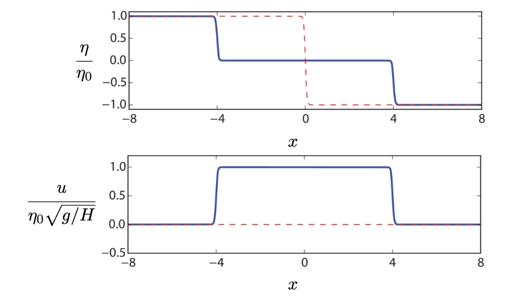

# Shallow Water Systems {#sec-chap:SW}

## Overview

The shallow water equations are a model of a thin layer of fluid with
constant density which is bounded by a rigid surface from below and by a
free surface from above. By \`\`thinness" -- which is the most defining
feature of these fluids -- we mean the horizontal length scales of these
flows are much larger than their vertical scales (and hence the name
shallow!). Other characteristics of these equations which we will discuss in
this section are the direct consequence of the thinness and constant
density assumptions.

The shallow water equations are one of the simplest sets of PDEs describing
geophysical fluids, yet they are very useful. They are used in practical
models of shallow lakes, rivers and coastal flows. Due to their relative
simplicity, many theoretical concepts in geophysical fluid dynamics are
first investigated for shallow water systems before being studied in more complex systems. 
They also incorporate many phenomena that characterise atmospheric and oceanic flows such as geostrophic balance and waves (we will discuss these later in the course). The practical importance of shallow water equations aside,
their derivation is a good example of using rigorous mathematical steps
and physical assumptions to reduce the Boussinsq equations to a much
simpler set.

## Derivation

We use the defining characteristics of shallow water flows to derive their
governing equations. Before that, let's clarify the notation and
conventions we are going to use (this is sometimes the most confusing
part about shallow water systems because different sources in the
literature adopt very different notation). We assume the $z$
axis is perpendicular to the layer of water as shown in
@fig-SW_schematic. $z=0$ can be placed at any arbitrary level (naturally
we want to see it close the bottom surface). $\eta(x,y,t)$ is the
vertical position of fluid surface measured from $z=0$. Likewise,
$\eta_b(x,y,t)$ is the vertical height of bottom topography measured
from $z=0$. $h(x,y,t)$ is the thickness of water column measured from
bottom boundary all the way to free surface, i.e. $h = \eta - \eta_b$.
The thinness of fluid has an important consequence: the vertical
velocity (in the $z$ direction) is much smaller than the horizontal
velocity components (but is not necessarily zero). Hence, we only
consider the two-dimensional horizontal velocity denoted by
$\vb =(u,v)$ and assume $w \ll u, v$.
Lastly, we denote the horizontal gradient operator by
$\gradH = (\partial / \partial x, \partial / \partial y)$.

{#fig-SW_schematic
width="70%"}

### Momentum equations

One of the main consequences of small vertical velocity appears in the
vertical momentum equation. Let's consider the vertical momentum
equation in the Boussinesq system (i.e., @eq-Bousmom) 
$$ \frac{\partial w}{\partial t} + (\vb \cdot\gradH)w + w \frac{\partial w}{\partial z} = -\frac{1}{\bar\rho} \frac{\partial p}{\partial z} -\frac{\rho}{\bar\rho}g. 
$$ {#eq-verticalBous} Assuming $w$ to be smaller than the other
variables, the vertical momentum equation then reduces to $$
    \frac{\partial p}{\partial z} = - \rho g,  
$$ which is simply the hydrostatic balance that was discussed in @sec-hydrostat
(cf. @eq-hydrobal). Because the density is assumed constant ($\rho = \rho_0$),
we may integrate this equation from $\eta$ to an arbitrary height $z$ to give 
$$ p(x,y,z,t) - p(x,y,\eta(x,y,t),t) = \rho_0 g (\eta(x,y,t) - z).
$$ {#eq-integrated_pressure} It is physically justified to assume the
pressure at the free surface $p(x,y,\eta,t)$ is constant (for some applications we may need to change this assumption though). Hence, we can
take the horizontal gradient of both sides of @eq-integrated_pressure to
arrive at $$ \gradH \ p = \rho_0 g \ \gradH \ \eta.
$$ {#eq-grad_p-eta} Now we consider the horizontal momentum equation in
@eq-Bousmom and substitute for the horizontal pressure gradient using
@eq-grad_p-eta
$$ \frac{\partial \vb}{\partial t} + (\vb \cdot\gradH) \vb =  - g \ \gradH \ \eta,
$$ {#eq-SWmomn1} where we also neglected the vertical velocity at
leading order. Note that the right-hand side of this equation is
independent of $z$. Hence, if we assume the velocity is initially
independent of $z$, it should remain independent of $z$, i.e.
$\vb = \vb(x,y,t)$. As a consequence, for the rest of this chapter we do
not deal with $z$ derivative. We also simplify the notation by replacing $\gradH$ with $\grad$ in the context of shallow water equation since there is no $z$ dependence. For example, we write @eq-SWmomn1 as
$$
    \frac{D \vb}{D t}  =  - g \ \grad \eta.
$$ {#eq-SWmomn1}

Note that for three-dimensional flows such as those described by the Boussinesq equations, we still distinguish between horizontal and three-dimensional gradient and show them with $\gradH$ and $\grad$, respectively.

### Mass continuity equation

{#fig-SW_column width="40%"}

Consider a (Cartesian) column of shallow water as shown in
@fig-SW_column. The height of this column $h$ is measured from the
bottom boundary to the free surface. The cross-sectional area of this
column is $\Dl x \Dl y$. If the fluid enters this column from the sides,
its height has to increase to conserve mass (note that the density is
constant and the fluid is incompressible). More quantitatively, let's
consider the two sides perpendicular to the $x$-axis. If the velocity
normal to one of the sides is $u$, the normal velocity to the other side
will be $u + \Dl x \ {\partial u} / {\partial x}$ (see @fig-SW_column).
Likewise, If the thickness of one side is $h$, the thickness of the
other side will be $h + \Dl x \ {\partial h} / {\partial x}$. The mass
flux through a side is calculated as the normal velocity times the
surface area of the side times density. For example, if the normal
velocity and vertical thickness are $u$ and $h$ respectively, the mass
flux will be $\rho_0 u h \Dl y$ (without loss of generality we assume
the velocity $u$ is pointing inward). Hence, the total amount of mass
entering/leaving from these two sides is

\begin{align*}
 \text{MF}_x = \text{mass flux along} &\text{ the $x$ axis} = \rho_0 u h \Dl y - \rho_0 \left( u + \Dl x \ \frac{\partial u}{\partial x} \right)  \left(h + \Dl x \ \frac{\partial h}{\partial x} \right) \Dl y \\
   &= -\rho_0 \Dl x \ \frac{\partial u}{\partial x}  h \Dl y
    -\rho_0 u \ \Dl x \  \frac{\partial h}{\partial x}   \Dl y  
    -\rho_0 \Dl x \ \frac{\partial u}{\partial x} \Dl x \ \frac{\partial h}{\partial x}  \Dl y 
    \end{align*}
Likewise, we obtain the total mass flux along the $y$ axis
$$        \text{MF}_y 
    = -\rho_0 \Dl y \ \frac{\partial v}{\partial y}  h \Dl x
    -\rho_0 v \ \Dl y \  \frac{\partial h}{\partial y}   \Dl x
    -\rho_0 \Dl y \ \frac{\partial v}{\partial y} \Dl y \ \frac{\partial h}{\partial y}  \Dl x 
$$
The rate of change of mass in this fluid column is $\rho_0 \Dl x \Dl y \Dl h / \Dl t$ which should be equal to mass flux from the sides, i.e.,
$$
    \rho_0 \Dl x \Dl y  \frac{\Dl h }{\Dl t } =  \text{MF}_x +  \text{MF}_y. 
$$
After dividing this equation by $\rho_0 \Dl x \Dl y$ and taking the limit as $\Dl x, \Dl y, \Dl t \to 0$, we find
$$
    \frac{\partial h}{\partial t} = - h \left( \frac{\partial u}{\partial x} +\frac{\partial v}{\partial y} \right) - u  \frac{\partial h}{\partial x} - v  \frac{\partial h}{\partial y} 
$$
which can be written as 
$$
    \frac{\partial h}{\partial t} + \gradH \cdot (h \vb)=0, \quad \text{or} \quad  \frac{D h}{D t} + h \gradH \cdot \vb=0.
$$ {#eq-SWmass}
Note that unlike Boussinesq or incompressible flows, the shallow water velocity is not divergence free. This is because the columns of fluids can be compressed by increasing their height.

::: {.callout-note appearance="simple"}

The conservation of mass equation for the shallow water system can be derived from 3D mass conservation equation using $w \ll u, v$ (see the assignments).
:::

In summary, in a non-rotating frame, the inviscid shallow water equations are

::: {.callout-important icon="false"}
## **Inviscid Shallow Water Equations** 

$$ \text{momentum:} \quad \frac{D \vb}{D t}  =  - g \ \gradH \eta. $$ {#eq-SW1}
$$ \text{mass continuity:} \quad \frac{\partial h}{\partial t} + \gradH \cdot (h \vb) = 0, \quad \text{or} \quad  \frac{D h}{D t} + h \gradH \cdot \vb=0 $$ {#eq-SW2}
$$ \text{height relation:}  \quad  h(x,y,t) = \eta(x,y,t) - \eta_b(x,y,t). $$ {#eq-SW3}
:::

::: {.callout-tip icon="false"}
## Example

{#fig-SW_dambreak width="40%"}

Let's consider an example of a dam or membrane that creates two levels of fluid as shown in the figure @fig-SW_dambreak. The fluid is initially at rest and the bottom surface is assumed flat (i.e. $\eta_b = \text{constant}$). At $t=0$, we remove the dam or membrane and want to see how this fluid behaves in time. This flow is one-dimensional so we can simply drop the dependence on $y$ and set $v=0$. Let's say the difference between two levels is $2\eta_0$ (see the figure). We place $z=0$ at half distance between the two levels such that
$$
    \eta(x,t=0) = 
\begin{cases}
+ \eta_0,  \quad x<0  \\
- \eta_0,  \quad x>0  
\end{cases}
= - \eta_0 \ \mathrm{sgn}(x),
$$ {#eq-ICSWdistrb}
where $\mathrm{sgn}$ is the sign function. Note that the fluid is initially at rest $u(x,t=0)=0$. To analyse this problem we assume the disturbances to the initial state are relatively small and write
$$
    h(x,t) = H + \eta(x,t), \quad u = u(x,t)
$$

Substituting these expressions into Equations ([-@eq-SW1])-([-@eq-SW3]) leads to
\begin{align*}
\frac{\partial u}{\partial t} + u \frac{\partial u}{\partial x} &= -g \frac{\partial \eta}{\partial x} \\
\frac{\partial \eta}{\partial t} + \frac{\partial}{\partial x} \left( (H + \eta)u \right) &=   0 ,
\end{align*}
and further neglecting the product of (small) disturbance terms (i.e. $u$ and $\eta$) gives
$$
    \frac{\partial u}{\partial t}  + g \frac{\partial \eta}{\partial x} = 0 $$ {#eq-exSW1a}
$$ \frac{\partial \eta}{\partial t} + H \frac{\partial u}{\partial x}  =   0. $$ {#eq-exSW1b}
We can take the $x$ derivative of @eq-exSW1a and $t$ derivative of @eq-exSW1b and eliminate $u$ to arrive at 
$$
    \frac{\partial^2 \eta}{\partial t^2} - c^2 \frac{\partial^2 \eta}{\partial x^2} = 0 , \quad c = \sqrt{g H},
$$
which is simply the one-dimensional wave equation. For unbounded domains, you are familiar with the d'Alembert solution of the wave equation 
$$
    \eta(x,t) = \frac{1}{2} \left( F(x-ct) + F(x+ct) \right),
$$ {#eq-dAlembert_sol}
where $F(x)$ is the initial condition. Using the given initial condition for this problem (@eq-ICSWdistrb), we find
$$
    \eta(x,t) = - \frac{1}{2} \eta_0 \left( \mathrm{sgn}(x-ct) + \mathrm{sgn}(x+ct) \right) = 
    \begin{cases}
+ \eta_0  \quad x<-ct  \\
       0 \ \   \quad -ct<x<ct \\
- \eta_0  \quad x>ct  
\end{cases}
$$
This solution implies that a half of the disturbance moves backwards and a half forwards, both with the speed $c=\sqrt{g H}$. In between the travelling disturbance becomes zero as shown in the left panel of @fig-damBreakSol. It is interesting that the height disturbance travels faster if the water is deeper. 

We can also derive the velocity for this solution by using @eq-dAlembert_sol and @eq-exSW1a (or @eq-exSW1b)
$$
    u(x,t) = - \frac{1}{2} \eta_0 \sqrt{\frac{g}{H}} \left( \mathrm{sgn}(x-ct) - \mathrm{sgn}(x+ct) \right) = 
    \begin{cases}
       0  \ \   \quad  \quad  \quad \quad  \quad \quad  x<-ct  \\
      {\eta_0} \sqrt{g/H}  \quad -ct<x<ct \\
       0  \ \   \quad  \quad  \quad \quad  \quad \quad x>ct  
\end{cases}
$$
As the disturbance moves to both sides, it creates a velocity in the middle (see the right panel of @fig-damBreakSol). This velocity is larger in shallower water (proportional to $H^{-1/2}$). 

{#fig-damBreakSol width="80%"}

:::

## Vortices on sloping beaches

There are cases where the changes in $\eta$ are small compared to the flow and bottom surface, but the surface pressure is no longer constant. In such cases, we need to modify the shallow water equations by changing the top boundary condition from constant pressure to constant $\eta$. This boundary condition is known as a *rigid lid* as it is literally the equivalent of putting a rigid lid on the top. Using this condition, @eq-integrated_pressure changes to
$$    p(x,y,z,t) - p(x,y,0,t) = \rho_0 g (0 - z), $$
where we place our $z$ axis at the top surface that is nearly constant. Taking the horizontal gradient of this equation gives,
$$  \gradH \ p(x,y,z,t)  = \gradH \ (p_0(x,y,t) =p(x,y,0,t)), $$
where we used $p_0$ to denote the surface pressure. Note the constant $\eta$ assumption means that $h(x,y,t) = - \eta_b(x,y)$. As a result, if the bottom surface doesn't change with time (reasonable assumption for many problems with a solid boundary), $\partial h /\partial t =0$. Using these assumptions, we can write the rigid-lid shallow water equations as
$$ \frac{D \vb}{D t}  =  - \frac{1}{\rho_0}\ \gradH p_0, $$ {#eq-riglid_SWeqs1}
$$ \gradH \cdot (h \vb) = 0, $$ {#eq-riglid_SWeqs2}
$$ h(x,y,t) = \eta_b(x,y,t).$$ {#eq-riglid_SWeqs3}

::: {.callout-note appearance="simple"}

The rigid-lid  shallow water system is a good approximation for flows on sloping beaches as surface variations compared to the changes of the bottom slope and velocities are negligible. This is also a good model for lab experiments where the flow is confined by a solid wall from the top.
:::

We can transform equations ([-@eq-riglid_SWeqs1])-([-@eq-riglid_SWeqs3]) into the following equation (see the assignment for derivation)
$$q = \frac{\nabla \times \vb}{h} = \frac{\partial v/\partial x - \partial u/\partial y}{h}, \quad  \frac{D q}{D t} = 0. $$ {#eq-PV4riglidSW}

This shows that the quantity $q$ is conserved materially (i.e. on particle trajectories), which has important consequences for the dynamics. For example, if a vortex is pushed up toward shallower parts of a sloping beach, it becomes stronger and rotates faster.

::: {.callout-note appearance="simple"}

$q$ as defined in @eq-PV4riglidSW is a special case of a quantity known as Potential Vorticity (PV). We will introduce the general form of this quantity in chapter 5 and show that is it conserved for some limits of the shallow water and Boussinesq equations. Such a conservation law is an important element of large-scale atmospheric and oceanic flows.
:::
