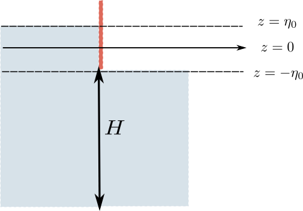
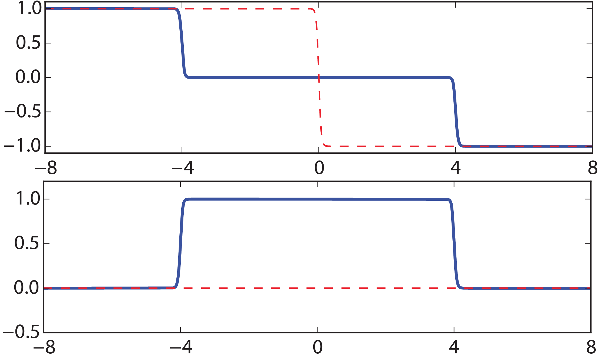
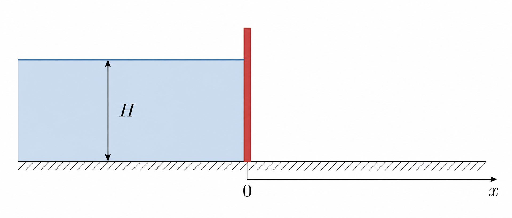
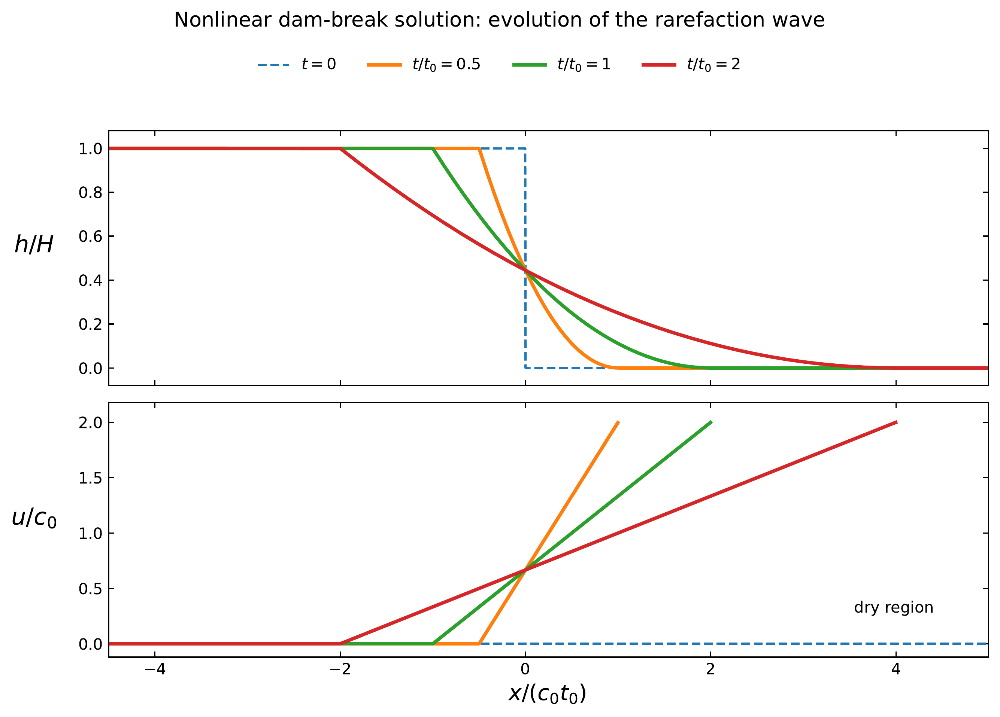

# Shallow Water Systems {#sec-chap:SW}

## Overview

The shallow water equations are a model of a thin layer of fluid with
constant density which is bounded by a rigid surface from below and by a
free surface from above. By \`\`thinness" -- which is the most defining
feature of these fluids -- we mean the horizontal length scales of these
flows are much larger than their vertical scales (and hence the name
shallow!). Other characteristics of these equations which we will discuss in
this section are the direct consequence of the thinness and constant
density assumptions.

The shallow water equations are one of the simplest sets of PDEs describing
geophysical fluids, yet they are very useful. They are used in practical
models of shallow lakes, rivers and coastal flows. Due to their relative
simplicity, many theoretical concepts in geophysical fluid dynamics are
first investigated for shallow water systems before being studied in more complex systems. 
They also incorporate many phenomena that characterise atmospheric and oceanic flows such as geostrophic balance and waves (we will discuss these later in the course). The practical importance of shallow water equations aside,
their derivation is a good example of using rigorous mathematical steps
and physical assumptions to reduce the Boussinsq equations to a much
simpler set.

## Derivation

We use the defining characteristics of shallow water flows to derive their
governing equations. Before that, let's clarify the notation and
conventions we are going to use (this is sometimes the most confusing
part about shallow water systems because different sources in the
literature adopt very different notation). We assume the $z$ axis is perpendicular to the layer of water as shown in @fig-SW_schematic. $\eta(x,y,t)$ is the vertical position of the fluid surface measured from $z=0$. Likewise, $\eta_b(x,y)$ is the vertical height of bottom topography. The origin, $z=0$, can be placed at any arbitrary level. In this course, we use the mean fluid surface as $z=0$, leading to
$$
\iint_S \eta \, dx \, dy = 0,
$$
where $S$ is the entire surface area covered by the layer of fluid. $h(x,y,t)$ is the thickness of water column measured from bottom boundary all the way to free surface, i.e. $h = \eta - \eta_b$. We define the constant $H$ as the average height of the fluid,
$$
H = \frac{\iint_S h \, dx \, dy}{S}.
$$
The thinness of fluid has an important consequence: the vertical velocity (in the $z$ direction) is much smaller than the horizontal velocity components (but is not necessarily zero), $w \ll u, v$. Lastly, we denote the horizontal gradient operator by $\gradH = (\partial / \partial x, \partial / \partial y)$.

{#fig-SW_schematic
width="70%"}

### Momentum equations

One of the main consequences of small vertical velocity appears in the
vertical momentum equation. Let's consider the vertical momentum
equation in the Boussinesq system (i.e., @eq-Bousmom) 
$$ \frac{\partial w}{\partial t} + (\vb \cdot\gradH)w + w \frac{\partial w}{\partial z} = -\frac{1}{\bar\rho} \frac{\partial p}{\partial z} -\frac{\rho}{\bar\rho}g. 
$$ {#eq-verticalBous}
Assuming $w$ to be smaller than the other
variables, the vertical momentum equation then reduces to $$
    \frac{\partial p}{\partial z} = - \rho g,  
$$ which is simply the hydrostatic balance that was discussed in @sec-hydrostat
(cf. @eq-hydrobal). Because the density is assumed constant ($\rho = \rho_0$),
we may integrate this equation from $\eta$ to an arbitrary height $z$ to give 
$$ p(x,y,z,t) - p(x,y,\eta(x,y,t),t) = \rho_0 g (\eta(x,y,t) - z).
$$ {#eq-integrated_pressure}
It is physically justified to assume the
pressure at the free surface $p(x,y,\eta,t)$ is constant (for some applications we may need to change this assumption though). Hence, we can
take the horizontal gradient of both sides of @eq-integrated_pressure to
arrive at $$ \gradH \ p = \rho_0 g \ \gradH \ \eta.
$$ {#eq-grad_p-eta}
Now we consider the horizontal momentum equation in @eq-Bousmom and substitute for the horizontal pressure gradient using @eq-grad_p-eta
$$
\frac{\partial \vb}{\partial t} + (\vb \cdot\gradH) \vb + w \frac{\partial \vb}{\partial z} =  - g \ \gradH \ \eta.
$$ {#eq-SWmomn1pre}
Note that the right-hand side of this equation is independent of $z$. Hence, if we assume the velocity is initially independent of $z$, it should remain independent of $z$, i.e. $\vb = \vb(x,y,t)$. As a consequence, for the rest of this chapter we do not deal with $z$ derivative. Since $\partial\vb/\partial z = 0$, @eq-SWmomn1pre simplifies to
$$
\frac{\partial \vb}{\partial t} + (\vb \cdot\gradH) \vb =  - g \ \gradH \ \eta.
$$
We also simplify the notation by replacing $\gradH$ with $\grad$ in the context of shallow water equations since there is no $z$ dependence, giving
$$
    \frac{D \vb}{D t}  =  - g \ \grad \eta.
$$ {#eq-SWmomn1}

Note that for three-dimensional flows such as those described by the Boussinesq equations, we still distinguish between horizontal and three-dimensional gradient and show them with $\gradH$ and $\grad$, respectively.

### Mass continuity equation

{#fig-SW_column width="40%"}

Consider a (Cartesian) column of shallow water as shown in
@fig-SW_column. The height of this column $h$ is measured from the
bottom boundary to the free surface. The cross-sectional area of this
column is $\Dl x \Dl y$. If the fluid enters this column from the sides,
its height has to increase to conserve mass (note that the density is
constant and the fluid is incompressible). More quantitatively, let's
consider the two sides perpendicular to the $x$-axis. If the velocity
normal to one of the sides is $u$, the normal velocity to the other side
will be $u + \Dl x \ {\partial u} / {\partial x}$ (see @fig-SW_column).
Likewise, If the thickness of one side is $h$, the thickness of the
other side will be $h + \Dl x \ {\partial h} / {\partial x}$. The mass
flux through a side is calculated as the normal velocity times the
surface area of the side times density. For example, if the normal
velocity and vertical thickness are $u$ and $h$ respectively, the mass
flux will be $\rho_0 u h \Dl y$ (without loss of generality we assume
the velocity $u$ is pointing inward). Hence, the total amount of mass
entering/leaving from these two sides is

\begin{align*}
 \text{MF}_x = \text{mass flux along} &\text{ the $x$ axis} = \rho_0 u h \Dl y - \rho_0 \left( u + \Dl x \ \frac{\partial u}{\partial x} \right)  \left(h + \Dl x \ \frac{\partial h}{\partial x} \right) \Dl y \\
   &= -\rho_0 \Dl x \ \frac{\partial u}{\partial x}  h \Dl y
    -\rho_0 u \ \Dl x \  \frac{\partial h}{\partial x}   \Dl y  
    -\rho_0 \Dl x \ \frac{\partial u}{\partial x} \Dl x \ \frac{\partial h}{\partial x}  \Dl y 
    \end{align*}
Likewise, we obtain the total mass flux along the $y$ axis
$$        \text{MF}_y 
    = -\rho_0 \Dl y \ \frac{\partial v}{\partial y}  h \Dl x
    -\rho_0 v \ \Dl y \  \frac{\partial h}{\partial y}   \Dl x
    -\rho_0 \Dl y \ \frac{\partial v}{\partial y} \Dl y \ \frac{\partial h}{\partial y}  \Dl x 
$$
The rate of change of mass in this fluid column is $\rho_0 \Dl x \Dl y \Dl h / \Dl t$ which should be equal to mass flux from the sides, i.e.,
$$
    \rho_0 \Dl x \Dl y  \frac{\Dl h }{\Dl t } =  \text{MF}_x +  \text{MF}_y. 
$$
After dividing this equation by $\rho_0 \Dl x \Dl y$ and taking the limit as $\Dl x, \Dl y, \Dl t \to 0$, we find
$$
    \frac{\partial h}{\partial t} = - h \left( \frac{\partial u}{\partial x} +\frac{\partial v}{\partial y} \right) - u  \frac{\partial h}{\partial x} - v  \frac{\partial h}{\partial y} 
$$
which can be written as 
$$
    \frac{\partial h}{\partial t} + \grad \cdot (h \vb)=0, \quad \text{or} \quad  \frac{D h}{D t} + h \grad \cdot \vb=0.
$$ {#eq-SWmass}
Note that unlike Boussinesq or incompressible flows, the shallow water velocity is not divergence free. This is because the columns of fluids can be compressed by increasing their height.

::: {.callout-note appearance="simple"}

The conservation of mass equation for the shallow water system can be derived from 3D mass conservation equation using $w \ll u, v$ (see the assignments).
:::

In summary, in a non-rotating frame, the inviscid shallow water equations are

::: {.callout-important icon="false"}
## **Inviscid Shallow Water Equations** 

$$
 \text{momentum:} \quad \frac{D \vb}{D t}  =  - g \ \grad \eta. 
$$ {#eq-SW1}
$$
 \text{mass continuity:} \quad \frac{\partial h}{\partial t} + \grad \cdot (h \vb) = 0, \quad \text{or} \quad  \frac{D h}{D t} + h \grad \cdot \vb=0 
$$ {#eq-SW2}
$$
 \text{height relation:}  \quad  h(x,y,t) = \eta(x,y,t) - \eta_b(x,y,t). 
$$ {#eq-SW3}
:::

::: {.callout-tip icon="false"}
## Example

{#fig-SW_dambreak width="40%"}

Let's consider an example of a dam or membrane that creates two levels of fluid as shown in the figure @fig-SW_dambreak. The fluid is initially at rest and the bottom surface is assumed flat (i.e. $\eta_b = \text{constant}$). At $t=0$, we remove the dam or membrane and want to see how this fluid behaves in time. This flow is one-dimensional so we can simply drop the dependence on $y$ and set $v=0$. Let's say the difference between two levels is $2\eta_0$ (see the figure). We place $z=0$ at half distance between the two levels such that
$$
    \eta(x,t=0) = 
\begin{cases}
+ \eta_0,  \quad x<0  \\
- \eta_0,  \quad x>0  
\end{cases}
= - \eta_0 \ \mathrm{sgn}(x),
$$ {#eq-ICSWdistrb}
where $\mathrm{sgn}$ is the sign function. Note that the fluid is initially at rest $u(x,t=0)=0$. To analyse this problem we assume the disturbances to the initial state are relatively small and write
$$
    h(x,t) = H + \eta(x,t), \quad u = u(x,t)
$$

Substituting these expressions into Equations ([-@eq-SW1])-([-@eq-SW3]) leads to
\begin{align*}
\frac{\partial u}{\partial t} + u \frac{\partial u}{\partial x} &= -g \frac{\partial \eta}{\partial x} \\
\frac{\partial \eta}{\partial t} + \frac{\partial}{\partial x} \left( (H + \eta)u \right) &=   0 ,
\end{align*}
and further neglecting the product of (small) disturbance terms (i.e. $u$ and $\eta$) gives
$$
    \frac{\partial u}{\partial t}  + g \frac{\partial \eta}{\partial x} = 0 $$ {#eq-exSW1a}
$$
 \frac{\partial \eta}{\partial t} + H \frac{\partial u}{\partial x}  =   0. 
$$ {#eq-exSW1b}
We can take the $x$ derivative of @eq-exSW1a and $t$ derivative of @eq-exSW1b and eliminate $u$ to arrive at 
$$
    \frac{\partial^2 \eta}{\partial t^2} - c_0^2 \frac{\partial^2 \eta}{\partial x^2} = 0 , \quad c_0 = \sqrt{g H},
$$
which is simply the one-dimensional wave equation. For unbounded domains, you are familiar with the d'Alembert solution of the wave equation 
$$
    \eta(x,t) = \frac{1}{2} \left( F(x-c_0t) + F(x+c_0t) \right),
$$ {#eq-dAlembert_sol}
where $F(x)$ is the initial condition. Using the given initial condition for this problem (@eq-ICSWdistrb), we find
$$
    \eta(x,t) = - \frac{1}{2} \eta_0 \left( \mathrm{sgn}(x-c_0t) + \mathrm{sgn}(x+c_0t) \right) = 
    \begin{cases}
+ \eta_0  \quad x<-c_0t  \\
       0 \ \   \quad -c_0t<x<c_0t \\
- \eta_0  \quad x>c_0t  
\end{cases}
$$
This solution implies that a half of the disturbance moves backwards and a half forwards, both with the speed $c_0=\sqrt{g H}$. In between the travelling disturbance becomes zero as shown in the top panel of @fig-damBreakSol. It is interesting that the height disturbance travels faster if the water is deeper. 

We can also derive the velocity for this solution by using @eq-dAlembert_sol and @eq-exSW1a (or @eq-exSW1b)
$$
    u(x,t) = - \frac{1}{2} \eta_0 \sqrt{\frac{g}{H}} \left( \mathrm{sgn}(x-c_0t) - \mathrm{sgn}(x+c_0t) \right) = 
    \begin{cases}
       0  \ \   \quad  \quad  \quad \quad  \quad \quad  x<-c_0t  \\
      {\eta_0} \sqrt{g/H}  \quad -c_0t<x<c_0t \\
       0  \ \   \quad  \quad  \quad \quad  \quad \quad x>c_0t  
\end{cases}
$$
As the disturbance moves to both sides, it creates a velocity in the middle (see the bottom panel of @fig-damBreakSol). This velocity is larger in shallower water (proportional to $H^{-1/2}$). 

{#fig-damBreakSol width=60%}

:::

::: {.callout-tip icon="false"}
## Example

{#fig-Nonlinear_dambreak width=70% fig-alt="Schematic of nonlinear dam break."}

Let us now return to the dam-break problem, but this time without linearising the shallow water equations. Consider a reservoir of water with constant depth $H$ occupying $x<0$, while the region $x>0$ is initially dry. At $t=0$, the dam at $x=0$ is suddenly removed. We would like to determine how the water spreads into the dry region.

The one-dimensional shallow water equations over a flat bottom are
$$
\frac{\partial u}{\partial t}
+ u\frac{\partial u}{\partial x}
= -g\frac{\partial h}{\partial x},
$$ {#eq-nonlinear_SW_momentum}
$$
\frac{\partial h}{\partial t}
+ \frac{\partial (hu)}{\partial x}
=0,
$$ {#eq-nonlinear_SW_mass}
with the initial condition
$$
h(x,0)=
\begin{cases}
    H, & x<0,\\
    0, & x>0,
\end{cases}
\qquad
u(x,0)=0.
$$

Unlike the previous example, we cannot assume that the disturbance is small. Therefore, the nonlinear terms in the shallow water equations are retained.

There is no fixed horizontal length scale in this problem. The initial condition specifies the water depth $H$, but does not specify a horizontal length scale over which the disturbance varies. We therefore expect the horizontal extent of the solution to grow with time.

To determine how fast it grows, let us seek a solution of the form
$$
h(x,t)=h(\xi), \qquad u(x,t)=u(\xi), \qquad \xi=\frac{x}{t^n},
$$
where the exponent $n$ is yet to be determined. Using
$$
\frac{\partial \xi}{\partial t} =-\frac{n\xi}{t}, \qquad \frac{\partial \xi}{\partial x} =\frac{1}{t^n},
$$
the momentum equation becomes
$$
-\frac{n\xi}{t}\frac{du}{d\xi} +\frac{u}{t^n}\frac{du}{d\xi} = -\frac{g}{t^n}\frac{dh}{d\xi}.
$$
For this equation to hold for all times, the different terms must have the same dependence on $t$. Therefore, $t^{-1}=t^{-n}$, which gives
$$
n=1.
$$
The mass equation leads to the same result. Hence, the appropriate similarity variable is
$$
\xi=\frac{x}{t}.
$$

This result also makes physical sense. The natural velocity scale of the problem is the shallow-water wave speed $c_0=\sqrt{gH}$, and hence the disturbed region is expected to spread over a distance of order $c_0t$. A solution depending on $x/t$ therefore describes a profile whose horizontal extent grows linearly with time. As time passes, the disturbed region simply expands away from the position of the original dam. We therefore look for a solution that depends on $x$ and $t$ only through the combination $\xi = x/t$, so that $h(x,t)=h(\xi)$ and $u(x,t)=u(\xi)$. Such a solution is known as a *self-similar solution*.

Using
$$
\frac{\partial}{\partial t}
=
-\frac{\xi}{t}\frac{d}{d\xi},
\qquad
\frac{\partial}{\partial x}
=
\frac{1}{t}\frac{d}{d\xi},
$$
the momentum equation @eq-nonlinear_SW_momentum becomes
$$
(u-\xi)\frac{du}{d\xi}
+g\frac{dh}{d\xi}=0.
$$ {#eq-dam_similarity_momentum}
Similarly, writing the mass equation as
$$
\frac{\partial h}{\partial t} +u\frac{\partial h}{\partial x} +h\frac{\partial u}{\partial x}=0,
$$
we obtain
$$
(u-\xi)\frac{dh}{d\xi}
+h\frac{du}{d\xi}=0.
$$ {#eq-dam_similarity_mass}

Equations @eq-dam_similarity_momentum and @eq-dam_similarity_mass form a pair of equations for $du/d\xi$ and $dh/d\xi$:
$$
\begin{pmatrix}
    u-\xi & g\\
    h & u-\xi
\end{pmatrix}
\begin{pmatrix}
    du/d\xi\\
    dh/d\xi
\end{pmatrix}
=0.
$$
For a non-trivial solution, the determinant of this matrix must vanish. Therefore,
$$
(u-\xi)^2=gh.
$$
Defining
$$
c=\sqrt{gh},
$$
which is the shallow-water wave speed corresponding to the local depth $h$, we choose
$$
u-\xi=c.
$$ {#eq-dam_branch}

Substituting this relation into @eq-dam_similarity_momentum gives
$$
c\frac{du}{d\xi} +g\frac{dh}{d\xi}=0.
$$
Since $c=\sqrt{gh}$, we have
$$
h=\frac{c^2}{g}, \qquad \frac{dh}{d\xi} =\frac{2c}{g}\frac{dc}{d\xi},
$$
and hence
$$
\frac{du}{d\xi} +2\frac{dc}{d\xi}=0.
$$
Integrating gives
$$
u+2c=\text{constant}.
$$
At the left-hand edge of the disturbed region, the solution must match the undisturbed reservoir, where $u=0$ and $h=H$. Therefore,
$$
u+2c=2c_0, \qquad c_0=\sqrt{gH}.
$$

Combining this result with @eq-dam_branch, i.e. $\xi=u-c$, gives
$$
u(\xi)=\frac{2}{3}(c_0+\xi),
$$
and
$$
c(\xi)=\frac{1}{3}(2c_0-\xi).
$$
Since $h=c^2/g$, the water depth is therefore
$$
h(\xi) = \frac{1}{9g}(2c_0-\xi)^2.
$$
Returning to $x$ and $t$, we find
$$
u(x,t)=\frac{2}{3}\left(c_0+\frac{x}{t}\right),
\qquad
h(x,t)=\frac{1}{9g}\left(2c_0-\frac{x}{t}\right)^2.
$$

It remains to determine the region in which this solution applies. At the left-hand edge, the solution matches the undisturbed reservoir, where $u=0$ and $h=H$. This occurs when
$$
\frac{x}{t}=-c_0.
$$
At the right-hand edge, the water depth vanishes, $h=0$, which gives
$$
\frac{x}{t}=2c_0.
$$
Hence, the complete solution is
$$
(h,u)=
\begin{cases}
    (H,\,0),
    & x<-c_0t,\\[2mm]
    \left(
    \dfrac{1}{9g}\!\left(2c_0-\dfrac{x}{t}\right)^2,\;
    \dfrac{2}{3}\!\left(c_0+\dfrac{x}{t}\right)
    \right),
    & -c_0t<x<2c_0t,\\[4mm]
    (0,\,0),
    & x>2c_0t.
\end{cases}
$$

The disturbed region therefore expands linearly in time. In particular, the front of the water moves into the dry region with the constant speed
$$
\frac{dx_{\mathrm{front}}}{dt} =2c_0 =2\sqrt{gH}.
$$
Thus, a deeper reservoir produces a faster-moving front.

{#fig-sol_nldambreak width=80%}

This solution is quite different from the linearised dam-break solution derived earlier (see @fig-sol_nldambreak). In the linear problem, the disturbance splits into waves travelling in opposite directions while retaining their shape. Here the nonlinear shallow water equations produce a continuously varying region connecting the undisturbed reservoir to the moving dry front. This type of expanding solution is called a *rarefaction wave*.
:::
