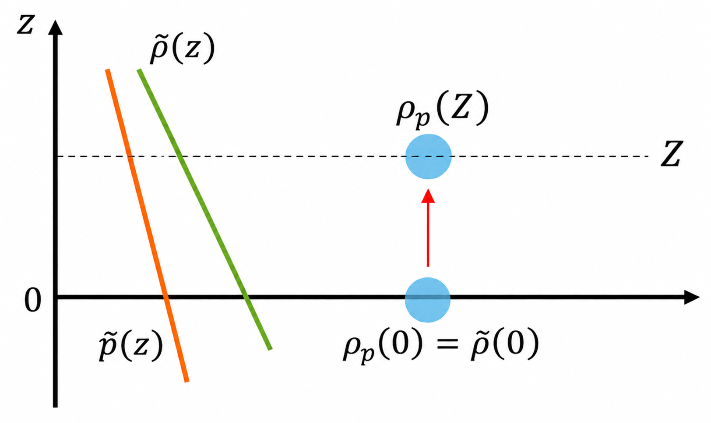
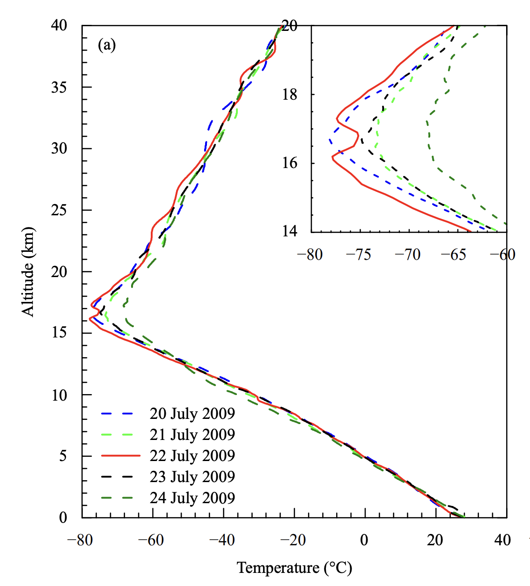
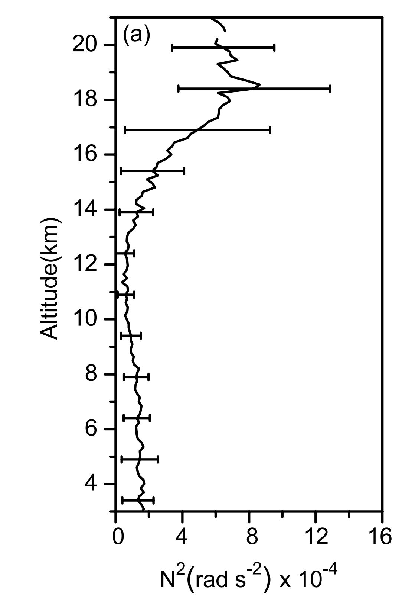
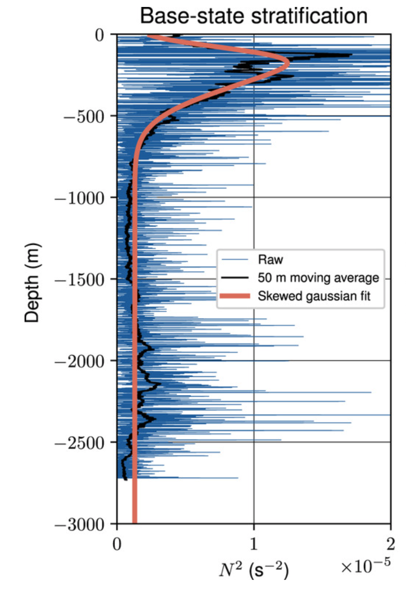
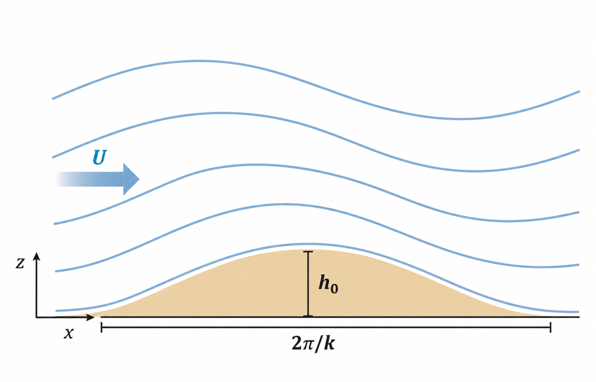
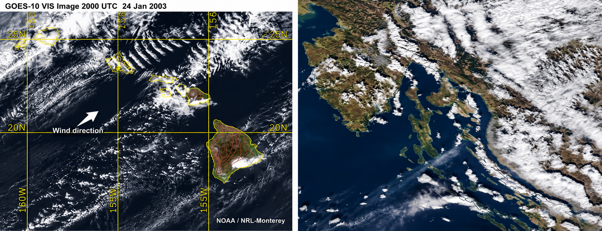

# Stratification {#sec-chap:strat}

$\nextSection$

## Buoyancy frequency

 A heavy object sinks down in a fluid because of gravity, but lighter objects float because of an upward force that the fluid exerts on them opposite to the direction of gravity. This force -- known as *buoyancy* -- is due to the weight of displaced fluid. 
 
 Typically, fluids in the atmosphere and ocean are *stratified*. That is, the density of air in the atmosphere and of water in the ocean varies with height. In a stably stratified medium (where lower density layers are above higher density ones), when a fluid parcel is pushed down vertically, we expect that it will try to come back up due to buoyancy force, and vice-versa. By considering the motion of such a fluid parcel, we can infer its buoyancy which is an important property of stratified fluids.

{#fig-Buoyancy_parcel width=50% fig-alt="Schematic of a fluid parcel in a layer of hydrostatically balanced fluid."}

Consider a fluid at rest with density $\tilde\rho(z)$ and hydrostatic pressure $\tilde p$, i.e.,
$$
\frac{d\tilde p}{dz}=-g\tilde\rho.
$$
Now consider raising a parcel of fluid from $z=0$ to $z=Z$ (see @fig-Buoyancy_parcel). The pressure of the parcel adjusts to the pressure of the surrounding environment, but its density may differ from that of the environment. To make this distinction, we denote the density of the parcel by $\rho_p$. At $z=0$, the parcel and the environment have the same density, and hence
$$
\frac{d\tilde p}{dz}\bigg|_{z=0}
=-g\tilde\rho(0)
=-g\rho_p(0).
$$

The environment at $z=Z$ is also in hydrostatic balance:
$$
\frac{d\tilde p}{dz}\bigg|_{z=Z}
=-g\tilde\rho(Z).
$$
However, the displaced parcel is no longer in hydrostatic balance. Since we consider a fixed mass of incompressible fluid, the parcel density does not change when it is lifted:
$$
\rho_p(Z)=\rho_p(0)=\tilde\rho(0).
$$ {#eq-parcel_density}
The upward pressure-gradient force per unit volume acting on the parcel is
$$
-\frac{d\tilde p}{dz}\bigg|_{z=Z}=g\tilde\rho(Z),
$$
whereas its weight per unit volume is $g\rho_p(Z)$. Hence, the net vertical force per unit volume is
$$
F_{\mathrm{net}}
=-\frac{d\tilde p}{dz}\bigg|_{z=Z}-g\rho_p(Z)
=g\left[\tilde\rho(Z)-\rho_p(Z)\right].
$$ {#eq-BuoForce}

We can then apply Newton's second law to the parcel:
$$
\rho_p(Z)\frac{d^2 Z}{dt^2}=F_{\mathrm{net}},
$$
and hence
$$
\frac{d^2 Z}{dt^2}
=
\frac{g\left[\tilde\rho(Z)-\rho_p(Z)\right]}
{\rho_p(Z)}.
$$ {#eq-N2Lparcel}
Using @eq-parcel_density, we can write @eq-N2Lparcel as
$$
\frac{d^2 Z}{dt^2}
=
\frac{g\left[\tilde\rho(Z)-\tilde\rho(0)\right]}
{\tilde\rho(0)}
\approx
\frac{g}{\tilde\rho(0)}
\frac{d\tilde\rho}{dz}\bigg|_{z=0}Z,
$$ {#eq-N2Lbuoyancy}
where we have used a Taylor expansion of $\tilde\rho(Z)$ about $z=0$.

Defining
$$
N_0^2
=
-\frac{g}{\tilde\rho(0)}
\frac{d\tilde\rho}{dz}\bigg|_{z=0},
$$
the equation becomes
$$
\frac{d^2 Z}{dt^2}=-N_0^2Z.
$$ {#eq-N0sq}

We will see in the example below that if ${d\tilde\rho}/{dz}<0$, the solution of the above equation is oscillatory and $N_0$ is the frequency of this motion.

::: {.callout-tip icon="false"}
## Example

Consider a fluid parcel that is raised to $Z=Z_0$ at $t=0$ in a fluid that is initially at rest. Find the motion of the parcel after it is released.

To find the parcel dynamics, we solve
$$
    \frac{d^2 Z}{dt^2}=-N_0^2Z,
    \qquad
    Z(0)=Z_0,
    \qquad
    \frac{dZ}{dt}(0)=0.
$$ {#eq-egBuoOscil}
The solution is
$$
    Z(t)=Z_0\cos(N_0t),
$$
which is a simple oscillatory motion with frequency $N_0$. @eq-egBuoOscil is very similar to the linearised pendulum equation. In pendulum motion, gravity provides the restoring force, whereas here the restoring force results from buoyancy.
:::

We could place our parcel at any height, rather than at $z=0$, and therefore generalise @eq-N0sq to define the general buoyancy frequency
$$
N^2(z) = -\frac{g}{\tilde\rho}\frac{d\tilde\rho}{dz}.
$$ {#eq-BVfreq}
The quantity $N(z)$ is known as the **buoyancy frequency** or **Brunt--Väisälä frequency**. It gives the frequency of small vertical oscillations of a fluid parcel in a stably stratified medium.

::: {.callout-note appearance="simple"}

If ${d\tilde\rho}/{dz}>0$ then $N^2<0$ and the stratification is *unstable*: a parcel displaced upwards continues to rise rather than oscillating about its original position.
:::

## Boussinesq equations

### Density and temperature variation in the ocean and atmosphere

![(a)  Position of different measurements in the Canada Basin of the Arctic Ocean. The trajectory followed during the cruise is represented by the black lines between the cast positions. (b) Density profiles from the 2006 survey within the 300–700$\mathrm{m}$ depth range against distance traveled from the first cast. Profiles in blue correspond to the blue dots in (a). (c) Mean temperature and density profiles from mooring D averaged between September 2006 and August 2007 are shown with solid lines. The dashed lines show the same quantities but for a single cast in March 2007. (d) Time evolution of the density profiles at mooring D shown in panel (a). This figure is taken from (Menesguen et al. 2022).](figures/densVarArcCorrected.png){#fig-density_arctic width=100%}

In the lower atmosphere and most parts of the ocean, the density (or temperature) does not change significantly at different horizontal locations $\xb=(x,y)$ or in time. This motivates the **Boussinesq approximation** which involves writing the density (and pressure) as a sum of a base profile plus small perturbation, where the base profile only depends on $z$. We will formulate this approximation mathematically in the next section, but before that it will be insightful to look at few observations of density and temperature variations in the ocean and atmosphere. 

@fig-density_arctic shows a combination of two types of measurements in a region in the arctic ocean. In panel (a), there are four red dots that are **mooring** measurements obtained by a collection of devices connected to a wire and anchored on the sea floor. The other dots are measurements taken by a cruise that sends diving devices down into the ocean. The details of these observations are not important for us, but they show that several locations are sampled by different measuring devices and at different times. Panel (b) shows the density profiles of the cruise measurements at different locations. It is clear that the density profile has a (horizontal) mean that is a function of $z$. The perturbations to this mean by changing the horizontal location are much smaller than the mean value itself. The variation of density from the base profile is better quantified in the panel (c). The solid black curve shows the mean (base) profile of the density next to a single cast with dashed black curve, which marginally deviates from the mean. Panel (d) shows the density profiles for a fixed location (location D in panel (a)), but at different times. It can be inferred from this plot that changing time does not affect the mean density profile very much. Looking at different part of the ocean, we get a more general base profile (a smoother mean). Nevertheless, the underlying message of this example still holds: the density is well approximated with a base profile that is a function of depth only plus small perturbations. 

{#fig-atmos_Tprofile width=50%}

@fig-atmos_Tprofile displays the (daily) temperature profiles over a region in India. Atmospheric temperature is directly related to the density at each altitude (which has a fixed pressure). Hence, the relative magnitude of the mean temperature to perturbations can translate to the density as well. It is evident from this figure that changes in temperature at each altitude are relatively small for lower atmosphere (below 15km). There is a jump in temperature that is known as "tropopause". Near the tropopause, the deviations from the mean temperature profile are larger, and the Boussinesq approximation is not justified. 

Measurements similar to the examples just discussed are abundant in the literature thanks to several decades of observational campaigns. Considering them all together, we can conclude that in most parts of the ocean, and in the lower atmosphere, the variations in density at a fixed $z$ are small relative to their means.

### Boussinesq approximation

As we have seen, the density in the ocean and in the lower layer of atmosphere varies by only a few percent across the depth or altitude. We can therefore exploit the smallness of these variations and write 
$$
\rho(\xb,t) = \rho_0 + \delta\rho(\xb,t)
$$
where $\rho_0$ is the average density (a constant) and $\delta\rho$ are (small) perturbations away from this mean. The perturbations are assumed small so that $|\delta\rho|\ll\rho_0$. 
Substituting this into the inviscid, incompressible momentum equation (i.e., @eq-incompmom with $\nu=0$) and again assuming gravity is the only body force acting so that $\fb_b=-g\eb_z$, we find
$$
(\rho_0 + \delta\rho(\xb,t)) \frac{D\ub}{Dt} = -\nabla p - (\rho_0 + \delta\rho(\xb,t))g\eb_z.
$$
Since $|\delta\rho|\ll\rho_0$ we may be tempted to ignore all the terms involving $\delta\rho$. Instead, we neglect all the terms involving $\delta\rho$ *except* in the term involving gravity (here there is only one but in more complex cases there may be others). This is because while $|\delta\rho|\ll\rho_0$, gravity is strong and so the buoyancy term (the one involving gravity) is retained. Making this approximation, known as the **Boussinesq approximation**, leads to 
$$
\rho_0 \frac{D\ub}{Dt} = -\nabla p - (\rho_0 + \delta\rho(\xb,t))g\eb_z.
$$
Then, dividing by $\rho_0$ and combining with equation ([-@eq-incompdensity]) and ([-@eq-divu0]), we obtain the so called **Boussinesq equations**:
$$
\frac{\partial\ub}{\partial t} + (\ub\cdot\nabla)\ub = -\frac{1}{\rho_0}\nabla p -\frac{\rho}{\rho_0}g\eb_z. 
$$ {#eq-Bousmom}
$$
 \nabla\cdot\ub = 0, 
$$ {#eq-Bousdivu0}
$$
\frac{D\rho}{Dt}  = \frac{\partial \rho}{\partial t} + (\ub\cdot\nabla)\rho= 0, 
$$ {#eq-Bousdensity}

::: {.callout-note appearance="simple"}
Although we have derived this set of Boussinesq equations starting from the assumption of an incompressible fluid, it is possible to show that the Boussinesq approximation applies to a more general compressible fluid.
:::

::: {.callout-note appearance="simple"}
The Boussineq approximation is valid everywhere in the ocean since density variations are small. However, it is also valid for any motions in the atmosphere that are confined to a layer that is thin compared with the scale height of the atmosphere. For the Earth's atmosphere, we have seen that the scale height is approximately $8$km and so the Boussinesq approximation should apply to motions that are confined to layers of about $1$km or less.
:::

### Buoyancy as a variable

Next, let's consider splitting our variables into a reference state and perturbations to this state. We will consider a static, time-independent reference state with a vertical density stratification $\rho=\tilde\rho(z)$. @eq-Bousdivu0 and @eq-Bousdensity are automatically satisfied by this reference state and @eq-Bousmom demands
$$
p=\tilde p(z) \quad \text{with} \quad \frac{d\tilde p}{dz} = -\tilde\rho g. 
$$ {#eq-hydrobal2}
Decomposing our variables in this way gives 
$$
\ub = \ub'(\xb,t), \quad \rho = \tilde\rho(z) + \rho'(\xb,t), \quad p = \tilde p(z) + p'(\xb,t) 
$$ {#eq-decompvar}
where a tilde denotes a reference state variable and the primed quantities are perturbations to these states (for now no assumptions are made about the size of the perturbations).

Now, substituting ([-@eq-decompvar]) into @eq-Bousmom gives
$$
	\frac{\partial\ub'}{\partial t} + (\ub'\cdot\nabla)\ub' = -\frac{1}{\rho_0}\nabla p' -\frac{\rho'}{\rho_0}g\eb_z = -\frac{1}{\rho_0}\nabla p' +b\eb_z, 
$$
where we have used @eq-hydrobal2 to cancel reference state terms and introduced the *buoyancy* variable 
$$ b = -\frac{\rho'}{\rho_0} g .
$$ {#eq-buoyance_Variable}
Note that this expression is analogous to the buoyancy force per unit mass $F_b/\rho_0$ introduced in @eq-BuoForce.

Substituting ([-@eq-decompvar]) into @eq-Bousdivu0 simply gives $\nabla\cdot\ub'=0$. Finally, substituting ([-@eq-decompvar]) into @eq-Bousdensity gives
$$
\frac{\partial(\tilde \rho(z)+\rho')}{\partial t} + (\ub'\cdot\nabla)(\tilde\rho(z)+\rho')=0$$
$$
\Rightarrow \frac{\partial\rho'}{\partial t} + (\ub'\cdot\nabla)\rho' + w'\frac{d\tilde\rho}{dz}=0.
$$ {#eq-rhoprimed}
Multiplying @eq-rhoprimed by $-\frac{g}{\rho_0}$ allows us to form
\begin{align*}
 \frac{Db}{Dt}+\left(\frac{-g}{\rho_0}\frac{d\tilde\rho}{dz}\right)w'&=0,\\
 \Rightarrow\frac{Db}{Dt}+N^2(z)w'&=0
\end{align*}
where 
$$
N^2(z) = -\frac{g}{\rho_0}\frac{d\tilde\rho}{dz}.
$$
Here $N(z)$ is the buoyancy frequency in the Boussinesq approximation. Note it is subtly different to the definition in @eq-BVfreq.

Gathering together the Boussinesq equations for the perturbation quantities we have the following equation set:

::: {.callout-important icon="false"}
## **(Non-hydrostatic) Boussinesq Equations** 

$$
 \frac{\partial\ub}{\partial t} + (\ub\cdot\nabla)\ub = -\frac{1}{\rho_0}\nabla p +b\eb_z, 
$$ {#eq-Bousmombuoy}
$$
\nabla\cdot\ub=0,  
$$ {#eq-Bousdivu0buoy}
$$
\frac{\partial b}{\partial t}+(\ub\cdot\nabla)b+N^2(z)w=0,
$$ {#eq-Bousdenistybuoy}
:::
where we have dropped the primes from perturbation quantities as is customary. 

::: {.callout-note appearance="simple"}
Note here that $p$ is a perturbation to the background pressure state. In general, when $p$ appears along side buoyancy in the governing equations then this indicates it is a perturbation pressure. This is in contrast to the Boussinesq equations where $p$ in @eq-Bousmom is taken to mean the full pressure (likewise in @eq-Bousmom, $\rho$ is the full density).
:::

::: {.callout-tip icon="false"}
## Example

The buoyancy (Brunt--Väisälä) frequency that appears in @{eq-Bousdenistybuoy} is an important quantity in different regimes of geophysical flows. @fig-Nprofile shows the values of $N^2$ for a region in the atmosphere/ocean as functions of altitude/depth. In the left plot, $N^2$ over the region of Gadanki in India is shown. There is a noticeable jump at around 18km altitude (similar to what we observed in figure @fig-atmos_Tprofile, marking the "tropopause", which is the border between two layers of atmosphere (troposphere and stratosphere). Note that the height of tropopause varies to some degrees in different locations (that is why the jump in @fig-atmos_Tprofile and @fig-Nprofile appears at slightly different altitudes). Around the tropopause, constant $N$ or even the Boussinesq approximation are not valid, but in the lower atmosphere (below the tropopause) $N$ can be assumed constant. Horizontal bars show standard deviations obtained while considering 43 different measurements during April 2006 to March 2007. The low variability in the lower atmosphere (relatively small bars) justifies the Boussinesq approximation, whereas the high variability near tropopause shows this approximation is no longer valid around this altitude. 

The right plot is obtained from a mooring observation ("NISKINe" campaign). For the deep ocean (lower than 800 meters), it is safe to use constant $N$. However, in the upper ocean the variation of $N$ with depth cannot be neglected. A comparison between the two figures shows that $N$ is an order of magnitude smaller in the ocean.

::: {#fig-Nprofile layout-ncol=2}

{width=85%}

{width=85%}

Left: Stratification in the atmosphere in the region of Gadanki in India (13.5$^{\circ}$N, 79.2$^{\circ}$E). This curve is obtained by averaging over 43 radar measurements and the bars show the standard deviation for each altitude. This plot is taken from (Mehta et al., 2008). Right: raw stratification profile (blue) observed during a pilot cruise measurement campaign named ``NISKINe", along with its 50-m moving average (black) and a Gaussian fit (orange). This plot is taken from (Asselin \& Young, 2020).
:::

:::

### Mountain waves caused by stratification {#sec-lee-waves}

{#fig-schem_leewaves width=50% fig-alt="Schematic of lee waves generated by wind flowing over a mountain."}

One of the interesting phenomena that arises as a result of stratification is the generation of mountain waves (also known as lee waves). We study a simplified version of these waves using the Boussinesq equations derived in the previous section. Consider a gentle mountain (see @fig-schem_leewaves), by which we mean that the topographic variations, or equivalently the height of the mountain, are relatively small. We assume that the mountain is periodic and described by
$$
h = h_0 \sin(kx),
$$ {#eq-mountain_shape}
where $h_0$ is the height of the mountain. A wind of speed $U$, which we assume to be constant, blows over the mountain and displaces air parcels vertically. We therefore expect buoyancy to act as a restoring force on these displaced parcels.

Let us consider a steady, two-dimensional version of this problem, assuming that variations in the $y$ direction are negligible. We write the flow variables as the sum of a background wind and disturbances caused by the mountain (denoted by primes):
$$
u = U + u', \qquad v=0, \qquad w = w', \qquad p = p',
\qquad b = b'.
$$
Substituting these expressions into ([-@eq-Bousmombuoy])-([-@eq-Bousdenistybuoy]), and neglecting $\partial/\partial y$ and $\partial/\partial t$, gives
$$
\begin{aligned}
    U \frac{\partial u'}{\partial x} + u' \frac{\partial u'}{\partial x} + w' \frac{\partial u'}{\partial z} &= -\frac{\partial p'}{\partial x}, \\
    U \frac{\partial w'}{\partial x} + u' \frac{\partial w'}{\partial x} + w' \frac{\partial w'}{\partial z} &= -\frac{\partial p'}{\partial z} + b',\\
    \frac{\partial u'}{\partial x} + \frac{\partial w'}{\partial z} &= 0, \\
    U \frac{\partial b'}{\partial x} + N^2 w' &= 0.
\end{aligned}
$$

If the mountain is small, it generates small disturbances. We can therefore neglect products of disturbance quantities, leading to the linearised equations. Dropping the primes for convenience, we obtain
$$
\begin{aligned}
    U \frac{\partial u}{\partial x} &= -\frac{\partial p}{\partial x}, \\
    U \frac{\partial w}{\partial x} &= -\frac{\partial p}{\partial z} + b, \\
    \frac{\partial u}{\partial x} + \frac{\partial w}{\partial z} &= 0, \\
    U \frac{\partial b}{\partial x} + N^2 w &= 0.
\end{aligned}
$$ {#eq-FreeAtmos2}

Eliminating $u$, $p$ and $b$ in favour of $w$ in @eq-FreeAtmos2, we obtain
$$
\frac{\partial^2 w}{\partial x^2} + \frac{\partial^2 w}{\partial z^2} = -\frac{N^2}{U^2}w.
$$ {#eq-weq}

At the ground, a fluid parcel must follow the terrain. Since the surface is described by $z=h(x)$, the vertical velocity of a parcel on the surface is
$$
w = \frac{Dh}{Dt}.
$$
For a steady, two-dimensional flow this gives
$$
w(x,z=h) = (U+u')\frac{\partial h}{\partial x}.
$$
For a small mountain, we linearise this condition by evaluating it at $z=0$ and neglecting the product $u'\partial h/\partial x$. Hence,
$$
w(x,z=0) \approx U\frac{\partial h}{\partial x}.
$$ {#eq-w_Dh}
Using @eq-mountain_shape, the lower boundary condition becomes
$$
w(x,z=0) = h_0Uk\cos(kx).
$$ {#eq-BC_ground}

Motivated by @eq-BC_ground, we seek a solution of the form
$$
w(x,z) = h_0Uk\cos(kx+mz).
$$
Substitution into @eq-weq gives
$$
\left(-k^2-m^2+\frac{N^2}{U^2}\right)
h_0Uk\cos(kx+mz)=0.
$$
For this expression to hold for all $x$ and $z$, we require
$$
-k^2-m^2+\frac{N^2}{U^2}=0.
$$
Hence,
$$
m^2 = \frac{N^2}{U^2}-k^2,
\qquad
m = \pm\sqrt{\frac{N^2}{U^2}-k^2}.
$$ {#eq-m_verwavenumber}
Here we have assumed that $N/U>k$, so that $m$ is real and the disturbance can propagate vertically as a mountain wave. This condition is favoured by strong stratification, weak winds, or sufficiently long horizontal wavelengths.

We now need to determine which sign of $m$ corresponds to the physical solution. Since the waves are generated by the mountain, we expect their energy to propagate upwards, away from the ground. The vertical flux of wave energy is given by the pressure work $pw$.

For our solution $w=h_0Uk\cos(kx+mz)$, the continuity equation gives
$$
u=-h_0Um\cos(kx+mz),
$$
and the $x$-momentum equation then gives
$$
p=-Uu = h_0U^2m\cos(kx+mz).
$$
Hence, the vertical energy flux is
$$
pw = h_0^2U^3km\cos^2(kx+mz).
$$
We take the $x$ direction to be the direction of the background wind, so that $U>0$, and take $k>0$. Since $\cos^2(kx+mz)\geq 0$, the sign of the vertical energy flux is determined by the sign of $m$. The waves are generated by the mountain, so their energy must propagate upwards. Therefore, requiring the vertical energy flux to be upwards selects
$$
m=+\sqrt{\frac{N^2}{U^2}-k^2}.
$$ {#eq-meq_signed}

{#fig-LeeWave_examples width=100% fig-alt="Lee-wave cloud patterns over islands and mountains."}

Hence, our final solution is
$$
\begin{aligned}
    w &= h_0Uk \cos\!\left(kx+\sqrt{\frac{N^2}{U^2}-k^2}\,z\right),\\
    u &= -h_0U\sqrt{\frac{N^2}{U^2}-k^2} \cos\!\left(kx+\sqrt{\frac{N^2}{U^2}-k^2}\,z\right),\\
    p &= h_0U^2\sqrt{\frac{N^2}{U^2}-k^2} \cos\!\left(kx+\sqrt{\frac{N^2}{U^2}-k^2}\,z\right).
\end{aligned}
$$
The solution has an oscillatory vertical structure rather than decaying with height. As air parcels are advected through this stationary wave pattern, they are displaced alternately upwards and downwards. In sufficiently moist air, the upward motion can cool the air and lead to condensation, producing cloud bands that follow the mountain-wave pattern. Such patterns can be visible in satellite images; two examples are shown in @fig-LeeWave_examples. Another cool video of these waves created by the Rockies can be found [on this page](https://www.boldmethod.com/learn-to-fly/weather/mountain-wave-today-boulder-co/).

In reality, mountains are of course not sinusoidal. However, more general topography can be decomposed into sinusoidal components using a Fourier transform. Since the equations considered here are linear, the wave response to each Fourier component can be calculated separately and the individual solutions superposed.

It is also insightful to consider the case with no stratification. If $N=0$, @eq-weq reduces to
$$
\frac{\partial^2 w}{\partial x^2}+\frac{\partial^2 w}{\partial z^2}=0.
$$
For the same sinusoidal forcing at the ground, the solution that decays as $z\to\infty$ is
$$
w=h_0Uk\,\mathrm{e}^{-kz}\cos(kx).
$$
The disturbance now has no oscillatory vertical structure and simply decays with height. Without stratification, there is no buoyancy restoring force to support vertically propagating mountain waves.

### Hydrostatic approximation {#sec-hydroapprox}

A common approximation in geophysical fluid dynamics is to assume that the horizontal scale is large compared to the vertical scale. In this case, the vertical component of the momentum equation is simply replaced by our hydrostatic balance equation. This is known as the *hydrostatic approximation* and leads to the following **hydrostatic Boussinesq equations**

::: {.callout-important icon="false"}
## **(Hydrostatic) Boussinesq Equations** {#eq-BoussinesqHydrostat}

$$
 \frac{\partial \vb}{\partial t} + (\ub\cdot\nabla)\vb = -\frac{1}{\rho_0}\nabla_H p,
$$ {#eq-BoussinesqHydrostat1}
$$
   \frac{\partial p}{\partial z}  = \rho_0 b = -\rho g,
$$ {#eq-hydroapprox_hydrobal}
$$
   \nabla\cdot \ub =0,
$$ {#eq-BoussinesqHydrostat3}
$$
    \frac{\partial b}{\partial t} + (\ub\cdot\nabla)b +N^2w =0,
$$ {#eq-BoussinesqHydrostat4}
:::
where $\vb=(u,v)$ is the horizontal velocity and $\nabla_H=\left(\frac{\partial}{\partial x}, \frac{\partial}{\partial y}\right)$.

Note that the hydrostatic approximation has resulted in the vertical momentum equation being replaced by hydrostatic balance. 

::: {.callout-note appearance="simple"}
The Boussinesq equations ([-@eq-Bousmombuoy]) - ([-@eq-Bousdenistybuoy]) (and their hydrostatic counterparts ([-@eq-BoussinesqHydrostat1]) - ([-@eq-BoussinesqHydrostat4])) are the fundamental equations that are solved numerically in weather forecast and climate models. Because we observe and measure everything from the rotating Earth, these equations are solved in the rotating frame of reference (which we will come to in @sec-chap:rotation). Most climate models use the Hydrostatic equations as they require far fewer computational resources. Hence, because climate models (unlike weather models) are run for very long times (several years or decades), it is worth reducing the computational cost at the expense of making the hydrostatic assumption.
:::

::: {.callout-note appearance="simple"}
In the geophysical fluids literature, equations ([-@eq-BoussinesqHydrostat1]) - ([-@eq-BoussinesqHydrostat4]) are often known as the *primitive equations*. This is somewhat confusing as the non-Hydrostatic Boussinesq equation set is more general. However, the Hydrostatic Boussinesq equations are still more accurate than some other reduced equations such as the shallow water equations and quasigeostrophic equations that we will study in Chapters [-@sec-chap:SW] and [-@sec-Geostrophic], respectively.
:::

