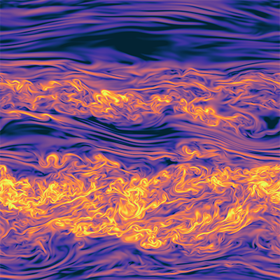
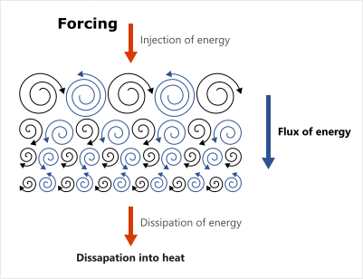
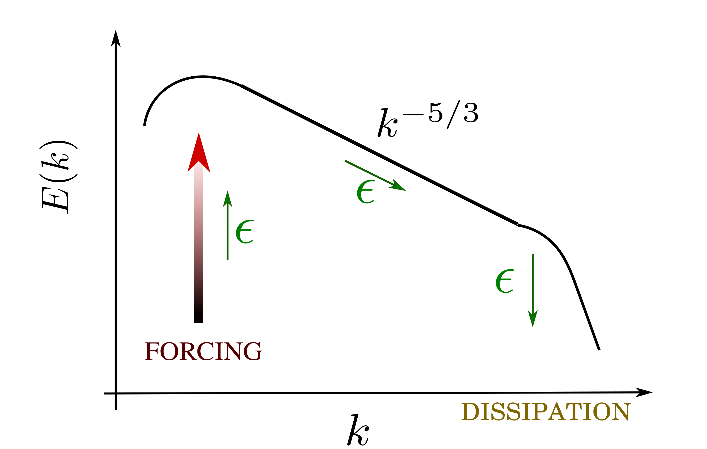
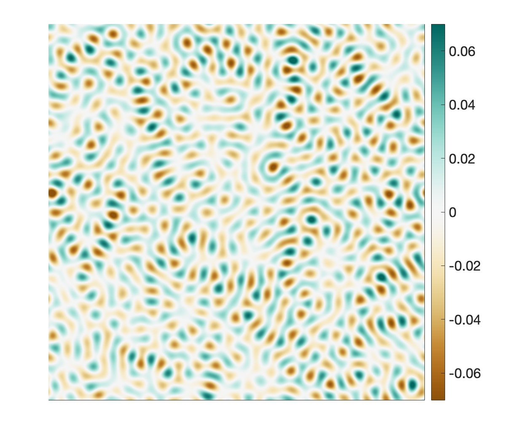
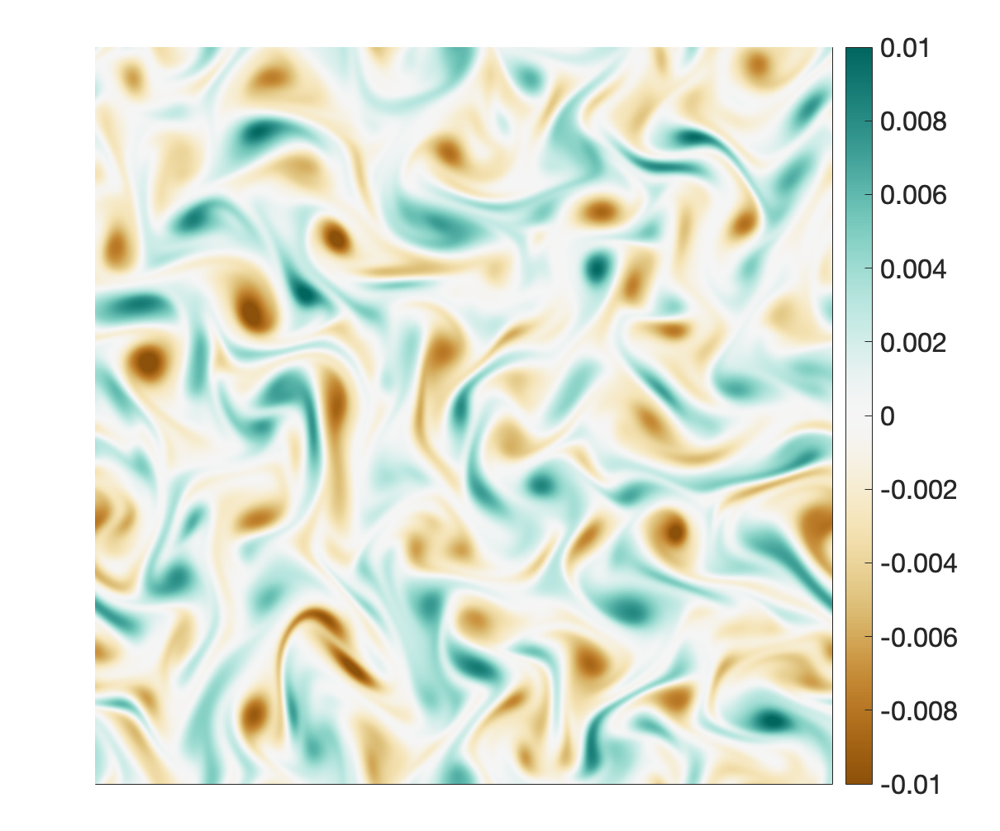
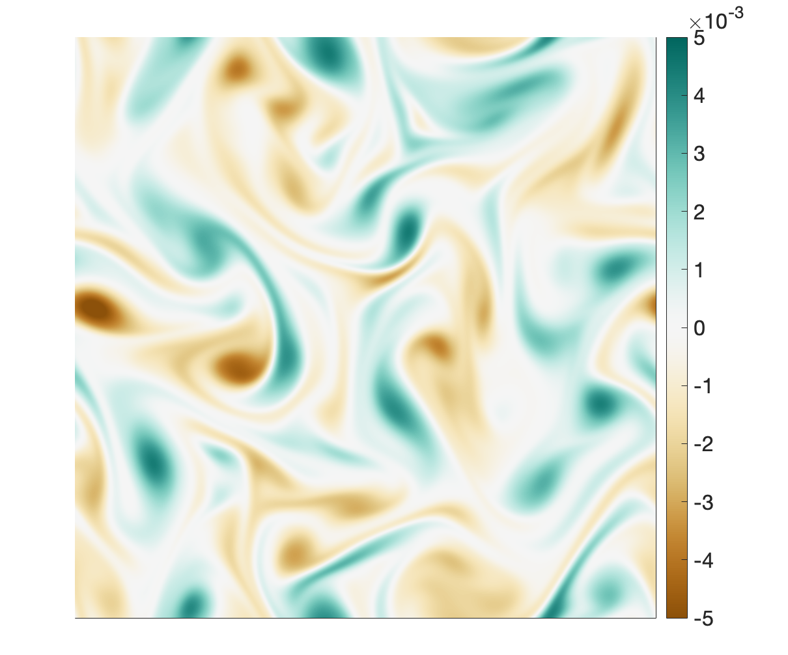
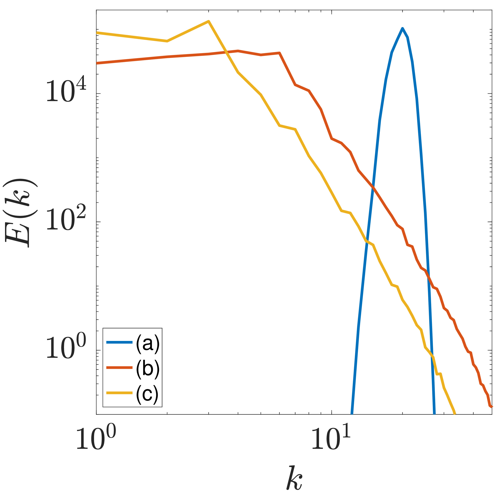
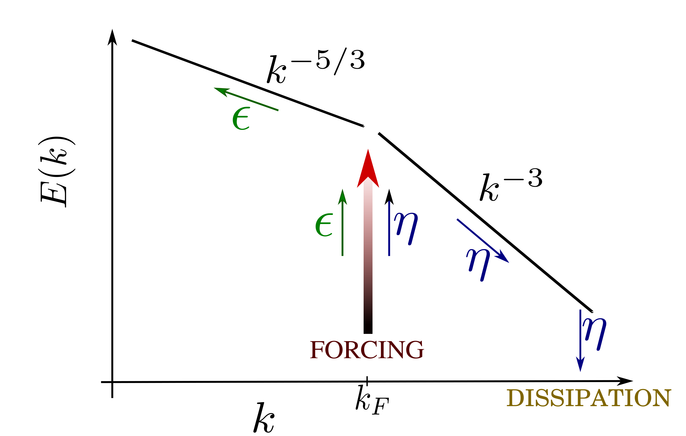
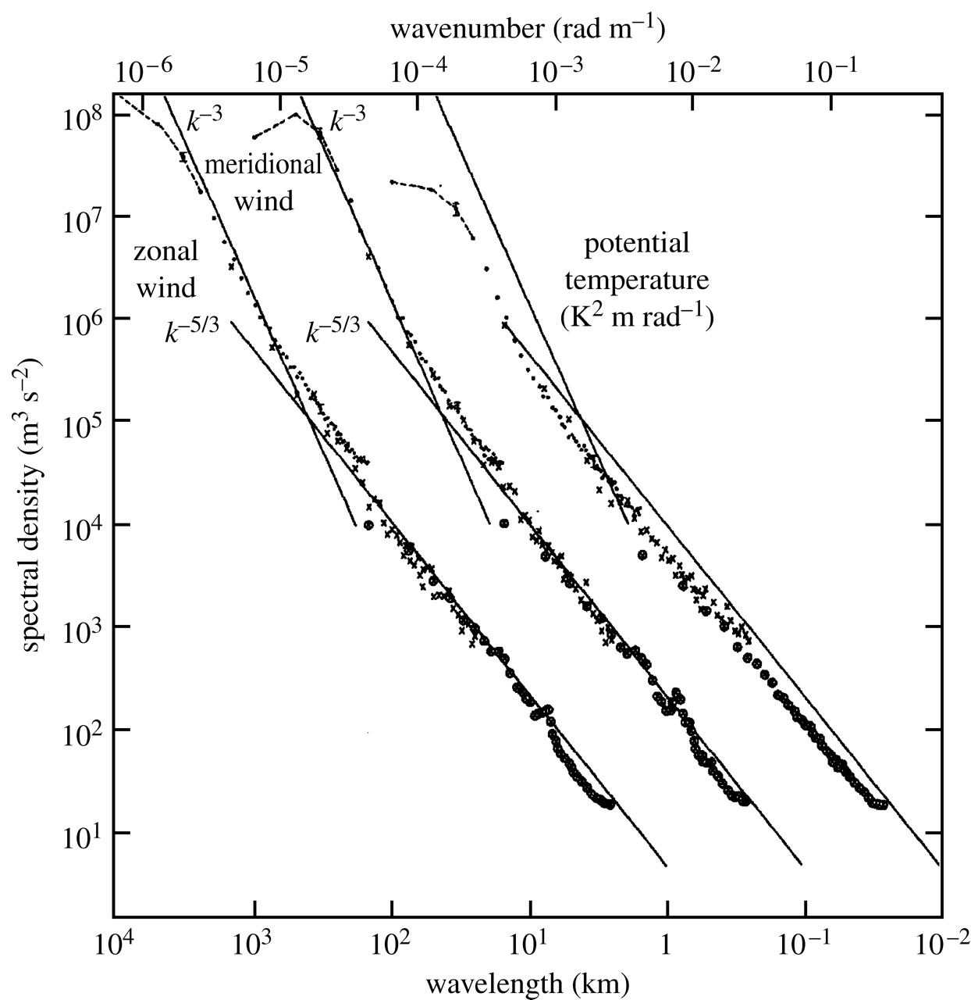

# Turbulence in geophysical flows {#chap-turbulence}

## Introduction

{#fig-mixingturbulence}

> *I am an old man now, and when I die and go to heaven, there are two matters on which I hope for enlightenment. One is quantum electrodynamics and the other is the turbulent motion of fluids. About the former, I am really rather optimistic.*

> *There is a physical problem that is common to many fields, that is very old, and that has not been solved. It is not the problem of finding new fundamental particles, but something left over from a long time ago---over a hundred years. Nobody in physics has really been able to analyze it mathematically satisfactorily, in spite of its importance to the sister sciences. It is the analysis of circulating or turbulent fluids.*

The latter quotation is attributed to Richard Feynman,\footnote{From *The Feynman Lectures on Physics*, Vol.~1; .} one of the most celebrated physicists of the twentieth century, while the former originates from Sir Horace Lamb nearly a century earlier. These and similar remarks frequently appear in opening paragraphs of talks, articles, and books on turbulence—not as a celebration of progress, but as an acknowledgement of the persistent challenges this subject poses. Beyond their wit, they reflect the inherent difficulty of turbulence in physics, a difficulty that begins with the challenge of defining it.

Before attempting such a definition, let us recall an important dimensionless quantity that is central to the study of turbulence: the **Reynolds number**
$$
\mathrm{Re} = \frac{\mathcal{U}\mathcal{L}}{\nu},
$$ {#eq-defRe}
where $\mathcal{U}$ is a characteristic velocity scale, $\mathcal{L}$ a characteristic length scale, and $\nu$ the kinematic viscosity. The inverse of $\mathcal{U}/\nu$ has units of length and represents a scale at which molecular viscosity becomes significant—one of the smallest dynamically relevant length scales in the flow. By contrast, the scale $\mathcal{L}$ typically denotes the largest dynamically active scales, such as the forcing scale, domain size, or the scale of the most energetic vortices. The Reynolds number therefore quantifies the ratio between the largest and smallest active spatial scales. Atmospheric and oceanic flows exhibit enormously large Reynolds numbers (often of order $10^{11}$), reflecting the breadth of scales they involve and the complexity of their dynamics.

As leading turbulence textbooks acknowledge, any precise definition of turbulence is at best difficult and arguably impossible. Following their approach, we characterise turbulence through its principal features:

**Randomness and chaos:** Turbulent motion is highly irregular and unpredictable. A hallmark of chaotic systems is the sensitivity to initial conditions: arbitrarily small perturbations may evolve into drastically different states. Consequently, deterministic prediction of particle trajectories or instantaneous field values (e.g. velocity or pressure) is infeasible. Instead, turbulence is studied statistically. Remarkably, despite the apparent randomness, turbulent flows exhibit universal statistical properties; several of these are explored below.

**Enhanced mixing and diffusivity:** Turbulence greatly increases the transport of momentum, heat, and scalar quantities. One may imagine turbulence as an “idealised whisk’’ stirring velocity, temperature, and other fields, thereby enhancing fluxes and accelerating mixing.

**A wide range of spatial scales:** Turbulence excites a continuum of Fourier modes. A flow with only a small number of active modes is not turbulent, even if chaotic. Because $\mathrm{Re}$ is (in a loose sense) the ratio of the outer to inner scales, large Reynolds numbers are associated with a wide spectral range. In this sense, “turbulence’’ is inherently a large–Reynolds-number phenomenon.

**Nonlinear interactions:** Without nonlinear terms, Fourier modes evolve independently. The Navier–Stokes equations, however, contain quadratic nonlinearities. Turbulence requires these nonlinear interactions to be dynamically significant, allowing energy and other invariants to be transferred between scales.

In the atmosphere and ocean, the largest scales exceed the dissipation scale by many orders of magnitude. Between them lies a vast range of intermediate scales that interact nonlinearly. This richness underpins both the complexity of weather and the limits of weather predictability. Thus, it is fair to state that both the atmosphere and ocean are turbulent systems, although the form and regime of turbulence vary across spatial and temporal scales.

Before describing specific turbulence regimes in geophysical flows, we first review a central mathematical tool: the *Fourier transform*.

## Fourier transform

Because turbulence involves nonlinear energy exchange between scales, the Fourier transform plays a central role. The Fourier transform of a function $f(\xb)$, denoted $\hat{f}$ or $\mathcal{F}[f]$, is defined as
$$
\hat{f}(\kb) = \mathcal{F}[f(\xb)](\kb)
= \int_{-\infty}^{\infty} f(\xb)\, e^{-i\kb\cdot\xb}\, d\xb,
$$ {#eq-defFourTrans}
where $\kb = (k_x,k_y,k_z)$ is the wavevector. The inverse transform is
$$
f(\xb) = \mathcal{F}^{-1}[\hat{f}(\kb)](\xb)
= \frac{1}{(2\pi)^3}\int_{-\infty}^{\infty} \hat{f}(\kb)\, e^{i\kb\cdot\xb}\, d\kb.
$$

We frequently use two key properties:

*Linearity:*
$$
\mathcal{F}[a f + b g] = a\,\mathcal{F}[f] + b\,\mathcal{F}[g].
$$

*Differentiation:*
$$
\mathcal{F}\!\left[\frac{\partial f}{\partial x}\right] = i k_x \hat{f}, \qquad
\mathcal{F}\!\left[\frac{\partial f}{\partial y}\right] = i k_y \hat{f}, \qquad
\mathcal{F}\!\left[\frac{\partial f}{\partial z}\right] = i k_z \hat{f}.
$$

These properties make Fourier space a natural setting in which to analyse turbulence and energy transfers across scales.

## Theory of 3D isotropic turbulence {#sec-3Dturb}

The modern theory of isotropic turbulence centres on the transfer of energy from large to small vortices—a process called the *energy cascade*. Richardson encapsulated this idea in his well-known verse:

> *Big whirls have little whirls that feed on their velocity,*  
> *and little whirls have lesser whirls and so on to viscosity.*

Large eddies transfer energy to somewhat smaller eddies, which transfer it to still smaller eddies, and so on, until the energy reaches sufficiently small scales that it is dissipated by viscosity. This is illustrated schematically in the left panel of @fig-cascades3D.

::: {#fig-cascades3D layout-ncol=2 fig-cap="Left: schematic picture of energy cascade by vortices of different sizes. Right: the energy spectrum of isotropic 3D turbulence."}

:::

Building on this idea, Kolmogorov introduced a phenomenological theory predicting how energy is distributed across scales. His theory—often considered the most significant single contribution to turbulence—applies directly to small-scale atmospheric and oceanic motions and forms the basis for several geophysical turbulence theories.

Kolmogorov’s theory relies on four principal assumptions: (i) *isotropy*, (ii) *homogeneity*, (iii) *large Reynolds number*, and (iv) *locality of energy transfer*. Isotropy means that the statistical properties of the flow are invariant under rotations of the coordinate system; homogeneity means translation invariance. These assumptions hold away from boundaries or when boundary layers are thin relative to the domain.

To describe the distribution of energy among Fourier modes, let $\hat{\ub}(\kb)$ be the Fourier transform of the velocity field. The modal kinetic energy at wavenumber $\kb$ is
$$
\mathcal{E}(\kb) = \frac12\,\hat{\ub}(\kb)\cdot\hat{\ub}(\kb)^*,
$$
and Parseval’s theorem yields
$$
E_{\text{tot}}
= \frac{1}{\mathtt{V}}\int_{\mathtt{V}} \frac12\,\ub(\xb)\cdot\ub(\xb)\, d\xb
= \int \mathcal{E}(\kb)\, d\kb.
$$ {#eq-relateEmodalEreal}

Isotropy implies that modes with equal $|\kb|=k$ have statistically identical energies. This motivates the definition of the *energy spectrum*
$$
E(k) = \oint_{S_k} \mathcal{E}(\kb)\, d\mathbf{s},
$$ {#eq-defEspc}
where $S_k$ is the sphere of radius $k$ in Fourier space. Therefore,
$$
E_{\text{tot}} = \int_0^\infty E(k)\, dk.
$$ {#eq-relateEavrtoEspc}
Thus $E(k)\,dk$ represents the kinetic energy per unit mass contained in wavenumbers between $k$ and $k+dk$.

If the flow is statistically stationary, energy conservation dictates that the rate at which energy is injected into the flow, $\epsilon$, must equal the rate at which it is dissipated by viscosity. The energy spectrum may depend on several quantities, including the forcing $F$, the dissipation $\nu$, the energy flux across each wavenumber $\epsilon$, and the wavenumber $k$:
$$
E = f(F,\epsilon,k,\nu).
$$ {#eq-Efun}

Kolmogorov’s final two assumptions now enter. Locality asserts that energy is transferred mainly between modes of comparable wavenumber. Because forcing acts at large scales and viscosity at small scales, a wide inertial subrange exists where neither forcing nor dissipation acts directly. In this range the spectrum cannot depend on $F$ or $\nu$, leaving
$$
E = f_i(\epsilon,k).
$$ {#eq-EfunInertialRange}

Dimensional analysis then suggests the form
$$
E = C\,\epsilon^{\,m}\,k^{\,n},
$$ {#eq-fatch}
where $C$ is a dimensionless constant. With dimensions
$$
[E]=L^3T^{-2},\qquad
[\epsilon]=L^2T^{-3},\qquad
[k]=L^{-1},
$$
matching powers of $L$ and $T$ yields $m=2/3$ and $n=-5/3$, giving the celebrated Kolmogorov spectrum,
$$
E(k) = C\,\epsilon^{2/3} k^{-5/3}.
$$ {#eq-K41}

This $k^{-5/3}$ law describes the energy spectrum of any (sufficiently isotropic) turbulent flow, regardless of the underlying fluid or environment. Laboratory experiments and oceanic observations have verified this law. The right panel of @fig-cascades3D shows the typical 3D isotropic turbulent spectrum.

## 2D turbulence {#sec-2Dturb}

While neither the atmosphere nor the ocean is exactly two-dimensional, the theory of 2D turbulence forms the conceptual foundation of geostrophic turbulence, which successfully describes many large-scale geophysical statistics. This connection arises because quasi-geostrophic (QG) flows and strictly 2D flows share important invariants and exhibit qualitatively similar nonlinear behaviour.

Consider the 2D incompressible Navier–Stokes equations without rotation, viscosity, or external forcing:
$$
\begin{aligned}
\frac{\partial\vb}{\partial t} + (\vb\cdot\nabla)\vb &= -\frac{1}{\rho}\nabla_H p, \\
\nabla\cdot\vb &= 0.
\end{aligned}
$$ {#eq-2DNavSto}

Taking the curl yields the vorticity equation
$$
\frac{D\zeta}{Dt} = 0,
$$ {#eq-EvolVertVort2D}
where $\zeta$ is the vertical vorticity.

A fundamentally different phenomenology emerges in 2D turbulence due to the conservation of vorticity alongside energy. If vorticity $\zeta$ is conserved for each fluid particle, the volume-averaged *enstrophy*, defined as
$$
Z_{\text{tot}} =  \frac{1}{\mathtt{V}}\int_{\mathtt{V}} \frac12\,\zeta(\xb)\, \zeta(\xb)\, d\xb
= \frac{1}{2} \int  \hat{\zeta}(\mathbf{k}) \, \hat{\zeta}(\mathbf{k})^* d \mathbf{k},
$$ {#eq-defZ}
is also conserved. Here, $\hat{\zeta}$ denotes the Fourier transform of $\zeta$.

Analogous to the energy spectrum defined in @eq-defEspc, the enstrophy spectrum is given by
$$
Z(k) =\frac{1}{2} \int\limits_{S_k} \hat{\zeta}(\mathbf{k}) \hat{\zeta}(\mathbf{k})^* d \mathbf{s},
$$ {#eq-defZspc}
where $S_k$ represents circles of constant $k$. The enstrophy spectrum relates to the energy spectrum via the definition of vorticity:
$$
Z(k) = k^2 E(k).
$$ {#eq-Zspc2Espc}
Combining @eq-Zspc2Espc with @eq-defZspc and @eq-defZ gives
$$
Z_{\text{tot}} = \int_0^\infty Z(k)\, d k = \int_0^\infty k^2 E(k)\, d k.
$$ {#eq-Z_k2E}

Similar to energy, enstrophy is injected into the flow by forcing and dissipated by viscosity. When there is a separation between the forcing and dissipation scales, enstrophy can cascade across intermediate scales. By analogy with the energy flux $\epsilon$, the enstrophy flux $\eta$ is defined as the rate of enstrophy transfer across scales (which equals the rate of enstrophy injection and dissipation in stationary flows). In inertial ranges—scales unaffected directly by forcing or dissipation—both $\epsilon$ and $\eta$ are expected to remain constant (i.e., neither $\epsilon$ nor $\eta$ is a function of $k$ in inertial ranges to maintain the conservation of energy and enstrophy). Using dimensional similarity, one can derive the relationship
$$ 
\eta = \mathcal{A} k^2 \epsilon,
$$ {#eq-relatefluxes}
where $\mathcal{A}$ is a dimensionless constant.

If energy is conserved and the flow is statistically stationary, the energy flux $\epsilon$ remains constant across wavenumbers in the inertial range. A similar argument holds for enstrophy conservation and $\eta$. However, from @eq-relatefluxes, if $\epsilon$ is constant, $\eta$ would necessarily vary with $k$, unless $\mathcal{A} = 0$. If $\mathcal{A} = 0$, then $\eta = 0$ as well. Conversely, if $\eta$ is constant, $\epsilon$ must vary with $k$. Consequently, energy and enstrophy fluxes cannot coexist in the same inertial range in 2D isotropic turbulence.

When $\epsilon = 0$ and $\eta \neq 0$, the energy spectrum depends solely on the enstrophy flux and wavenumber. Dimensional analysis similar to what was presented for @eq-K41 yields
$$ 
E(k) = \mathcal{C}_{\eta} \, \eta^{2/3} k^{-3},
$$ {#eq-EnstrophySubrange}
where $\mathcal{C}_{\eta}$ is a dimensionless constant. On the other hand, if $\epsilon \neq 0$ and $\eta = 0$, the energy spectrum follows Kolmogorov’s formula @eq-K41:
$$
E(k) = \mathcal{C}_{\epsilon} \, \epsilon^{2/3} k^{-5/3}.
$$ {#eq-EnergySubrange}

This raises an important question: which inertial range dominates in a given 2D turbulent flow? This question is closely tied to whether energy or enstrophy cascades upscale or downscale. Before presenting a mathematical argument for the direction of these cascades, we first develop physical intuition by examining a numerical experiment.

We consider a 2D Navier–Stokes simulation governed by @eq-2DNavSto with an initial distribution of vortices that has a thin energy spectrum localized near the wavenumber $k_i = 20$, and we set the forcing term $F=0$. The vorticity field of the initial condition in physical space is shown in @fig-decay (a), with its energy spectrum plotted on a logarithmic scale in @fig-spectra.

::: {#fig-decay layout-ncol=3 fig-cap="Evolution of a decaying turbulent 2D flow at initial time (a), intermediate time (b), and the end of the simulation (c). Colours represent the vorticity field."}
{fig-alt="Initial time"}

{fig-alt="Intermediate time"}

{fig-alt="End of the simulation"}
:::

The flow is then allowed to evolve over time. @fig-decay illustrates the evolution of this flow in physical space at various times. Initially, the flow’s energy is concentrated at smaller vortices, consistent with the energy spectrum peaking at the intermediate (or relatively small) scale of $1/k_i$. Over time, smaller vortices transfer their energy to larger ones that gradually become the most energetic structures. This process continues, forming increasingly larger vortices (see panels (a), (b) and (c) of @fig-decay). This behaviour contrasts sharply with 3D turbulence, where energy cascades from large to small scales. In 2D turbulence, energy moves from smaller to larger scales, as evidenced by the energy spectrum’s peak shifting toward smaller wavenumbers (larger scales) over time, as shown in @fig-spectra. This energy transfer to larger scales is referred to as the *inverse cascade*, distinguishing it from the forward cascade characteristic of 3D turbulence.

{#fig-spectra width=45%}

To put these observations on a firmer mathematical foundation, let us analyze the evolution of energy distribution in wavenumber space. If the initial energy spectrum is sufficiently narrow, we can define the characteristic wavenumber of the initial condition $k_i$ by 
$$
k_i = \frac{\int k E(k)\, d k}{\int E(k)\, d k}
= \frac{\int k E(k)\, d k}{E_{\text{tot}}}.
$$ {#eq-def_ki}
We want to see how the spectrum evolves in time. A fundamental characteristic of turbulence is mixing, which leads to the spread of this narrow band of energy in wavenumber space. In other words, due to strong nonlinear interactions in turbulence, the energy is naturally transferred to other scales. We can quantify the spreading out of the energy distribution with
$$
W = \int (k-k_i)^2 E(k)\, d k,
$$
which can be expanded to 
\begin{align*}
     W = {} & \int k^2 E(k)\, d k - 2 k_i \int k E(k)\, d k + k_i^2 \int  E(k)\, d k \\
     \Rightarrow\quad
     W = {} & Z_{\text{tot}} -  k_i^2 E_{\text{tot}},
\end{align*}
where we used @eq-relateEavrtoEspc, @eq-Z_k2E and @eq-def_ki to arrive at the final expression:
$$
W = Z_{\text{tot}} - k_i^2 E_{\text{tot}}.
$$ {#eq-x1}

Since energy and enstrophy are conserved in 2D turbulence, $d E_{\text{tot}} / d t = d Z_{\text{tot}} / d t = 0$. Then, differentiating @eq-x1 with respect to time gives
$$
\frac{d k_i^2}{d t} = -\frac{1}{E_{\text{tot}}} \frac{d W}{d t}.
$$
The spreading of the initial narrow energy band implies $dW/dt > 0$, leading to $d k_i^2/d t < 0$. Thus, $k_i$ decreases over time, indicating that the typical length scale of vortices increases, consistent with the numerical results shown in @fig-decay.

{#fig-cascades2D width=60%}

Now, let us return to the forced problem, equipped with the insight that energy in 2D turbulence is transferred to larger scales. If the flow is forced at an intermediate scale $k_F$, we expect energy to cascade upscale for $k < k_F$, resulting in an energy spectrum following @eq-EnergySubrange. Conversely, enstrophy, which is also conserved in 2D flows, must cascade downscale for $k > k_F$ (as its flux cannot co-exist with energy flux in the range of $k < k_F$), leading to an energy spectrum consistent with @eq-EnstrophySubrange. This behaviour, known as the double or dual cascade, is depicted schematically in @fig-cascades2D, where the cascade directions and the corresponding slopes of spectra are shown.

This picture of forced 2D turbulence is commonly referred to as the *Kraichnan–Batchelor* theory, named after the two prominent scientists who developed it. To achieve the statistical stationarity assumed in @eq-EnergySubrange, a mechanism must dissipate energy at scales much larger than the forcing scale. A plausible physical mechanism is the scale-independent dissipation characteristic of Ekman layers near boundaries as long as their effects remain negligible within the inertial range.

## Geostrophic turbulence {#sec-geoturb}

The seminal paper by Charney (1971) established the theory of geostrophic turbulence. The motivation stemmed from a paradox: observational spectra showed a $k^{-3}$ slope at large atmospheric scales—consistent with 2D turbulence—yet the atmosphere is clearly not two-dimensional in this regime.

The theory relies on the QG system introduced in Section~@sec-Geostrophic, which accurately describes large-scale atmospheric and oceanic flows. For simplicity, assume constant $N$ and $f$. The total QG energy, consisting of horizontal kinetic plus available potential energy, is
$$
E_{\text{tot}}
= \frac{1}{\mathtt{V}}\int_{\mathtt{V}}
\left( u^2 + v^2 + \frac{b^2}{N^2} \right) d\xb
= \frac{1}{\mathtt{V}}\int_{\mathtt{V}}
\left( |\nabla\psi|^2 + \frac{f^2}{N^2} \psi_z^2 \right) d\xb.
$$ {#eq-consEinQG}

The QG potential vorticity,
$$
q = \zeta + \frac{f_0}{N^2} \frac{\partial b}{\partial z}
= \nabla_H^2\psi + \frac{f_0^2}{N^2}\psi_{zz},
$$ {#eq-PVrep}
is materially conserved,
$$
\frac{Dq}{Dt} = \frac{\partial q}{\partial t} + \vb\cdot\nabla_H q = 0,
$$ {#eq-QGdim2}
implying conservation of *potential enstrophy*,
$$
Z_{\text{tot}} = \frac{1}{\mathtt{V}}\int_{\mathtt{V}} q^2\, d\xb.
$$ {#eq-consZinQG}

QG flow is neither 2D nor 3D isotropic. To make its invariants resemble those of 2D turbulence, Charney proposed a vertical coordinate stretching:
$$
\tilde{z} = \frac{N}{f} z.
$$

In the stretched coordinate, @eq-QGdim2 becomes
$$
\frac{\partial}{\partial t}\nabla^2_\ast\psi
+ u\,\frac{\partial}{\partial x}\nabla^2_\ast\psi
+ v\,\frac{\partial}{\partial y}\nabla^2_\ast\psi = 0,
$$ {#eq-QGeqNewCor}
where
$$
\nabla_\ast = \left(\frac{\partial}{\partial x},
                 \frac{\partial}{\partial y},
                 \frac{\partial}{\partial \tilde{z}}\right)
$$
is an isotropic gradient operator. The energy and potential enstrophy become
$$
\mathsf{E}_{\text{geo}} = \int |\nabla_\ast\psi|^2\, d\xb,
$$ {#eq-EcharneyCor}
and
$$
\mathsf{Z}_{\text{geo}} = \int (\nabla_\ast^2\psi)^2\, d\xb.
$$ {#eq-ZcharneyCor}

These have the same mathematical form as the 2D energy and enstrophy invariants, except that $\nabla_H$ has been replaced by $\nabla_\ast$ and the integrals are now three-dimensional.

Therefore, the same arguments that apply to 2D turbulence apply to QG turbulence in the stretched coordinates. In particular, potential enstrophy cascades forward, and the associated energy spectrum in the “synoptic’’ range is
$$
E(\tilde{k}) = C_{\text{geo}}\,\eta^{2/3}\,\tilde{k}^{-3},
$$ {#eq-QGEnsSubrange}
where $\tilde{k} = (k_x^2 + k_y^2 + (f/N)^2 k_z^2)^{1/2}$.

Assuming isotropy in $\nabla_\ast$ space, the kinetic and potential energy components,
$$
E_x,\; E_y,\; E_{\tilde{z}},
$$
each inherit the same $k^{-3}$ slope. Transforming back to physical coordinates implies that both horizontal kinetic and available potential energy spectra in the atmosphere follow this $-3$ scaling.

## Atmospheric energy spectrum {#sec-atmosspc}

We now illustrate how turbulence theories explain the observed atmospheric energy spectrum. @fig-GageNastrom, taken from Nastrom and Gage 1985, is a landmark observational result covering a broad range of scales, obtained from over $6000$ commercial aircraft flights in the Global Atmospheric Sampling Program (GASP). Later studies using improved datasets reproduced similar spectra.

In the synoptic range (corresponding to wavelengths up to roughly $500\,\mathrm{km}$), the zonal velocity, meridional velocity, and potential temperature all exhibit a $k^{-3}$ slope. This is precisely the scaling predicted by geostrophic turbulence theory in the forward-cascading enstrophy subrange (Section~@sec-geoturb). Because $E_x$, $E_y$, and $E_{\tilde{z}}$ all share the same $k^{-3}$ slope, the consistency across all three observed spectra supports the applicability of QG dynamics at synoptic scales.

At wavelengths smaller than $500\,\mathrm{km}$, the spectrum transitions sharply to a shallower $k^{-5/3}$ slope (sometimes interpreted as $-2$). While the $k^{-3}$ regime is well-understood, the physical explanation of the $k^{-5/3}$ range remains an active area of research.

{#fig-GageNastrom width=60%}
