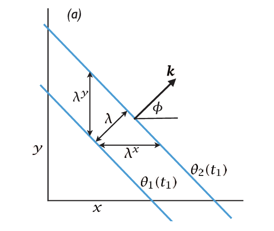
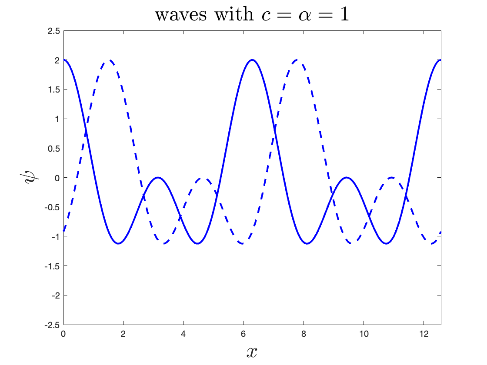
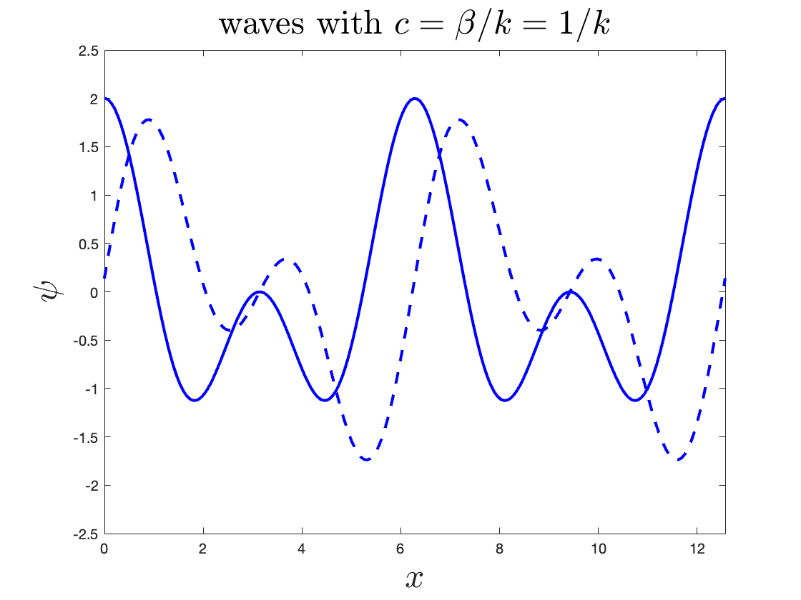
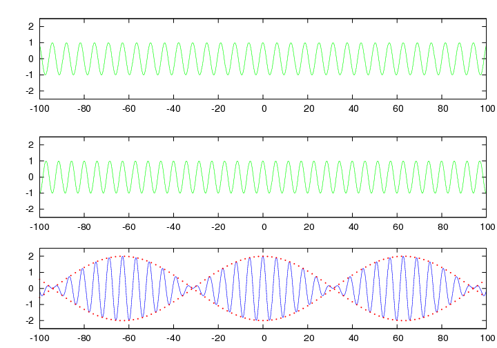
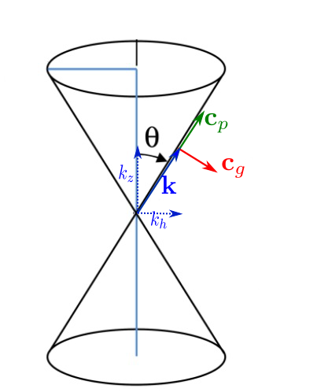
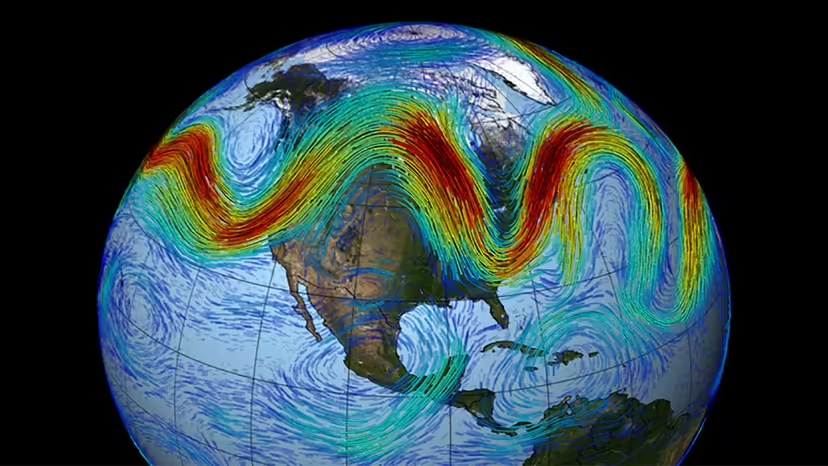

# Waves in the atmosphere and ocean {#chap-waves}

## Basic concepts

We review some basic concepts about waves that you might already be familiar with from other courses. To start, consider a plane sinusoidal wave  
$$
    \psi(\xb,t) = \mathcal{M} \cos(\kb \cdot \xb - \omega t) + \mathcal{N} \sin(\kb \cdot \xb - \omega t),
$$ {#eq-planewave_sin}
where $\kb = (k_x,k_y,k_z)$ is the wavevector and $\omega$ the frequency. The norm of wavevector $k = |\kb|$, is known as the wavenumber (in the  literature even $\kb$ is sometimes loosely referred to as the wavenumber). The argument of $\sin$ and $\cos$ functions is known as the phase and usually denoted by $\theta = \kb . \xb - \omega t$. Using trigonometric identities, we can write @eq-planewave_sin in the equivalent different form
$$
    \psi(\xb,t) = \mathcal{A} \cos(\kb \cdot \xb - \omega t + \phi_0),
$$
where $\mathcal{A} = \sqrt{\mathcal{M}^2+\mathcal{N}^2}$ is the wave amplitude and $\phi_0$ is an initial phase shift.  

Another useful equivalent form of @eq-planewave_sin is in terms of the complex exponential function:
$$
    \psi(\xb,t) = \mathcal{R}e \{ A e^{i (\kb . \xb - \omega t)} \}
$$ {#eq-planewave_exp}
where $A$ is the complex wave amplitude (often loosely referred to simply as the wave amplitude). For plane waves $A$ is constant, but in general it may depend on space and time. With some complex algebra one can show that $|A| = \mathcal{A}$.  

In the remainder of this chapter, we will often omit the real-part operator $\mathcal{R}e$ to lighten the notation, with the understanding that the physical solution is always the real part of the complex expression.

From @planewave_sin we can infer that the distance between two consecutive crests (or troughs) is
$$
    \lambda = \frac{2\pi}{|\kb|},
$$

which is called the wavelength. If we fix a point in space, the period
$$
    T = \frac{2\pi}{\omega}
$$
is the time it takes for the wave to repeat itself at that point (for example, the time between two crests passing a fixed location).

### Dispersion relation

Different kinds of waves arise as solutions of different linear (partial) differential equations (there are also nonlinear waves, which are beyond the scope of this course). For example, the plane wave considered above (in one spatial dimension) can be a solution of
$$
    \frac{\partial \psi}{\partial t} + \alpha \ \frac{\partial \psi}{\partial x} = 0.
$$ {#eq-waveq_1D}
Upon substituting @eq-planewave_exp into this equation, we obtain $A(-i\omega + \alpha \ ik_x)=0$. For a non-trivial solution ($A \neq 0$), this requires
$$
  \omega = \alpha k_x 
$$ {#eq-planewave_disprel}
In other words, for any wavenumber $k_x$ we can find a corresponding frequency $\omega$ from @eq-planewave_disprel such that $A e^{i (\kb \cdot \xb - \omega t)}$ is a solution of @eq-waveq_1D. A relation between $\omega$ and $\kb$ obtained in this way is called the *dispersion relation*. 

::: {.callout-tip icon="false"}
## Example

For the following equation 
$$
    \frac{\partial}{\partial t} \nabla^2 \psi + \beta \ \frac{\partial \psi}{\partial x} = 0,
$$ {#eq-RossbyWave_3D}
we find the dispersion relation
$$
    \omega = \frac{-\beta k_x}{k_x^2+k_y^2+k_z^2}
$$ {#eq-RossbyWave_disprel}
:::

For a general linear equation, the dispersion relation can have the form of
$$
    \omega = \Omega(\kb; \xb, k)
$$

### Phase speed and phase velocity

{#fig-plane_wave_crest width=50%}

Phase speed is the distant that the crests (or troughs) of a wave are travelling per unit of time. To find the value of phase speed, (at any instance in time) we align our coordinate along the $\kb$ axis as shown in @fig-plane_wave_crest. If denote the position along the $\kb$ axis in the new coordinate by $x^*$, $\kb \cdot \xb = k x^*$. We then write @eq-planewave_exp as
$$
    \psi = A e^{i (\kb . \xb - \omega t)} = A e^{i k (x^*- c t)} ,
$$
where
$$
    c_p = \frac{\omega}{k}
$${#eq-phase_speed}
is the phase speed. From this form we can see that the wave function is simply shifted along the $\kb$ direction by $c t$. Hence, if we pick a point on the wave (for example on a crest), it moves along the $\kb$ axis with the speed $c$. 

::: {.callout-tip icon="false"}
## Example

Based on the definition of phase speed in @eq-phase_speed, we derive $c$ for the following equations 
$$
  \frac{\partial \psi}{\partial t} + \alpha \ \frac{\partial \psi}{\partial x} = 0 
$$ {#eq-PlaneWave_1D}
$$
    \frac{\partial}{\partial t} \frac{\partial^2 \psi}{\partial x^2} \psi + \beta \ \frac{\partial \psi}{\partial x} = 0. 
$$ {#eq-RossbyWave_1D}
We can first derive the dispersion relation for the above systems and then divide $\omega$ by $k$ to get the phase speed. We have already found the dispersion for @eq-PlaneWave_1D in @eq-planewave_disprel. Dividing this expression by $k$, we obtain $c_p = \alpha$. The system @eq-RossbyWave_1D is a one-dimensional case of @eq-RossbyWave_3D, where $k = k_x$ and $k_y = k_z =0$. Dividing @eq-RossbyWave_disprel by $k$ leads to $c_p = -\beta / k_x$.
:::

It is common to assign a direction to the phase speed and turn it into a velocity vector. Considering that wave crests propagate along $\kb$ we can define the phase velocity as 
$$
    \boldsymbol{c}_p = \frac{\omega}{k} \ \frac{\kb}{k}.
$$
(decide later if you want to talk about phase velocity in more detail. probably better not to bother)

::: {#fig-disp_nondispWave layout-ncol=2}

{width=50%}

{width=50%}

Propagation of two superimposed waves: left) non-dispersive and right) dispersive. The solid line is the initial wave $\psi(x,t=0)$ and the dashed line after 1.5 time $\psi(x,t=1.5)$.
:::

Now let's consider a (one-dimensional) compound wave that consists of two wavenumbers, for example 
$$
    \psi = A_1 e^{i ( x - c_1 t)} + A_2 e^{i 2 ( x - c_2 t)}. 
$$ {#eq-twowaves_1_2}
If this wave evolves under @eq-PlaneWave_1D we find that phase velocity of both components are the same $c_1 = c_2 = \alpha$. This means that both signals (wave components) move at the same speed so the initial shape of the wave will be preserved in time and just gets shifted along the x axis. The story is very different for the system @eq-RossbyWave_1D as each component of the wave has a different velocity $c_1 = \beta$ and $c_2 = \beta / 2$. This means that the shape of the wave deforms in time as its constituents propagate at different speed. This is demonstrated in figure @fig-disp_nondispWave. The first systems @eq-PlaneWave_1D belongs to a class of waves that are called *non-dispersive*. For non-dispersive waves the phase speed does not depend on the wavenumber (left panel of @fig-disp_nondispWave). The second system @eq-RossbyWave_1D is an example of *dispersive* waves for which the phase speed is an explicit function of wavenumber (right panel of @fig-disp_nondispWave). 

### Group velocity

{#fig-groupvel width=65%}

Energy and information do not necessarily travel at the phase speed. We do not care too much about how individual crests and troughs propagate in time. Instead, we want to know how a packet or bundle of them move together. Their collective motion shows how much energy and information is transferred by them. The quantity that characterises such a collective motion is the *group velocity*. 

To understand the concept of group velocity, we consider a superposition of two waves similar to @eq-twowaves_1_2
$$
    \psi = A \left[ e^{i ( k_1 x - \omega_1 t)} + e^{i (k_2 x - \omega_2 t) } \right], 
$$ {#eq-twoSimilarWaves}
but this time we set the frequency of individual signals to $\omega_1 = \omega + \Delta \omega$ and $\omega_2 = \omega - \Delta \omega$, and their wavenumbers to $k_1 = k + \Delta k$ and $k_2 = k - \Delta k$. If $\Delta k$ and $\Delta \omega$ are small, these two components will have similar frequencies and wavenumbers. An example of two wave signals with slightly different frequencies and wavenumbers is depicted in the top rows of @fig-groupvel. The bottom row of this figure shows the superposition of these waves, which forms a wave packets (an envelope of crests and troughs) that look like a wave itself. We can see this in a mathematical expression by simplifying @eq-twoSimilarWaves
$$
    \psi = A e^{i ( k x - \omega t)} \left[ e^{i ( \Delta k x - \Delta \omega t)} + e^{- i ( \Delta k x - \Delta \omega t)}  \right] = A \cos (\Delta k x - \Delta \omega t) e^{i ( k x - \omega t)}   
$$
The amplitude of the superposition is no longer constant and instead is *modulated* by $\cos(\Delta k x - \Delta \omega t)$. Just like the original wave signals, this modulated envelope moves in time, however, with a different speed that is $\Delta \omega / \Delta k$. This quantity at the limit of $\Delta k, \Delta \omega \to 0$ is the group velocity $c_g = \partial \omega / \partial k$. Group velocity is equal to the phase speed only for non-dispersive waves, i.e. when the frequency is a linear function of wavenumber. The energy in a wave is transported by group velocity. To have a better understanding of this phenomenon, consider the nodes between the envelopes in figure @fig-groupvel. The wave function is zero at these nodes so the energy cannot be transferred across them. These nodes (as well as the envelopes between them that contains the wave energy) move with the group velocity. We can generalise this concept to three dimensions and define the group velocity as
$$
    \boldsymbol{c}_g = \nabla_{\kb} \omega = \ddy{\omega}{\kb} = \left(\ddy{\omega}{k_x}, \ddy{\omega}{k_y}, \ddy{\omega}{k_z} \right)
$$ {#eq-groupVel_def} 

## Poincaré waves in the Shallow Water equations {#sec-SW_waves}

Now that we are equipped with some basic concepts from wave dynamics, we can study waves in geophysical flows. One might ask why waves appear so prominently in large-scale geophysical systems. In the previous chapter we saw that the leading-order dynamics at large scales ($\mathcal{L} \approx \mathcal{L}_d$) is quasigeostrophic. With a different timescale, and still at small Rossby number with $\mathcal{L} \approx \mathcal{L}_d$, wave dynamics can also emerge. In this course we demonstrate this for the Shallow Water system; similar arguments can be made for the Boussinesq equations.

We consider the Shallow Water equations with a flat bottom and place $z=0$ at the mean free-surface level. With these assumptions, $\eta_b = - H$ and $h = \eta + H$, where $H$ is the (constant) mean depth. Writing the Shallow Water equations in terms of $\eta$ and $\vb$ (substituting $h = \eta + H$) gives
$$
\begin{aligned}
    \frac{\partial \vb}{\partial t} + (\vb\cdot\gradH)\vb + \fb\times\vb &= -g \ \gradH \eta, \\
    \frac{\partial \eta}{\partial t} + H \ \gradH \cdot \vb  + \gradH \cdot (\eta \vb) &= 0.
\end{aligned}
$$ {#eq-SWxi}

This formulation allows us to distinguish the scale of height variations from the mean depth $H$. We now non-dimensionalise @eq-SWxi using
$$
   (x,y) = {\mathcal{L}}{({x^*},{y^*})}, \quad (u,v) =  {\mathcal{U}}{({u^*},{v^*})}, \quad t = \frac{1}{f_0} t^* , \quad \eta = \frac{f_0\mathcal{L} \ \mathcal{U}}{g} \eta^*, \quad \fb = f_0 \fb^* .
$$ {#eq-wavescalingSW}

This is very similar to the scaling we used for geostrophic theory, except that we now choose the characteristic time scale to be $1/f_0$ rather than the advective time scale $\mathcal{L}/\mathcal{U}$. In large-scale geophysical flows, $1/f_0$ is typically shorter than $\mathcal{L}/\mathcal{U}$, so we are focusing on dynamics that are faster than quasigeostrophic motions.  

The dimensionless shallow water equations obtained from @eq-wavescalingSW are
$$
\begin{aligned}
    \frac{\partial \nd{\vb}}{\partial \nd{t}} + \Ro \ (\nd{\vb}\cdot \gradH^*) \nd{\vb} + \nd{\fb} \times \nd{\vb} &= - \ \gradH^* \nd{\eta}, \\
    \frac{\partial \nd{\eta}}{\partial \nd{t}} + \left( \frac{\mathcal{L}_d}{\mathcal{L}} \right)^2 \ \gradH^* \cdot \nd{\vb}  + \Ro \ \gradH^* \cdot (\nd{\eta} \nd{\vb}) &= 0,
\end{aligned}
$$ {#eq-ndSWxi}
where $\mathcal{L}_d = \sqrt{gH}/f_0$ is the deformation radius and $\Ro = \mathcal{U}/(f_0 \mathcal{L})$ is the Rossby number.  

In the limit of small $\Ro$ (with $\mathcal{L} \approx \mathcal{L}_d$), these equations simplify to
$$
\begin{aligned}
    \frac{\partial \nd{\vb}}{\partial \nd{t}} + \nd{\fb} \times \nd{\vb} &= - \ \gradH^* \nd{\eta}, \\
    \frac{\partial \nd{\eta}}{\partial \nd{t}} + \left( \frac{\mathcal{L}_d}{\mathcal{L}} \right)^2 \ \gradH^* \cdot \nd{\vb} &= 0,
\end{aligned}
$$ {#eq-lin-ndSWxi}
which are simply the linearised Shallow Water equations. Transforming back to dimensional variables yields
$$
\begin{aligned}
    \frac{\partial \vb}{\partial t} + \fb\times\vb &= -g \ \gradH \eta, \\
    \frac{\partial \eta}{\partial t} + H \ \gradH \cdot \vb &= 0.
\end{aligned}
$$ {#eq-linSWxi}

The take-home message from this scaling argument is that, on the fast timescale $1/f_0$ and in the limit of small $\Ro$ with $\mathcal{L} \approx \mathcal{L}_d$, the Shallow Water equations become effectively linear and admit wave solutions.  

To derive these wave solutions, it is convenient to introduce
$$
	\zeta =  \ddy{v}{x} - \ddy{u}{y}, \qquad
	\delta = \ddy{u}{x} + \ddy{v}{y} = \gradH \cdot \vb,
$$
where $\zeta$ and $\delta$ are the vertical vorticity and horizontal divergence, respectively. In other words, we rewrite the equations in terms of $(\zeta,\delta,\eta)$ instead of $(u,v,\eta)$.

Taking the curl and divergence of @eq-linSWxi gives
$$
\begin{aligned}
	\ddy{\zeta}{t} + f \delta &= 0, \\
	\ddy{\delta}{t} - f \zeta &= -g \gradH^2 \eta.
\end{aligned}
$$ {#eq-zetdeltSWmom}
Substituting $\delta = \gradH \cdot \vb$ into @eq-linSWxi gives
$$
	\frac{\partial \eta}{\partial t} + H \ \delta = 0.
$$ {#eq-deltSWheight}
Equations @eq-zetdeltSWmom and @eq-deltSWheight together form a closed linear system for $(\zeta,\delta,\eta)$, which we solve using the wave ansatz
$$
	\zeta = \tilde{\zeta}\ e^{i (k_x x + k_y y - \omega t)}, \quad
	\delta = \tilde{\delta}\ e^{i (k_x x + k_y y - \omega t)}, \quad
	\eta = \tilde{\eta}\ e^{i (k_x x + k_y y - \omega t)}.
$$
Substituting into @eq-zetdeltSWmom–@eq-deltSWheight and cancelling the exponential factor leads to the matrix system
$$
    \begin{bmatrix}
	-i \omega  	    & f            	 &  0    \\
	-f            	& -i \omega      & - g (k_x^2+k_y^2)    \\
	0               &  H              & -i \omega
	\end{bmatrix} 
	\begin{bmatrix} \tilde{\zeta} \\ \tilde{\delta} \\ \tilde{\eta} \end{bmatrix}
        = 0.
$$
The dispersion relation follows from the characteristic equation
$$
    -i \omega \bigl(-\omega^2 + gH (k_x^2+k_y^2)\bigr)  + f (-i \omega f ) = 0,
$$
which gives
$$
  \omega = 0, \qquad \omega = \pm \sqrt{f^2 + g H (k_x^2+k_y^2)}.
$$
The non-zero frequencies correspond to shallow-water waves, often referred to as *Poincaré waves*. For these waves, the phase and group velocities are
$$
	\boldsymbol{c}_p =
    \omega \left(\frac{k_x}{k^2}, \frac{k_y}{k^2}\right) = \frac{\omega}{k^2} \boldsymbol{k}, \qquad
	\boldsymbol{c}_g = \left(\ddy{\omega}{k_x},\ddy{\omega}{k_y}\right) = \left(\frac{gH k_x}{\omega},\frac{gH k_y}{\omega}\right) = \frac{gH}{\omega} \boldsymbol{k}.
$$
Thus the phase and group velocities are parallel: wave crests and wave packets move in the same direction. The ratio of group to phase speed is
$$
	\frac{c_g}{c_p} = \frac{gH}{c_p^2} = \frac{\mathcal{L}^2_d(k_x^2+k_y^2)}{1+\mathcal{L}^2_d(k_x^2+k_y^2)},
$$
which shows that wave packets move more slowly than the crests. For larger wavenumbers (shorter wavelengths), the difference between these speeds decreases.

## Inertia-gravity waves in the Boussinesq equations

We now consider the wave dynamics in the context of the Boussinesq system. This leads to an important class of waves in the atmosphere and ocean: *inertia–gravity waves*. These waves are associated with two restoring effects introduced earlier: buoyancy and the Coriolis force. They can be generated in many ways, e.g.\ atmospheric flows impinging on topography, tides in the ocean, or wind forcing at the sea surface. Despite their diverse generation mechanisms, the waves that propagate in the ocean and atmosphere interior follow similar physical principles.

We can follow a similar scaling argument as in Section @sec-SW_waves to justify linearising the Boussinesq equations for the fast-timescale motion. We can also consider small disturbances propagating in a fluid initially at rest. If the disturbances are small, we can neglect the quadratic nonlinear terms, leading to the linearised equations. In the hydrostatic Boussinesq approximation, the linear equations are
$$
\begin{aligned}
\frac{\partial \vb}{\partial t} + \fb \times \vb &= - \frac{1}{\rho_0} \ \gradH p, \\
b &= \frac{1}{\rho_0} \frac{\partial p }{\partial z}, \\
\gradH \cdot \vb + \frac{\partial w}{\partial z} &= 0, \\
\frac{\partial b}{\partial t} + N^2 w &= 0,
\end{aligned}
$$ {#eq-lin-Bous}
where $b$ is buoyancy, $N$ the buoyancy frequency, and $w$ the vertical velocity.

Using a plane-wave ansatz for all variables,
$$
    u = \tilde{u}\ e^{i (\kb \cdot \xb - \omega t)}, \quad v = \tilde{v}\ e^{i (\kb \cdot \xb - \omega t)}, \quad w = \tilde{w}\ e^{i (\kb \cdot \xb - \omega t)},
$$
$$
    b = \tilde{b}\ e^{i (\kb \cdot \xb - \omega t)}, \quad p = \tilde{p}\ e^{i (\kb \cdot \xb - \omega t)},
$$
and substituting into @eq-lin-Bous, then cancelling the common factor $e^{i (\kb \cdot \xb - \omega t)}$, we obtain
$$
\begin{aligned}
-i\omega \tilde{u} -f \tilde{v} &= -\frac{1}{\rho_0} \ i k_x \tilde{p}, \\
-i\omega \tilde{v} +f \tilde{u} &= -\frac{1}{\rho_0} \ i k_y \tilde{p}, \\
\tilde{b} &= \frac{1}{\rho_0} \ i k_z \tilde{p}, \\
i k_x \tilde{u} + i k_y \tilde{v} +  i k_z \tilde{w} &= 0, \\
-i \omega \tilde{b} + N^2 \tilde{w} &= 0.
\end{aligned}
$$ {#eq-klin-Bous}

We eliminate $\tilde{p}$ from the first two equations using the third, and eliminate $\tilde{w}$ from the last using the fourth, to obtain the reduced system
$$
    \begin{bmatrix}
	-i \omega  	    & -f            	& k_x / k_z    \\
	f            	& -i \omega        	& k_y / k_z    \\
	- N^2 k_x/k_z   & - N^2 k_y/k_z     & -i \omega
	\end{bmatrix} 
	\begin{bmatrix} \tilde{u} \\ \tilde{v} \\ \tilde{b} \end{bmatrix}
        = 0.
$$
The dispersion relation follows from the characteristic equation of this matrix:
$$
    i \omega \left(-\omega^2 + f^2 + N^2 \frac{k_x^2+k_y^2}{k_z^2}\right) = 0,
$$
so
$$
  \omega = 0, \qquad \omega = \pm \sqrt{f^2 + N^2 \frac{k_h^2}{k_z^2}},
$$ {#eq-IGWdispersion}
where $k_h = \sqrt{k_x^2+k_y^2}$. We focus on the non-zero frequencies, which describe propagating waves.

The dispersion relation @eq-IGWdispersion reveals key features of inertia–gravity waves. The frequency for a given wavevector $\kb$ depends only on the ratio $k_h/k_z$. As illustrated schematically in Figure @fig-IGWcone, this ratio is equal to $\tan\theta$, where $\theta$ is the angle between the wavevector and the vertical, so
$$
    \frac{k_h}{k_z} = \tan(\theta).
$$
Thus, all wavevectors with the same $\theta$ have the same frequency. Surfaces of constant frequency in wavenumber space are therefore double cones (Figure @fig-IGWcone).

{#fig-IGWcone width=35%}

From the definition of group velocity @eq-groupVel_def, we know that $\boldsymbol{c}_g$ is perpendicular to surfaces of constant $\omega$, so it is normal to these cones. The phase velocity, on the other hand, is parallel to $\kb$ and thus lies along the cone. As a result, the group and phase velocities are perpendicular to one another: energy and information propagate in a direction perpendicular to the propagation of individual crests.  

We can see this explicitly by differentiating @eq-IGWdispersion with respect to $\kb$:
$$
    \boldsymbol{c}_g =
    \left( \frac{N^2  k_x/ k_z^2}{\omega}, \frac{N^2 k_y/k_z^2}{\omega},  - \frac{N^2 k_h^2/k_z^3}{\omega} \right).
$$ {#eq-hydstat-IGWdisp}
It is straightforward to check that the inner product of this vector with $\kb = (k_x, k_y, k_z)$ is zero, confirming that $\boldsymbol{c}_g \perp \kb$.

We can repeat the analysis for the non-hydrostatic Boussinesq equations (see the earlier Boussinesq chapter) to obtain the dispersion relation
$$
    \omega = \pm \sqrt{f^2 \frac{k_z^2}{k^2} + N^2 \frac{k_h^2}{k^2}} = \pm \sqrt{f^2 \cos^2(\theta) + N^2 \sin^2(\theta)},
$$ {#eq-nonhydstat-IGWdisp}
where again $\theta$ is the angle from the vertical.

The hydrostatic and non-hydrostatic dispersion relations share a key feature: both depend only on $\theta$, so the constant-frequency surfaces are the same cones, and $\boldsymbol{c}_p$ and $\boldsymbol{c}_g$ remain perpendicular. The non-hydrostatic dispersion relation @eq-nonhydstat-IGWdisp, however, shows an additional property: the wave frequency is bounded between $f$ and $N$ (for typical geophysical conditions with $N > f$). This is consistent with observations in the atmosphere and ocean. 

## Rossby waves

{#fig-RossbyWaveSim width=65%}

Rossby waves are another important class of waves in the ocean and atmosphere. They have relatively large spatial scales—comparable to the planetary radius—and are therefore also called *planetary waves*. Figure @fig-RossbyWaveSim illustrates the large scale of atmospheric Rossby waves. These waves play a crucial role in shaping weather patterns, as they can transport substantial masses of air or water and give rise to cyclones and anticyclones.  

The restoring mechanism for Rossby waves is the variation of the Coriolis parameter with latitude, the so-called $\beta$-effect introduced in the earlier chapter on the tangent-plane approximation. As usual, we will start from a set of linear equations and derive a dispersion relation. For Rossby waves we begin from the quasigeostrophic (QG) potential vorticity equation
$$
     \frac{D q}{D t}  = 0,
$$ {#eq-QGrepeat}
where $q$ is the potential vorticity (PV). We did not start from the full Boussinesq equations, because at large scales the QG approximation is appropriate. As discussed in previous chapters, PV conservation holds for both the shallow-water and Boussinesq systems, but the expressions for $q$ differ. Starting from @eq-QGrepeat, one can derive Rossby waves in both systems; here we restrict attention to the shallow-water case for simplicity, noting that many properties are shared.

Recall that the QG PV for the shallow-water system is
$$
    q = \gradH^2 \psi + f_0 + \beta y -\frac{1}{\mathcal{L}_d^2} \psi,
$$ {#eq-PVSWrepeat}
where $\mathcal{L}_d = \sqrt{g H}/f_0$ is the deformation radius.

We linearise @eq-QGrepeat about a time-independent basic state. Unlike the inertia–gravity wave case, the basic state now includes a non-zero flow. We assume a uniform zonal (east–west) basic flow, appropriate for the strong zonal jets often observed in large-scale atmospheric and oceanic flows. We decompose the flow into a zonal mean (denoted by an overbar) and a perturbation (denoted by a prime):
$$
    \psi = \overline{\psi}(y) + \psi'(x,y,t) = - \overline{u}\, y + \psi'(x,y,t),
$$
$$
    u = \overline{u} - \frac{\partial \psi'}{\partial y}, \quad v = \frac{\partial \psi'}{\partial x},
$$ {#eq-velRoWave}
where $\overline{u}$ is a constant zonal velocity and we have used $\overline{v} = 0$. The PV @eq-PVSWrepeat becomes
$$
    q = \gradH^2 \psi' + f_0 + \beta y + \frac{\overline{u} y}{\mathcal{L}_d^2} -\frac{\psi'}{\mathcal{L}_d^2}.
$$ {#eq-qRoWave}
Substituting @eq-velRoWave and @eq-qRoWave into @eq-QGrepeat and simplifying yields
$$
    \ddy{}{t}\left( \gradH^2 \psi' -\frac{\psi'}{\mathcal{L}_d^2} \right) 
    + \left( \overline{u} - \frac{\partial \psi'}{\partial y} \right) \ddy{}{x} \left( \gradH^2 \psi' -\frac{\psi'}{\mathcal{L}_d^2} \right) +
    \frac{\partial \psi'}{\partial x} \ddy{}{y} \left( \gradH^2 \psi' + \beta y + \frac{\overline{u} y}{\mathcal{L}_d^2} -\frac{\psi'}{\mathcal{L}_d^2} \right) = 0.
$$
Neglecting products of perturbation quantities (as usual in linearisation) gives
$$
   \left(\ddy{}{t} + \overline{u} \ddy{}{x}\right) \left( \gradH^2 \psi' -\frac{\psi'}{\mathcal{L}_d^2} \right) 
   + \frac{\partial \psi'}{\partial x} \left( \beta + \frac{\overline{u}}{\mathcal{L}_d^2} \right) = 0.
$$
Substituting the wave ansatz  $\psi' = \tilde{\psi} e^{i ( k_x x + k_y y - \omega t)}$ in the above equation, we derive the dispersion relation
$$
    \omega = \overline{u} k_x - k_x \frac{\beta + \overline{u}/\mathcal{L}_d^2}{k_x^2+k_y^2+1/\mathcal{L}_d^2}.
$$
It is instructive to consider the special case of a very large deformation radius, $\mathcal{L}_d \to \infty$, which is a good approximation when the horizontal scale of the motion is much smaller than $\mathcal{L}_d$. In this limit, the dispersion relation reduces to 
$$
    \omega = \overline{u} k_x - \frac{\beta k_x }{k_x^2+k_y^2}.
$$
The (scalar) phase speed in the $x$-direction is then
$$
    c_{p,x} = \frac{\omega}{k_x} = \overline{u} - \frac{\beta}{k_x^2+k_y^2}.
$$ {#eq-cp-RossWav-Inf}

::: {.callout-note appearance="simple"}
In the absence of a mean flow ($\overline{u} = 0$), the phase speed in the $x$-direction is negative for all wavenumbers, meaning that Rossby waves propagate westward. If we choose an eastward background flow with $\overline{u} = \beta / (k_x^2+k_y^2)$, the phase speed becomes zero and the Rossby wave pattern is stationary.
:::

The group velocity of Rossby waves in the limit $\mathcal{L}_d \to \infty$ is
$$
    \boldsymbol{c}_g = \left(\ddy{\omega}{k_x} ,\ddy{\omega}{k_y} \right) = \left( \overline{u} + \frac{\beta(k_x^2-k_y^2)}{(k_x^2+k_y^2)^2}, \frac{2 k_x k_y \beta}{(k_x^2+k_y^2)^2}\right).
$$ {#eq-cg-RossWav-Inf}
Unlike inertia–gravity waves, the phase and group velocities for Rossby waves are not perpendicular; instead, the angle between them depends on the wavenumber and the background flow.

Comparing @eq-cp-RossWav-Inf and @eq-cg-RossWav-Inf, we find that the $x$-component of the group velocity can be written as the $x$-component of the phase velocity plus a positive correction:
$$
    \boldsymbol{c}_g \cdot \eb_x = \boldsymbol{c}_p \cdot \eb_x + \frac{2 k_x^2 \beta}{(k_x^2+k_y^2)^2}.
$$
This is an interesting result: the group velocity of the Rossby wave is shifted eastward relative to its phase velocity. For example, consider a stationary Rossby wave (with $\mathcal{L}_d \to \infty$ and $\omega = 0$). Although the wave pattern is fixed in space, the corresponding wave packets transport energy and mass eastward.

![Mechanism of a Rossby wave with infinite deformation radius. An initial disturbance displaces a material line at constant latitude (black straight line) into the solid curve $\eta(t=0)$. Conservation of absolute vorticity ($\zeta + f_0 + \beta y$) leads to the production of relative vorticity $\zeta$ for parcels moved northward or southward. The induced velocity field (arrows) then advects the fluid parcels further, and the material line evolves into the dashed curve $\eta(t>0)$, with the phase propagating westward.](figures/RossbyWaveSchem.jpg){#fig:Mechanism_RossbyWave width=65%}

We can gain more physical intuition for Rossby waves (with large deformation radius) using a heuristic argument. Consider a line of fluid parcels at a fixed latitude $y$, represented by the black straight line in Figure @fig:Mechanism_RossbyWave. Suppose this material line is disturbed so that it acquires the shape $\eta(t=0)$ (solid blue curve).  

The PV in the limit $\mathcal{L}_d \to \infty$ becomes $q = \zeta + f_0 + \beta y$ and is conserved according to @eq-QGrepeat. A parcel displaced northward (to larger $y$) must therefore acquire negative relative vorticity ($\zeta<0$) to keep its absolute vorticity unchanged; a parcel displaced southward must acquire positive vorticity. As indicated in Figure @fig:Mechanism_RossbyWave, these vorticity anomalies induce a velocity field that pushes the neighbouring parcels westward, causing the disturbed material line (solid curve) to evolve into the dashed curve $\eta(t>0)$. Thus the disturbance propagates westward, consistent with the sign of the $x$-component of the phase velocity in @eq-cp-RossWav-Inf when $\overline{u}=0$.
